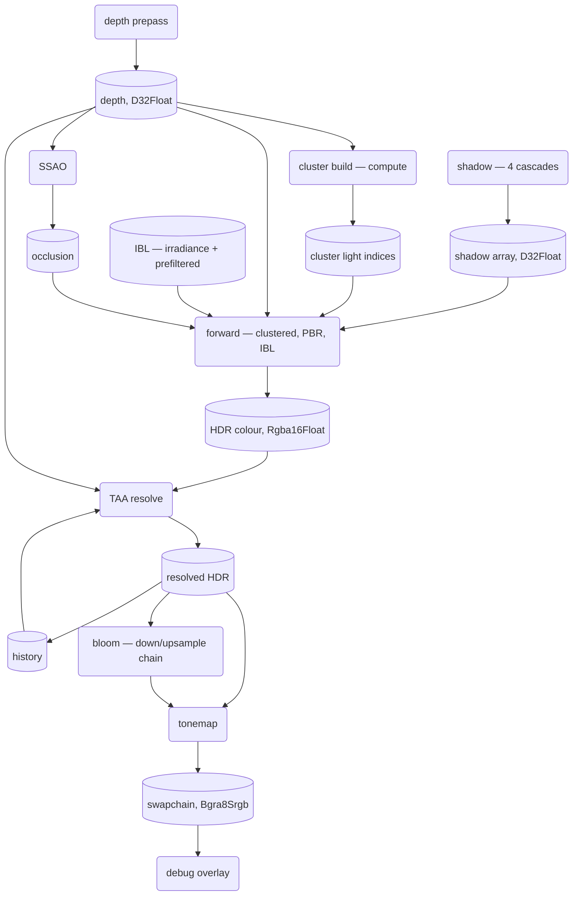
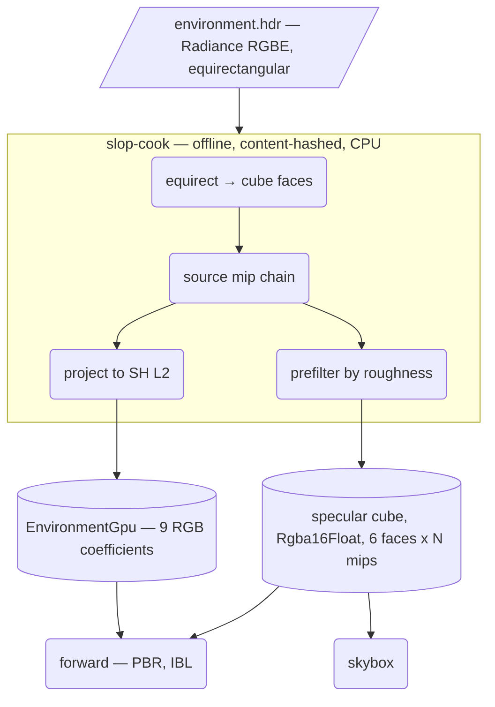

# Slop Engine — Implementation Plan & Session Handoff

**Status:** M0, M1 and M2 complete. M3 — the renderer, Stage A — is next and has
not started. **§9.4 specifies the target frame, §9.5 the order, §9.6 what done
means.** The first work is E1: float colour formats and a compute pipeline in
`slop-rhi`, neither of which exists.
**Last updated:** 2026-08-03

This document is the working companion to `DESIGN.md`. **`DESIGN.md` is
authoritative for all architectural decisions** — read it first, in full, before
writing any code. This file covers what `DESIGN.md` deliberately does not: who
we are building for, the state of the environment, the immediate task breakdown,
and the invariants that are easy to violate by accident.

`CONVENTIONS.md` is the third document and is authoritative for code-level
conventions — how code is written, rather than what is built or in what order.
The three divide as: **`DESIGN.md` what, `PLAN.md` when, `CONVENTIONS.md` how.**

---

## 1. Context for whoever picks this up

### 1.1 Who the work is for

Adam is a **seasoned software developer with no prior game development
experience.** Both halves matter:

- **Do not dumb down the engineering.** Architecture, concurrency, trade-off
  analysis, and systems design all land fluently. Give recommendations with
  reasoning, not menus of options.
- **Do explain game dev and graphics terminology inline.** ECS, render graph,
  bindless, meshlets, descriptor sets, RHI, cooking, gizmos — define them when
  used. Mapping to general software concepts works well (databases,
  producer/consumer queues, ABI stability, cache locality, demand paging).
  `DESIGN.md` §11 is the running glossary; **add to it as new concepts appear.**

The stated goal is a **best-practice, advanced engine.** Hacky or expedient
options have been explicitly rejected multiple times in favor of the harder,
more scalable choice. Do not propose shortcuts that compromise the architecture
to save time.

### 1.2 How this project got scoped

Worth knowing, because it explains some decisions that look unusual:

- It started as "a Rust engine with AI integration," and the AI angle was
  **deliberately demoted to an accessory** (`DESIGN.md` §9). Do not re-center
  the design on AI tooling.
- The engine is to be **owned, not assembled on top of another engine.** Bevy as
  a foundation was explicitly rejected. Dependencies are fine; being a plugin is
  not. See §3 of `DESIGN.md` for the exact write/take line.
- Fidelity target is **AAA-adjacent**, which is what drove dropping wgpu for an
  owned Vulkan RHI, and dropping macOS.

---

## 2. Environment

### 2.1 Development moves to native Windows

The project was scoped in WSL2, but WSL2 is **not viable for development here.**
Diagnosis run on 2026-07-31:

```
GPU:            NVIDIA RTX 5090, driver 610.47   ✅
Vulkan loader:  1.3.275 present                   ✅
Vulkan ICDs:    lavapipe, nouveau, intel, radeon,
                asahi, virtio, gfxstream          ❌ no NVIDIA ICD
/dev/dri:       missing                           ❌
Rust toolchain: not installed                     —
```

No `nvidia_icd.json` means Vulkan would fall back to **lavapipe, Mesa's CPU
software rasterizer.** Useless for this project. `nvidia-smi` works because WSL
passes through the compute path, not the graphics path.

Even if the WSL Vulkan ICD were installed, **RenderDoc and Nsight Graphics are
degraded across the WSL boundary** — and `DESIGN.md` §5 identifies GPU debugging
as the work that does not compress. Crippling those tools is the wrong trade.

**Decision: develop natively on Windows.** Windows is a first-class target
anyway (`DESIGN.md` §2.1), and §2.13 requires CI on both platforms so Linux
never silently rots.

### 2.2 Windows setup — complete as of 2026-07-31

Installed and verified end to end (hello-world `cargo run` links and executes,
so the MSVC linker is genuinely wired up, not merely present):

| Component | Version |
|---|---|
| Repo location | `C:\Users\adaml\development\slop` — native path, not `/mnt/c` |
| VS Build Tools | MSVC 14.44.35207 |
| Windows SDK | 10.0.26100 |
| Rust | 1.97.1 `stable-x86_64-pc-windows-msvc`, + clippy and rustfmt |
| Vulkan SDK | 1.4.350.0 (LunarG) |
| Slang (`slangc`) | 2026.8 — ships inside the Vulkan SDK |
| RenderDoc | 1.45 |

Not installed: NVIDIA Nsight Graphics (optional).

**Vulkan runtime, confirmed via `vulkaninfo --summary`:**

```
Instance version   1.4.350
RTX 5090           apiVersion 1.4.341, driver 610.47, DISCRETE_GPU
Intel UHD 770      apiVersion 1.4.323, driver 101.7082, INTEGRATED_GPU
```

Two consequences worth carrying into M0:

- **Vulkan 1.4 is available natively**, so timeline semaphores, dynamic
  rendering, and descriptor indexing are all core features rather than
  extensions. `DESIGN.md` §2.2's explicit model needs no extension juggling.
- **Two physical devices enumerate.** Device selection must score on
  `deviceType` and prefer `DISCRETE_GPU`. Taking index 0 is the difference
  between the 5090 and silently rendering on the iGPU.

### 2.3 Repo

`git@github.com:adamloec/slop.git`, branch `main`.

---

## 3. Current state

**M0, M1 and M2 are complete. M3 has not started.**

A Sponza-scale glTF scene — 103 primitives, 25 materials, 70 BC7 textures with
mip chains — loads through the cook pipeline and renders with its own materials
and normal maps, guarded by a golden image. Underneath it: the reflection and ECS
foundations through scheduling and world serialization, a content pipeline that
cooks and hot reloads meshes, textures and shaders on a content-hash cache, and a
debug overlay that shows frame timing and inspects a live entity.

§9.3 records M2's exit criteria and that they are met. §9.2 item E is what M3
starts from.

**860 tests.** Clippy and rustdoc clean under `-D warnings` in both feature
configurations, Vulkan validation reporting nothing, and every crate containing
`unsafe` passing under Miri — `slop-ecs` under both Stacked and Tree Borrows.

Two things this section is not allowed to imply. **A milestone being complete is
not the codebase being clean:** `docs/reviews/2026-08-03.md` is a full read of
the tree at this point — twelve findings, all acted on — and §6.1 below is the
register of what is standing in for something else. And **Linux has never been
run** — every portability claim in this repository is untested, standing since
M0.

### 3.0 M1 — reflection, the ECS, and serialization

| Area | State |
|---|---|
| `slop-reflect` — `TypeInfo` as data, registry, `#[derive(Reflect)]` | Landed |
| `slop-ecs` — `Column`, `Signature`, `Archetype`, `World`, queries | Landed |
| Command buffers — deferred structural change | Landed |
| Query filters — `With`, `Without`, `Or`, `Option<&T>` | Landed |
| Change detection — `Tick`, `Mut<T>`, `Changed<T>`, `Added<T>` | Landed |
| Work-stealing job pool behind the M0 API | Landed |
| System scheduling from read/write sets — `System`, `WorldCell`, `Schedule` | Landed |
| Resources — data the world holds exactly one of | Landed |
| Layout fingerprints for the §2.3 guest boundary | Landed |
| Serialization — `Value`, the text format, `Value` ↔ component memory | Landed |
| World serialization — the whole world to text and back | Landed |

**M1 is complete.** Its exit condition was that a scene round-trips, and one
does: memory → `Value` → text → `Value` → memory, per component and for a whole
world at once. Save, load and save again produces byte-identical text.

### 3.0.2 M2 — content pipeline and debug UI

`DESIGN.md` §6 sets M2 as "asset pipeline, glTF import + cook, texture
compression, hot reload, **material system**. Load and render a **Sponza-scale
scene**. Plus the **debug UI layer** (§10.2)." **All of it is done**, and §9.3's
exit criteria are met — Sponza loads through the cook pipeline and renders with
its own materials, mipmaps and normal maps, and the debug UI shows frame timing
and inspects a live entity.

What is *not* done is everything §6.1 records as deferred behind a seam. The
milestone is complete; the register is the honest account of what it is standing
on.

| Area | State |
|---|---|
| `slop-asset` — cook cache, content-hash keying, stamps | Landed |
| `slop-asset` — the VFS read path | Landed |
| Shader cooking driven onto the shared cache | Landed |
| The cooked mesh format — binary, versioned, validated on load | Landed |
| glTF import — positions, normals, UVs, indices | Landed |
| Texture cooking — PNG to a versioned artifact | Landed |
| Block compression — BC7, 4:1, with the golden image unchanged | Landed |
| `examples/cube` drawing entirely from cooked assets | Landed |
| `Assets<T>` — the registry, handles, load/reload/unload | Landed |
| Hot reload — `Assets::reload_changed` + `slop-cli cook --watch` | Landed |
| `slop-render` — the frame renderer, all examples driven by it | Landed |
| Safe draw recording in `slop-rhi`, so `slop-render` has no `unsafe` | Landed |
| Shader reflection — layouts read from the cooked shader, not restated | Landed |
| Debug UI (§10.2) — the egui overlay and frame timing | Landed |
| Materials — the cooked format, glTF import, referenced images | Landed |
| Node transforms flattened into a cooked model | Landed |
| Rendering a model's meshes with their materials | Landed — `MeshRenderer`, `examples/model` |
| A Sponza-scale scene loading and drawing | Landed — 103 primitives, 25 materials, 70 textures, clean validation. Fetched by `slop-cli fetch sponza`, not committed. |
| Debug UI — the entity inspector over `slop-reflect` | Landed — `slop_app::inspector`, driven entirely by the type registry. No UI code names a component or a field. |
| Mipmaps | Landed — generated at cook time in RGBA8, then each level compressed to BC7 separately. Payload grows by exactly the geometric-series third. |
| Tangents, so normal maps can be sampled | Landed — read from glTF when present, derived from UVs when not. Sponza's 24 normal maps are sampled. |

Async streaming has **moved to M3**. It was never an M2 exit criterion, and
nothing yet loads enough at once to say what the API needs — Sponza is what will.
`docs/PLAN.md` §6.1 carries the row.

The cache was lifted out of `slop-cli` rather than invented: keying, stamping and
staleness were already working for shaders and are not shader-specific. What was
deliberately *not* lifted is a `Cooker` trait — a shader is one source to one
artifact and a glTF is one source to many, so a trait shaped by the first would
break on the second (§6.1).

**BC7 landed without the golden image moving**, which is a smaller claim than it
looks and worth stating precisely. A two-colour checkerboard is the easy case for
a block codec — two endpoints reproduce it exactly — so the reference approved
before the content pipeline existed still matches bit for bit through a lossy
encoder. That says the pipeline is intact, not that the encoder is good on hard
content; the quality claim rests on Intel's ISPC compressor being the industry
default, not on anything tested here. What *is* tested here is the arithmetic
that silently corrupts: `intel_tex_2` sizes its output as `ceil(w × h / 16) × 16`,
which is the block count only when both dimensions are already multiples of four,
so an unpadded 5×5 surface loses half its blocks. The importer pads first, and
breaking the padding on purpose fails two tests.

**The registry landed before the things that need it, and the ordering is the
point.** A `Handle<Mesh>` is a **seam**, not an implementation, and §1.2
principle 6 says to defer implementations freely and never seams. `slop-render`
arrives at M3 and will be written against whatever the asset API is at that
moment; if that is `Mesh` by value, then streaming and hot reload each become a
refactor of every call site rather than code behind an API nobody has to notice.
So `Assets<T>` went in first and its features follow — the reverse of the order
the feature list suggests. The three properties that are easy to get wrong
(unloading frees the *name* as well as the slot, a reload decodes before it
replaces, a failed load caches nothing) each have a test that was confirmed to
fail when the property was broken on purpose.

**The golden image is the pipeline's oracle, and that was engineered rather than
noticed.** `examples/cube` now draws nothing it holds in code: its shader, its
albedo and its geometry all arrive as cooked bytes through the VFS. Both source
assets were *generated from the code they replaced* — `assets/checker.png` from
the old `checkerboard()`, `assets/cube.gltf` and its buffer from the old
`VERTICES`/`INDICES` — so the reference image from before the change is still the
correct answer after it. An identical render therefore proves the entire path:
parse, cook, key, cache, VFS, decode, upload. A pipeline bug that produced
plausible output would have gone unnoticed against a reference generated *by* the
pipeline; against one that predates it, it cannot. The assertions that used to
sit beside those consts moved to `examples/cube/tests/mesh.rs` and
`tests/texture.rs`, where they now check the artifact rather than a generator
that no longer runs.

**Deferred structural change diverges from the conventional answer, on purpose.**
Bevy and Unity's `EntityCommandBuffer` both return a usable entity id from a
deferred spawn, reserving it from the allocator through an atomic. §2.14 rules
that out: two systems spawning on two threads would receive ids in whatever
order the hardware resolved the contention, making every recorded replay and
every golden image of a scene that spawns anything timing-dependent. `slop-ecs`
returns a `Target` instead — an ordinal within the recording buffer, resolved to
a real `Entity` at the sync point, on one thread, in schedule order. The cost is
recorded in §6.1.

The binding constraint §2.4 named has been honoured: `TypeInfo` is a **value**,
so a component type declared at runtime by a WASM guest is a first-class
component rather than a second tier. A test builds an archetype and allocates a
column for a type with no Rust type behind it.

The two halves §2.10 insisted be designed together were: `Column` is both the
array a query scans linearly and the contiguous run §2.3 hands to a guest, and
`Transfer::Blittable` is what gates the second use.

**Miri is now part of the suite.** Type-erased storage is raw pointer arithmetic
by construction, and its failure modes — misaligned access, aliasing violations,
deallocating with the wrong layout, double frees — are invisible to ordinary
tests and usually invisible on x86. Verified by breaking the code on purpose;
see §3.1.

### 3.0.1 M0, for reference

Verified on the RTX 5090: window, surface, device, swapchain, cooked Slang
shader, graphics pipeline, and a frame loop with two frames in flight, running
with validation active and reporting no errors, and shutting down cleanly. A
one-second run completes roughly 5,400 frames, which is the evidence that the
frames-in-flight pipelining works rather than stalling on the GPU each frame.

Verification landed *before* the cube rather than after it, and brought the
memory work with it — readback needs an allocator, a device-local image and a
host-visible buffer, so task G contained the first half of task D:

- **`gpu-allocator` integration** — `Allocator`, `Buffer`, `Image`, and
  image-to-buffer readback. Every resource suballocates from the start.
- **Headless rendering** — no window, no surface, no swapchain, `present_family`
  genuinely `None`. This is the mode `DESIGN.md` §5 asks for; the golden test
  *is* it, rather than a demo binary that would be the same program written
  twice.
- **`slop-verify`** — the golden-image harness: tolerance model, difference
  reporting, diff images, and an approval mode that never runs by default.

§4.2's exit criteria are met except for CI:

| Exit criterion | State |
|---|---|
| Lit textured cube renders | **Met** on Windows. Linux is untested — see below. |
| Validation layers clean | **Met** |
| One golden-image test passing | **Met** on the hardware tier; lavapipe lands with CI |
| No `#[allow]` hiding real problems | **Met** — one `expect(dead_code)` for an RAII field and one in the shared test-support module, both justified |
| CI green on both platforms | **Outstanding** — deferred by decision, see §2.2 |

What the cube exercises, all at once: staged vertex, index and texture uploads;
the bindless heap; depth testing under reverse-Z; push constants; the projection
conventions; and two draws sharing one pipeline. `slop-rhi` now covers instance,
device, swapchain, sync, commands, memory, resources, descriptors and pipelines.

**The one gap that remains is Linux.** Nothing in this project has ever run
there. That is not just a build question — Wayland's `u32::MAX` extent path
(§4.1-E) has never executed, and §2.14's cross-platform determinism cannot be
tested from one platform by construction. Both are claims the docs already make.

### 3.1 What verification actually bought

Two lists, and the contrast between them is the argument for having pulled
task G ahead of the cube.

**First, a correction to this section's own premise.** For most of M0 and M1 the
golden tests could not fail for the most important reason they exist. Every one
of them was written as:

```rust
let mut renderer = match Headless::new(&device, &allocator) {
    Ok(renderer) => renderer,
    Err(failure) => { eprintln!("skipping: {failure}"); return; }   // ← test passes
};
```

`Headless::new` builds the `Scene`. So a shader that disagreed with its Rust
side, a pipeline that would not build, a missing artifact — **any** setup failure
— printed a line nobody reads and reported the suite green. Found on 2026-08-02
by breaking the cube shader on purpose to check that reflection caught it: the
new reflection tests failed loudly, the demo refused to start, and all five
golden tests passed.

Fixed by separating the one legitimate skip — "nothing has been cooked yet",
checked by name against the VFS before anything is constructed — from every other
failure, which now panics. The lesson generalises past this file: **a test that
skips on setup failure is a test that reports success when the thing it guards is
most broken.** Any `return` in a test body deserves the question "what state does
this silently accept?".

**Before the verification skeleton existed, three bugs reached a running
program:**

1. A missing `shaderDrawParameters` feature: 18 validation errors, zero test
   failures, and correct output on this driver regardless.
2. A backwards triangle winding: invisible geometry, no validation complaint,
   and reasoning about it produced the wrong answer twice.
3. A drop-order crash on shutdown, which only appeared when a human closed the
   window rather than when the process was killed.

None of the three was visible to the type system, clippy, or the test suite.
Validation caught the first; a human caught the other two.

**After it existed, three bugs were caught before any GPU saw them:**

1. **Two cube faces wound inward.** `cross(right, up)` must equal the face
   normal, and for the ±Y faces the obvious axis choice is wrong. Under
   back-face culling both faces would have silently vanished. A unit test on the
   geometry caught it with no GPU involved.
2. **The orthographic depth scale had the wrong sign.** `-1/depth` where
   `+1/depth` was needed. Shadow cascades built on it would have rendered
   inside out.
3. **The cook cache did not key on shader includes.** Editing a shared include
   changed what every dependent compiled to while leaving every stamp matching —
   a cache that was *wrong*, not merely stale.

**And four were found by breaking working code on purpose**, to check the tests
would notice:

- Reversing the triangle's winding — 18.09% of pixels differ.
- Flipping `DEPTH_COMPARE` to `LESS_OR_EQUAL`, which made both cubes vanish
  entirely because every fragment failed against a 0.0 clear.
- Deallocating a column with alignment 1 instead of the element's 16. **Every
  ordinary test still passed** — real allocators do not care in practice. Miri
  named it exactly:

  ```
  error: Undefined Behavior: incorrect layout on deallocation:
  alloc59958 has size 64 and alignment 16, but gave size 64 and alignment 1
    --> crates\slop-ecs\src\column.rs:378:22
  ```

- Making the command buffer's staging area ignore the alignment a component
  asks for — the mistake a `Vec<u8>` staging area makes for free, since its
  allocation is aligned to 1 whatever offsets are computed within it. **All 24
  command-buffer tests still passed**, including one written specifically to
  place a 16-aligned component. Only Miri objected:

  ```
  error: Undefined Behavior: constructing invalid value of type &mut Tracked:
  encountered an unaligned reference (required 8 byte alignment but found 1)
  ```

*A test that has never caught anything is not known to work.* That applies to
golden images and to Miri alike — and Miri's caveat is that it only reports
undefined behaviour on paths a test actually executes, so it is worth precisely
as much as the coverage of the `unsafe` code.

The cube's golden also needed a design fix to be worth anything: a single convex
cube with back-face culling renders identically whether or not depth works, so
the scene draws a **second** cube, near-first, where only a working depth test
keeps the far one behind. Drawing them far-first would have produced a correct
image by draw order alone and proven nothing.

The `Drop`-order crash is covered structurally rather than by a test: every type
owning Vulkan objects waits for idle in its own `Drop`, recorded as invariant 22
in `docs/slop-rhi/README.md`.

1. **Two cube faces wound inward.** `cross(right, up)` must equal the face
   normal, and for the ±Y faces the obvious axis choice is wrong. Under
   back-face culling both faces would have silently vanished. A unit test on the
   geometry caught it with no GPU involved.
2. **The orthographic depth scale had the wrong sign.** `-1/depth` where
   `+1/depth` was needed. Shadow cascades built on it would have rendered
   inside out.
3. **The cook cache did not key on shader includes.** Editing a shared include
   changed what every dependent compiled to while leaving every stamp matching —
   a cache that was *wrong*, not merely stale.

**The determinism tier is settled** — `DESIGN.md` §2.14, decided before M1
rather than before M5. A golden image means nothing unless the frame it captures
is reproducible, and determinism constrains ECS iteration order and job
scheduling, both of which land at M1. Deciding it after they exist would mean
auditing both at once. What landed: `slop_core::Rng` (seeded PCG32),
`slop_core::FxHashMap` (`RandomState` reseeds *per process*, so a plain
`HashMap` iterates differently on every run), `slop_math::scalar` and glam's
`libm` feature, and `clippy.toml` entries so the `std` alternatives cannot come
back by accident.

---

### 3.2 Earlier state

**M0 tasks A and C: workspace scaffolding, and `slop-core` complete.**

`slop-core` ships `Handle<T>` / `RawHandle`, `SlotMap<T>`, `HandleAllocator<T>`,
`FrameArena`, `FixedTimestep` / `Clock`, `JobSystem` / `Scope`, and
`diagnostics`. 68 tests, clippy clean under `-D warnings` in both feature
configurations, rustdoc clean. Two implementations behind it are provisional and
labelled as such — the job system's `std::thread::scope` backing, and
`HandleAllocator`'s `Vec<bool>` liveness — both entirely behind their APIs.

Remaining for M0: `slop-math` (B), `slop-rhi` (D), window and surface (E), first
render (F), verification skeleton (G).

The repository also contains:

- `.gitattributes` — LF normalization (§2.13). Repo-local `core.autocrlf` set to
  `false` so the attributes file is the sole authority; the machine's global
  setting was `true`, which would have defeated §2.8's content-hash cache.
- `rust-toolchain.toml` pinning 1.97.1, `rustfmt.toml`, `clippy.toml`
- Cargo workspace, edition 2024, resolver 3, with `slop-math`, `slop-core`,
  `slop-rhi`, `slop-app` — all libraries, per `DESIGN.md` §1.2 principle 4. The
  M0 cube lands as an example, not a binary.
- Workspace lints centralized in the root manifest. Notably
  `clippy::undocumented_unsafe_blocks` is on, which turns §7's "every `unsafe`
  block carries a `// SAFETY:` comment" convention into a machine-checked rule
  rather than a review responsibility.
- `.github/workflows/ci.yml` — Windows + Linux matrix running fmt, clippy,
  build, and test with `-D warnings` and `fail-fast: false`. **Currently paused
  to `workflow_dispatch` only** — see below.
- `LICENSE-APACHE` and `LICENSE-MIT`, backing the `MIT OR Apache-2.0` every
  manifest declares.

All four crates pass fmt, clippy, build, and test locally on Windows.

> **CI must come back before task E.** It was paused while the workspace was
> empty, on the stated condition that it returns before the first
> platform-conditional code lands. Task E — the `winit` window and Vulkan
> surface — is exactly that point, and it is now also the first code with
> dependencies that must build under both MSVC and GCC. `DESIGN.md` §2.13 exists
> to stop "we'll port it later" from becoming the default, and this is the
> commit where that starts being possible.

**Design decisions locked** (`DESIGN.md` §2): target platforms, owned Vulkan RHI,
WASM gameplay ABI, reflection-first, job-system-first, handles everywhere, fixed
timestep, cooked assets, render snapshot, archetype ECS, Slang, editor-as-host,
dual-platform CI.

**Still open** (`DESIGN.md` §8), none blocking M0: scene text format, Slang Rust
binding choice (M3), whether to enable pipelining (M3), runtime UI (M5), debug UI
library (M2), naming.

---

## 4. M0 — Foundation

**Goal:** prove the entire stack connects end to end. A lit, textured, rotating
cube in a window, on both platforms, with CI green.

The cube is deliberately unambitious. Its job is integration, not looks.

### 4.1 Task breakdown, in dependency order

**A. Workspace scaffolding**
- Cargo workspace with the crate layout from `DESIGN.md` §4 (create only the
  crates M0 needs: `slop-math`, `slop-core`, `slop-rhi`, `slop-app`)
- `rust-toolchain.toml` pinning the toolchain
- `.gitattributes` normalizing line endings — required by §2.13, and it must
  exist *before* content hashing lands in M2
- `rustfmt.toml`, `clippy.toml`
- **CI matrix: Windows + Linux, build + clippy + test.** Add now; retrofitting is
  annoying and it is the whole enforcement mechanism for §2.13.

**B. `slop-math`**
- Re-export `glam`; do not wrap what does not need wrapping
- `Transform` (translation / rotation / scale, and to-matrix conversion)
- `Aabb`, `Frustum`, plane types
- Only what M0 needs; grow it on demand

**C. `slop-core`**
- Generational-index slotmap and handle types — `DESIGN.md` §2.6, used by
  everything downstream, so get the ergonomics right

> **Handle API — decided 2026-07-31.** Four calls, each hard to reverse once
> entities, assets, GPU resources, and scene nodes all depend on them.
>
> 1. **Typed.** `Handle<T>` carrying `PhantomData<fn() -> T>`. Passing a
>    `Handle<Texture>` where a `Handle<Buffer>` belongs becomes a compile error
>    rather than a garbage read. The `fn() -> T` phantom rather than a bare
>    `PhantomData<T>` is deliberate: it keeps `Handle<T>` unconditionally `Copy`,
>    `Send`, and `Sync` no matter what `T` is. At the §2.3 WASM boundary handles
>    erase to opaque integers through an explicit `to_raw` / `from_raw` pair.
>
> 2. **64-bit: `u32` index + `NonZeroU32` generation.** Packing to 32 bits
>    (24 index / 8 generation) was considered to halve bandwidth in the arrays
>    culling and transform propagation sweep every frame, and rejected: 8 bits of
>    generation wraps after 256 reuses of a slot, and for high-churn entities —
>    bullets, particles, decals — 256 is trivially reachable. A wrapped
>    generation means a stale handle silently validates against the wrong object.
>    Correctness over four bytes. `NonZeroU32` additionally makes
>    `Option<Handle<T>>` the same size as `Handle<T>`; fresh slots start at
>    generation 1.
>
> 3. **Checked access returning `Option`** — not panic, not debug-only. The check
>    is one comparison against a generation already being loaded into cache.
>    Panicking is wrong for an engine where deleting an object something still
>    references is routine in the editor and during hot reload. Debug-only
>    checking manufactures precisely the bugs that surface only in shipping
>    builds, which inverts the point of `DESIGN.md` §5. An `unsafe` unchecked
>    accessor may exist for *measured* hot spots under §7's policy. Note the perf
>    objection is largely misplaced: handle lookup is not the ECS hot path —
>    iteration over archetype columns is, and that never touches a handle.
>
> 4. **Two primitives, not one.** This is the call that matters most:
>    - `SlotMap<T>` owns its values — for GPU resources, assets, and scene
>      nodes, where lookup by handle is the access pattern.
>    - `HandleAllocator` tracks generations with no payload — for ECS entities,
>      whose component data lives in §2.10's archetype columns and *not* in one
>      array.
>
>    Both hand out the same `Handle<T>`. Building only the owning variant and
>    discovering at M1 that the ECS cannot use it is exactly the rework §8 warns
>    about when it says archetype storage and the columnar boundary must be
>    designed together.
- Arena / bump allocator for per-frame scratch
- Time and frame pacing primitives
- `tracing` setup for structured logging
- Job system: **a work-stealing scheduler is §2.5 and foundational**, but
  **decided 2026-07-31: M0 lands the API shape only, backed by a plain thread
  pool; the work-stealing implementation follows in M1.** M0 has nothing to
  schedule, so writing the scheduler now means designing against imagined
  workloads — ECS system scheduling at M1 is what supplies real requirements.
  The API shape must not assume single-threaded execution, because that
  assumption is the part that becomes unfixable later. The implementation
  behind it can be replaced freely.

**D. `slop-rhi` — the bulk of M0**
- `ash` instance creation, validation layers wired in debug builds
- Physical device selection with explicit feature requirements
- Logical device, queue family selection (graphics / compute / transfer)
- `gpu-allocator` integration
- Swapchain creation and recreation on resize
- Command pool and buffer management
- Synchronization primitives — **design against timeline semaphores from the
  start**, per §2.2
- Minimal pipeline creation path

> **Decided 2026-07-31 — M0 ships RHI primitives, not RHI abstraction.**
>
> An earlier draft of this section held that the RHI's consumer-facing API shape
> was M0's central design problem. That is now considered a trap. An abstraction
> designed with zero consumers is designed against imagined requirements; the
> render graph and frame renderer at M3 are what actually determine what the API
> must be, and a shape guessed now gets rebuilt then anyway. Building it twice is
> fine. Building it once, early, and then living with it is worse.
>
> So M0 sits close to `ash` and defers the extraction to M3.
>
> What M0 *must* get right is the **feature model**, because that is the part
> which cannot be retrofitted (`DESIGN.md` §2.2):
>
> - Timeline semaphores, not fences plus binary semaphores
> - Explicit barriers, never implicit synchronization
> - A bindless descriptor heap allocated from the start, even though the cube
>   uses one texture
> - Graphics, compute, and transfer queues acquired up front
> - Physical device selection scoring on `deviceType` — see §2.2, two devices
>   enumerate on this machine
>
> Get those right and the M3 extraction is a refactor. Get them wrong and it is a
> rewrite. Expect roughly a thousand lines before the first triangle regardless —
> that is the tax §2.2 knowingly accepted.

**E. Window + surface**
- `winit` window
- `ash-window` / `raw-window-handle` for surface creation — **never hand-roll
  platform surface code**, per §2.13

**F. First render**
- Triangle, then a lit textured cube
- Shaders in Slang compiled to SPIR-V. `slangc` CLI is acceptable *for M0 only*;
  §2.11 requires library integration once reflection is needed (M2/M3)

**G. Verification skeleton** — *done, see §3*
- Headless mode that renders N frames without a window
- One golden-image test wired into CI
- Establishes the §5 pattern early, while it is trivial

> **Note on ordering — moved ahead of the cube.** Task G was scoped last and ran
> sixth, because three bugs had already reached a running program that review did
> not catch (§3). Building the cube first would have meant debugging a silent
> visual regression with no reference to compare against.
>
> Task G also turned out to *contain* the first half of task D's memory work:
> readback needs an allocator, a device-local image, and a host-visible buffer.
> Doing it in this order meant the allocator arrived with a test that exercises
> it, rather than arriving alongside the cube and being debugged at the same
> time as vertex buffers, descriptor sets, and depth.
>
> Still outstanding from the original scope: **wired into CI**. The test exists
> and passes locally; CI itself is deferred (§2.2), and the lavapipe tier lands
> with it.

> **Decided 2026-07-31 — golden images run on lavapipe in CI.**
>
> GitHub-hosted runners have no GPU, so the §4.2 exit criterion "one
> golden-image test passing on both platforms" cannot be met by hosted CI as
> written. `DESIGN.md` §2.13's expectation that images match across operating
> systems also quietly assumed self-hosted runners with identical hardware — a
> standing cost this project should not take on yet.
>
> Resolution is two tiers:
>
> 1. **Hosted CI, both platforms, lavapipe** (Mesa's CPU rasterizer). Being a
>    software rasterizer it is bit-deterministic with no vendor divergence, so
>    comparison is **exact match, not tolerance**, and a Windows/Linux diff
>    becomes a real signal instead of driver noise. This catches the class of bug
>    golden images actually catch: state, ordering, and logic errors.
> 2. **Real-GPU goldens on the 5090**, in a separate opt-in lane, run locally.
>    Covers what lavapipe cannot — driver behavior and actual hardware features.
>
> Note this uses lavapipe for exactly the purpose §2.1 rejected it for: it is
> useless for *development* and well suited to *deterministic verification*.

### 4.2 Definition of done

- Lit textured cube renders on Windows and Linux
- CI green on both
- Validation layers clean — **met**
- One golden-image test passing — **met on the hardware tier**; the lavapipe tier
  needs CI
- No `#[allow]` suppressions hiding real problems

---

## 5. Invariants — easy to violate, expensive to fix

These are the ones where a small local convenience creates a large structural
problem later. Check work against this list.

1. **The renderer never reads live simulation state.** It consumes an immutable
   snapshot (§2.9). The moment one subsystem reaches across, the boundary is
   gone and pipelining, replay, and interpolation all become unavailable.
2. **The WASM guest API is columnar and bulk, never per-entity.** (§2.3) A
   convenient `get_transform(entity)` accessor is the failure mode that makes the
   whole ABI unusably slow. Hand slices of component columns.
3. **Handles, never pointers,** for engine-owned resources (§2.6). No `Rc<RefCell<>>`
   in engine data structures.
4. **Structural ECS changes go through command buffers** applied at explicit sync
   points, never immediately (§2.10). Required for both archetype churn and safe
   parallel systems.
5. **Asset paths are lowercase, always.** (§2.13) Enforced at cook time. This is
   the single most common Windows→Linux breakage.
6. **`PathBuf` / `Path::join` only.** No separator literals, no string concatenation.
7. **Nothing a shader declares is restated in Rust.** Vertex layouts, attribute
   offsets and push constant sizes come from cooked reflection, never from a
   parallel table someone maintains by hand. *(This invariant used to read
   "Slang integrates as a library, because reflection is unavailable from
   CLI-compiled shaders" — which was false. `slangc -reflection-json` produces
   it; see `DESIGN.md` §2.11's correction. The library is still wanted, for
   link-time specialization, and is no longer blocking.)*
8. **Nothing parses source assets at runtime in shipping builds.** (§2.8)
9. **Both platforms stay green.** (§2.13) Do not defer a Linux fix.

## 6. Explicitly rejected — do not reintroduce

- **wgpu** as the graphics layer (§2.2) — including "temporarily, to move faster"
- **macOS support** (§2.1)
- **Native dynamic library plugins** for gameplay (§2.3) — Rust has no stable ABI
- **Sparse-set as the default ECS storage** (§2.10)
- **Editor as a privileged engine mode** (§2.12)
- **AI-first design** (§9)
- **Building on Bevy or as anyone's plugin** (§1.1)

---

## 6.1 Provisional implementations — the register

Everything currently standing in for something else, in one place, so that
"temporary" stays a decision rather than becoming an accident.

**"Moved" does not mean copied.** Several rows below say a piece of example code
moves into an engine crate. Read that as *the requirement moves* — the example is
evidence that the problem is real and evidence of what shape a solution has to
be, not a donor implementation to lift. Example code was written to get a picture
on screen: it returns `String` errors where a library owes typed ones
(`CONVENTIONS.md` §6), it reaches for `CARGO_MANIFEST_DIR`, it submits uploads
and waits, and it hard-codes constants an engine has to expose. Lifting it would
import all of that under a better crate name. **Each of these is a rewrite against
two working references, and the golden images are what say the rewrite is
equivalent.**

**Reading the `When` column.** It is the milestone at which the fate happens, so
a row still listed with a milestone that has already shipped is either resolved
and not struck, or overdue. `✅` means resolved, and the row is kept struck
rather than deleted so the decision stays readable.

**Audited 2026-08-03**, partially. Verified against the source: `No mipmaps`
(resolved), `JobSystem backed by std::thread::scope` (resolved), the fixed vertex
layout (tangent added, so retargeted at M3), `Every sampler is created fresh at
its use site` (still true at three call sites, overdue), `WorldCell::query
allocates` (**now resolved** — see the row) and `Reflect rejects generic types`
(still true, overdue). **The remaining rows tagged M1 or M2 have not been
re-checked and may be in either state.** That is a gap, and naming it is better
than a register that reads as audited when it is not.

**`Synchronous upload — submit and wait` is now half true, and the row is kept
because the half that remains is the one it names.** `slop-render` batches every
transfer for one `MeshRenderer::load` into a single command buffer rather than
submitting and blocking per vertex buffer, per index buffer and per texture —
which was `docs/reviews/2026-08-03.md` item 2's fifth defect. That is still one blocking
submit at the end, and `examples/cube/src/scene.rs` still submits per resource.
The async transfer queue with a staging ring is what closes it.

**The distinction this table enforces:** everything below is either a requirement
currently living in the wrong crate (which gets **rebuilt** where it belongs), or
a simple implementation behind a final seam (which gets **replaced** with no
caller changing). `DESIGN.md` §1.2 principle 6 is the rule: defer implementations
freely, never seams.

**This table used to claim there were no hacks in the tree. That claim is
withdrawn.** A hack is a shortcut that makes the right thing harder later, and
`docs/reviews/2026-08-03.md` found several — Vulkan types leaking through every
layer above the RHI, a `MeshRenderer` whose `load` was not safe to call twice,
and a duplicated uploader in `examples/cube` that had already drifted from its
counterpart by one barrier. **The register is not the whole debt.** It records
what was deferred *deliberately, behind a seam*; a review records what was found
afterwards. The vocabulary here — Replaced, Extended, Rebuilt — makes every row
read as scheduling, which is exactly how a register turns into a story about not
having debt. Read both.

**All three of those examples have since been fixed**, along with the rest of
that review's twelve items — the `vk::` leak is at zero references above
`slop-rhi`, `load` replaces rather than accumulates, and the barrier
disagreement is settled and recorded. What has *not* changed is why the claim
was withdrawn. The register did not catch any of them, because it only ever
records what was chosen; a review is what finds what was not. Keeping both is
the arrangement, and a future audit that finds this table clean has learned
nothing about the tree.

| What | Where | Standing in for | Fate | When |
|---|---|---|---|---|
| Every renderer must be told whether it is the last to draw | `slop-render` | The render graph deriving barriers from declared reads and writes | **Replaced, for everything inside the graph.** The convention was: only the last writer may transition the target, and no renderer can know whether it is last, so each stops at `COLOR_ATTACHMENT` and the caller ends with `Frame::finish`. It failed once already — `MeshRenderer` transitioned to `PRESENT_SRC`, and adding an overlay put a pass on an image the presentation engine already owned, once per frame. `Graph` derives it now: it ran the passes, so it knows which touched a resource last, and `Imported::final_state` is what it emits. The headless golden harness calls no `finish` at all. **Still open for the overlay**, which draws outside the graph because `DebugUi::draw` mixes buffer upload with pass recording and splitting it is `slop-editor` work. That is the last caller of `Frame::finish`. | M3, E3 |
| ~~The tangent is transformed by the normal matrix, not the model matrix~~ | `shaders/passes/model.slang` | — | **Resolved at E4**, and by the route this row predicted. Point lights need world position, world position needs the model matrix, and the push block had no room — so per-instance data went into a storage buffer, and the tangent now uses the model matrix that arrived with it. The block dropped from 120 bytes to 88 in the process, since the model-view-projection and the normal matrix both moved into the instance row. Neither reference image moved: an unlit render of both models is bit-identical to the pre-lighting references, which is what says the transform rewrite was exact. | ✅ |
| The instance buffer is written once at load, not per frame | `slop-render/src/mesh.rs` | One buffer per frame in flight, as `Lights` has | **Extended.** A placement's transform comes from the cooked model and nothing moves, so a single buffer is the truth rather than a shortcut. The day something moves it becomes a ring — the shader already reads it by index, so the seam does not move. | M5 |
| ~~The directional light is still a constant in the shader~~ | `slop-render/src/environment.rs` | — | **Resolved at E5's prerequisite**, and by the route this row named: E5's cascades are built along the sun's direction, so it had to become a value the CPU chooses. `Environment` is a per-frame buffer carrying the sun and the ambient term, separate from the cluster grid because a directional light belongs to every cell by construction. `DirectionalLight::default` holds the exact constants the shader did, and both references are bit-identical across the change — which is what says it was a move rather than an edit. | ✅ |
| The shadow bias is tuned by eye on two scenes | `slop-render/src/shadow.rs` | Either a normal-offset-only scheme, or per-scene values | **Extended.** `depth_bias` and `slope_bias` were chosen by looking at Sponza and the cube. Nothing says they hold for a scene at a different scale, and the failure modes are opposite — stripes if too small, shadows detached from their casters if too large. Both are fields rather than constants, so a scene can override them; what is missing is a way to know it needs to. | M3 |
| Nothing verifies the cascades independently of the final image | `slop-render/src/shadow.rs` | A readback test over the depth array, as `tests/cluster.rs` does for clusters | **Extended.** The fitting maths is tested on the CPU and the reference images show shadows appearing where a roof is overhead — but "everything is shadowed" and "correctly shadowed" are not distinguishable from one interior view. What currently stands in: the *cube*'s reference is bit-identical, so unoccluded lit faces stay lit, and an exterior Sponza render shows a sunlit roof. That is three consistent observations, not a test. | M3 |
| A cascade's texels are not filtered across its edge | `shaders/lib/shadow.slang` | Blending between neighbouring cascades over a band | **Extended.** A fragment takes one cascade's answer, so the boundary between two is a visible step wherever their resolutions differ. The usual fix is to sample both across a narrow band and blend. Cheap to add; wants a scene where the seam is actually visible to tune the band against. | M3, E7 |
| A cube's mip chain is box-filtered within each face | `slop-cook/src/cube.rs` | Resampling across the face boundary | **Extended.** The four texels averaged for an edge texel are the four that exist; the neighbouring face's are not consulted, so each level's outermost ring is filtered against a boundary that is not there. The error is confined to one texel per edge and shrinks with the level, which is what every offline pipeline accepts here — and the hardware filters *across* faces when sampling, so the artefact is in the source of the prefilter rather than in the lookup. Doing it properly means resampling across the seam, which is a different and much larger piece of work than mip generation. | M3 |
| An environment cooks at one fixed size with no per-asset settings | `slop-cook/src/import/environment.rs` | Import settings, as the texture rows want | **Extended.** `SIZE` is a constant of the cooker rather than a property of the asset, so a small studio HDR and a 8K outdoor capture both become 256. It is an input to the cache key, so changing it recooks correctly — what is missing is any way for one asset to say something different. The same missing per-asset import settings as the two mip rows above, and it closes with them. | M3 |
| The ambient term is a flat colour | `slop-render/src/environment.rs` | Image-based lighting | **Replaced at E6.** Real ambient light arrives from different directions with different colours; a constant cannot express that and makes every surface's unlit side the same shade. Already a field in the environment buffer, so the seam does not move. | M3, E6 |
| ~~The forward pass loops over every light~~ | `shaders/passes/model.slang` | — | **Resolved at E4.** It reads its own cluster's list, and the loop body did not change — only where the indices come from, exactly as the row predicted. | ✅ |
| A cluster's light list has a fixed stride | `slop-render/src/cluster.rs` | A compacted list with an atomic allocator | **Replaced.** The default grid at the default stride is under a megabyte, so the waste is bounded and known. The seam is already the compacted one: a cluster's range is written as an offset *and* a count rather than derived from its index, so compaction changes how the offset is produced and nothing that reads it. | M3, E7 |
| A cluster silently drops lights past its stride | `shaders/passes/cluster_build.slang` | Either a compacted list, or a reported overflow | **Extended.** A cell reached by more than `max_per_cluster` lights keeps the first 64 in buffer order and drops the rest, and *which* it drops therefore depends on light order. Nothing reports it. At four lights this cannot fire; at the light counts §9.4 is aimed at, it can. The compaction row above is the fix, and a counter is the cheap interim. | M3, E7 |
| The cluster build reads every light per cell | `shaders/passes/cluster_build.slang` | A coarse cull per tile column first | **Replaced.** 3456 clusters × the light count, every frame. Fine at the scene sizes here and the standard next step when it is not. Behind an unchanged declaration — the pass's inputs and outputs do not change. | M3, E7 |
| The grid is a fixed 16 × 9 × 24 regardless of aspect | `slop-render/src/cluster.rs`, the examples | Tiles derived from the target's size | **Extended.** Tiles stay square only at 16:9. A window at another ratio gets stretched cells, which costs efficiency rather than correctness — a cell covering more screen lists more lights. The fields are already per-instance, so this is a caller change. | M3 |
| Every shader drawing cooked geometry must declare all four vertex attributes | `slop-asset/src/mesh.rs`, every pass | Per-mesh vertex layouts, with pipeline variants to match | **Extended.** The layout is derived from shader reflection, so a shader omitting a field computes a stride shorter than the buffer's and reads every vertex after the first from the middle of its predecessor. `cube.slang` declares a tangent it never samples for exactly this reason, and a test asserts the reflected stride equals `VERTEX_SIZE`. Real per-mesh layouts arrive with skinning, which needs joints and weights on some meshes and not others. | M5 |
| `slop-cook` uses `anyhow`, and `CONVENTIONS.md` §6 says libraries use `thiserror` | `slop-cook` | Typed errors, once something branches on the kind | **Replaced.** Argued from the rule's own reason — "a caller must be able to match and respond" — which no caller does: the CLI and the editor both report the failure and mark the asset uncooked. What a cook failure is *for* is the context chain, and "reading primitive 3 of mesh 'Body' in sponza.gltf: index 5 names a vertex the primitive does not have" is the whole diagnosis. A flat enum discards it. **The trigger is an editor that shows a missing-texture failure differently from a malformed-file one.** | M4 |
| Mip levels are averaged in whatever space the texture is stored in | `slop-cook/src/texture_import.rs` | Filtering in linear light for colour textures, and in raw values for data ones | **Replaced.** A box filter over sRGB-encoded bytes is not the mean of the light they represent — it biases dark, so distant surfaces darken slightly. Doing it right needs to know which textures are colour and which are data (normal, roughness, occlusion), and that is per-asset import settings, which do not exist. The material already records `TextureSlot::is_srgb`, so the information exists at *import* time and does not reach the texture cooker — closing that gap is the work. | M3 |
| Mip generation is a box filter | `slop-cook/src/texture_import.rs` | A Kaiser or Mitchell kernel, per asset | **Replaced.** What hardware would do and what every pipeline starts with. Better kernels trade sharpness against ringing, which is a per-asset judgement — the same missing import settings. | M3 |
| `Gpu` ties one window to one device | `slop-app/src/gpu.rs` | A device shared by several surfaces | **Extended.** Right for a game, which has one window; wrong for the editor (`DESIGN.md` §2.12), where a detached viewport is a second surface on the *same* device — re-running bring-up would create a second device and make sharing a texture between panels impossible. The split is `Gpu` keeping instance/device/allocator and handing out surfaces, and it is additive: `Gpu::new` stays the one-window path. Not done now because the editor does not exist and a two-window API designed without one is a guess. | M6 |
| `FrameRenderer` has no automated test | `slop-render` | A smoke test that drives a real window, or a headless path that fakes a swapchain | **Extended.** Everything it does needs a surface, a surface needs a window, and a test harness has no event loop — the cube's golden renders headlessly and so covers `Scene`, not this. The check today is running both examples under `SLOP_FRAMES` with validation on, which is a command someone has to type. **The resize path has no coverage at all**, automated or otherwise, because `SLOP_FRAMES` never resizes the window. | M3 |
| Scene setup — uploads, pipeline, draw recording | `examples/cube/src/scene.rs` | `slop-render` + `slop-asset` | **Rebuilt.** It proves the pieces fit together; it is not the shape an engine wants. One hard-coded pipeline, a sampler and a heap owned by the scene, and push constants restated from the shader — all of it example-grade on purpose, none of it moves. (`CARGO_MANIFEST_DIR` is no longer among them: `Vfs::discover` walks up for a cooked cache, which works the same in a source tree and beside a shipped binary.) **Exit condition: the material system absorbs this rather than becoming a third copy of it.** `docs/reviews/2026-08-03.md` item 3 is what that guards against — this file's uploader and `slop-render`'s had already disagreed about a staging barrier, and both passed their golden tests, so the suite could not tell a redundant barrier from a missing one. That question is settled and recorded (`MemoryLocation::Upload`), which is the part that could not wait for M3; the duplication itself still can. | M3 |
| `VertexBinding` cannot express a buffer format that differs from the shader's type | `slop-render/src/vertex.rs` | A per-location format override | **Extended.** Reflection is a fact about the shader; the buffer format is a decision about memory. They coincide for every float attribute and diverge for a packed one — egui's four-byte colour read as a `float4`. The overlay states its layout and uses reflection to check the shader, which is correct and is not derivation. | M3 |
| A glTF-referenced image is cooked separately from the same file under `assets/` | `slop-cli` | One artifact per distinct source image | **Replaced.** `assets/checker.png` cooks to `textures/checker.tex` *and*, because `cube.gltf` references it, to `textures/cube.0.tex`. Correct and wasteful. Deduplicating means keying artifacts by content rather than by name, which is a cache change rather than an importer one. | M2/M3 |
| A cooked model is a flat list, not a hierarchy | `slop-asset/src/model.rs` | `slop-scene`'s runtime tree, once something articulates | **Joined by.** Right for a static level, which is drawn rather than posed, and wrong the moment a parent joint animates. The tree is a *runtime* structure `slop-scene` owns; this format records where things ended up. | M5 |
| Materials carry no occlusion or HDR emissive | `slop-asset/src/material.rs` | More slots and a float texture format | **Extended.** Occlusion is a baked term a real-time renderer computes or ignores; float images are refused by name rather than silently narrowed, and arrive with IBL. | M3 |
| Frame timing is CPU wall-clock, not GPU time | `slop-app/src/timing.rs` | GPU timestamp queries written into the command buffer | **Joined by.** Wall-clock between frames is the honest measure of how fast frames arrive and a poor one for attributing cost to a pass — it includes waiting for the GPU. Attribution needs timestamps, and the render graph is what will know which pass one belongs to. §9.6 makes per-pass GPU timings an M3 exit criterion, so this closes at E3. | M3 |
| `ImageState` and `BufferState` bake the pipeline stage into each constant | `slop-rhi/src/command.rs` | A state carrying access intent, with the render graph supplying the stage | **Replaced.** `SHADER_READ` means "read by a **fragment** shader" and cannot express the same read from compute, so E1b added `STORAGE_WRITE` beside it rather than generalising. The constants double for now. The graph knows what stage each pass runs at and is the right thing to supply it; designing that against one compute pass that does not exist yet is what §9.4 exists to avoid. | M3, at E3 |
| ~~A graph pass must have a colour attachment~~ | `slop-render/src/graph.rs` | — | **Resolved at E4.** `ComputePass` declares sampled images, storage-image writes, and buffer reads and writes; `Graph::add_compute` hands the command buffer rather than a `Pass`, because a dispatch is not inside a render pass and having no `Pass` to give makes that structural. Buffers are tracked with their own `BufferId`, so passing one where an image belongs is a type error. Depth-only render passes followed in the row below. | ✅ |
| ~~A render pass must have a colour attachment~~ | `slop-render/src/graph.rs`, `slop-rhi/src/pass.rs` | — | **Resolved at E4.** `Attachments::color` and `GraphicsPipelineConfig::color_format` are `Option`, and `fragment` is too — a prepass over opaque geometry runs no fragment shader at all, which is the whole saving. The render area comes from whichever attachment exists. A pass declaring *neither* still panics by name. | ✅ |
| The masked half of the prepass is untested | `slop-render/src/mesh.rs`, `examples/model/tests/golden.rs` | A source asset with a cutout in front of solid geometry | **Measured, not assumed.** Drawing Sponza's 14 masked meshes through `prepass_opaque` — the exact mistake the split prevents — changes **0 of 65536 pixels** in the reference frame. The camera sits in the arcade among columns and banners, and no cutout in view has anything behind it whose disappearance would show. Two other cameras were tried and neither found foliage. The path is correct by construction (the prepass shader tests the same expression the forward shader does) and nothing independent checks it. | M3 |
| The forward pass re-tests and re-writes depth | `slop-render/src/mesh.rs`, `slop-rhi/src/pipeline.rs` | `EQUAL` test with depth writes off | After a prepass the depth is already exact, so the forward pass could test for equality and write nothing — saving depth bandwidth and letting early-Z reject harder. Not done, for a reason rather than an oversight: `EQUAL` is only safe if the two passes compute *bit-identical* positions, which Vulkan does not guarantee across pipelines without an `invariant` output. `GREATER_OR_EQUAL` tolerates the equal case and is what ships. Closing this wants the invariance declared and the saving measured, in that order. | M3, E7 |
| The graph boxes one closure per pass per frame | `slop-render/src/graph.rs` | A frame arena, or recording into a reusable buffer | **Replaced.** `CONVENTIONS.md` §8 says the frame loop allocates nothing, and eight passes is eight allocations. The seam — declare, then record — is unchanged by whichever allocator sits behind it, which is why the allocation is the deferred half rather than the API. | M3 |
| Graph passes run in declaration order | `slop-render/src/graph.rs` | Topological ordering, dead-pass culling, transient aliasing | **Extended.** §9.4's frame is already written in dependency order, so a scheduler would be reordering something that does not need it — the mistake §4.1-C avoided for the job system. Aliasing (`DESIGN.md` §2.2) needs lifetime analysis over the pass list, and the declarations here are what it would be computed from. | M3+ |
| ~~The compute workgroup size is stated in the shader and again in the caller~~ | `slop-asset/src/shader.rs` | — | **Resolved.** Cooked reflection version 2 carries `[numthreads(..)]`, and `Reflection::workgroups` divides by it. The `slop_rhi::workgroups` helper that took a hand-typed size was deleted rather than kept beside it: an API that lets the two disagree is the thing the field exists to remove. | ✅ |
| The HDR target is `Rgba16Float` | `slop-render`, from E2 | `R11G11B10Float`, at half the bandwidth | **Replaced**, behind an unchanged seam — the format is one constant and the graph declares it. Chosen for correctness first: `R11G11B10` has no alpha, cannot hold negatives, and bands visibly in a TAA history buffer. Whether any of that is visible on real content is a measurement, and the goldens are what will make it. Both formats exist as of E1a and a test asserts the cheaper one is a usable sampled colour attachment, so the swap stays a one-line change rather than an investigation. §9.4 has the reasoning. | M3 |
| The overlay assumes one scale factor for the whole frame | `slop-editor/src/overlay.rs` | Per-viewport scale, once a window can span two monitors at different scalings | **Extended.** `pixels_per_point` arrives per frame and applies to every draw in it, which is right until a window straddles a 100% and a 150% display. | M3 |
| A partial texture update re-uploads the whole image | `slop-editor/src/overlay.rs` | `vkCmdCopyBufferToImage` into the sub-region | **Replaced.** Wasteful and correct. Font atlases settle within a few frames of startup, so this runs a handful of times and then never again. | M3 |
| `PushConstants` field *order* is not checked against the shader | `examples/cube/src/scene.rs` | A generic material parameter writer driven by reflected field offsets | **Replaced.** Reflection gives every field's name, offset and size; only the block *size* is compared today. Swapping two same-sized fields would still pass. The writer that fixes it arrives with materials. | M2 |
| Synchronous upload — submit and wait | `examples/cube/src/scene.rs` | Async transfer queue + staging ring | **Replaced.** Correct for startup, wrong for streaming. | M2 |
| `slangc` invoked as a CLI | `slop-cook/src/shader_import.rs` | The Slang library, for link-time specialization | **Replaced**, and no longer urgent. This was recorded as blocking reflection; that premise was false (`DESIGN.md` §2.11, corrected) and `-reflection-json` now feeds the cooker. What the library still buys is composing modules with specialization constants, and not spawning a process per shader. The cache layout, keying and read path all survive either way. | M3+ |
| The asset VFS reads synchronously | `slop-asset` | Async streaming alongside it | **Joined by, not replaced.** A blocking read stays correct for startup, for tools, and for the cooker itself; §2.8's streaming is an additional entry point rather than a different one. Recorded because "the VFS is sync" reads like a shortcut and is not.  Moved to M3: nothing yet loads enough at once to notice, and a Sponza-scale scene is what will say what the streaming API needs. | M3 |
| An asset is unloaded by hand, never by refcount | `slop-asset` | Reference counting, once something holds handles long enough to outlive its need for them | **Extended.** `unload` is explicit and correct; what is missing is *who decides*, and nothing holds a handle past a frame yet. Counting references now would count them from one place. | M2/M3 |
| `Assets<T>` is single-threaded — every mutation takes `&mut` | `slop-asset` | Interior mutability or a job-system-owned loader, once streaming decodes off the main thread | **Extended.** `Asset: Send + Sync` is already required so the bound does not have to be added later; only the *ownership* is provisional, and no public signature changes when the loader moves. | M2 |
| Every texture is cooked to BC7 with one fixed encoder setting | `slop-cook/src/texture_import.rs` | Per-asset import settings — format, sRGB, alpha mode, mip policy | **Extended.** BC7 is right for colour and wrong for a normal map (BC5) or HDR (BC6H), and the alpha modes differ in whether they preserve alpha at all. Nothing yet knows what a texture *is for*; the material system is what will. | M2/M3 |
| ~~No mipmaps~~ | `slop-cook/src/texture_import.rs` | A mip chain generated at cook time, compressed per level | **Resolved in M2.** Texture format version 2 carries a level count and per-level offsets; chains are generated in RGBA8 and compressed per level. | ✅ |
| `cook --watch` polls the source tree on a timer | `slop-cli/src/main.rs` | An event-driven watcher (`notify` or the platform API) | **Replaced.** A tree walk four times a second is nothing here and wrong for a large project. Correctness does not depend on the watcher being right about what changed — the cache decides that, on the same code path a one-shot cook uses — so the loop is all that is replaced. | M2/M3 |
| The runtime polls cooked mtimes rather than subscribing | `slop-asset/src/vfs.rs` | Watching the cache directory for events | **Replaced.** One `stat` per loaded asset, throttled; fine for tens, wasteful for thousands. `Version` is already opaque, so where the answer comes from can change without a caller noticing. | M2/M3 |
| Hot reload waits for the device to go idle before swapping | `examples/cube/src/scene.rs` | Deferred deletion — free after the last frame that could reference it retires | **Replaced.** Correct, and the blunt instrument: a stall nobody perceives when a human saves a file. A renderer streaming assets per frame cannot do this, and that is what forces the queue. | M3 |
| A cooked mesh has one fixed vertex layout — position, normal, UV, tangent | `slop-asset/src/mesh.rs` | Flexible attributes, once a material needs a second UV set or skinning weights | **Replaced.** Cheap to change *because* it is cooked: bump `COOKER_VERSION` and every artifact regenerates from source, which is exactly what that constant is for. Tangent was added this way in M2 — format version 2 → 3, vertex 32 → 48 bytes — which is the evidence that the escape hatch works. A format that guessed at flexibility now would still be guessing. | M3 |
| A cooked mesh is decoded field by field rather than cast | `slop-asset` | A zero-copy read over an aligned or memory-mapped buffer | **Replaced.** `fs::read` returns a `Vec<u8>` aligned to 1, so casting it to `[Vertex]` is undefined; decoding explicitly is also what makes the format little-endian by construction rather than by accident. Zero-copy arrives with the streaming loader, which is what will own an aligned buffer. | M2 |
| glTF import covers positions, normals, UVs and indices | `slop-cli` | Materials, tangents, skinning, animation, scene hierarchy | **Extended.** Enough that `examples/cube` draws from a file and its golden image still matches, which is the consumer that exists. Each addition is another attribute in the same pipeline, not a different one. | M2/M3 |
| No `Cooker` trait — each asset kind drives the cache itself | `slop-asset`, `slop-cli` | An asset-kind abstraction, once two kinds disagree usefully | **Extended.** Deliberately not designed against one real implementor: a shader is one source to one artifact, a glTF is one source to many, and a trait shaped by the first would break on the second. The **cache** is what is shared and is what was factored out. | M2 |
| Coarse include digest — any include recooks everything | `slop-cook/src/shader_import.rs` | Per-shader dependency lists via `slangc -depfile` | **Replaced.** Correct but pessimistic; wrong would be a cache that lies. | M2 |
| ~~`JobSystem` backed by `std::thread::scope`~~ | `slop-core/src/jobs.rs` | Work-stealing pool | **Resolved in M1.** Backed by `rayon`, held privately — no `rayon` type appears in any public signature, so the exit stays one file. | ✅ |
| `HandleAllocator` liveness in a `Vec<bool>` | `slop-core/src/alloc.rs` | A bitset | **Replaced.** Entirely behind the API. | M1 |
| Every sampler is created fresh at its use site | `examples/cube/src/scene.rs`, `slop-render/src/{mesh,overlay}.rs` | A sampler cache in the material system | **Replaced.** No longer a raw `vk::Sampler` freed by hand — `slop_rhi::TextureSampler` owns its own `Drop` as of 2026-08-02 — but there is still no sharing. Samplers are a small, highly repeated set of states, and a device permits only a few thousand; one per material is how that limit is reached. | M2 |
| Whole-frame golden comparison only | `slop-verify` | Region assertions, intermediate captures | **Extended**, not replaced (`DESIGN.md` §8 item 8). | M3 |
| Hardware-tier golden references | `examples/cube/tests/golden/` | The lavapipe exact-match tier | **Joined by**, not replaced (§4.1-G). | M1 |
| A deferred spawn's `Target` cannot be stored inside a component | `slop-ecs` | Nothing — this is permanent, and §2.14 is why | **Kept.** Wiring a freshly spawned child into a parent's component takes the direct `&mut World` path or a second frame. | — |
| A deferred spawn plus *n* inserts performs *n* archetype moves | `slop-ecs` | Recording the full component set and spawning straight into the final archetype | **Replaced.** Correct today, and pure throughput — no caller changes when it lands. | M1 |
| `CommandBuffer::apply` reports only the first error | `slop-ecs` | Nothing planned | **Kept.** The alternative is stopping half way with no way to describe which half; an unregistered type is a wiring bug, not a condition to recover from. | — |
| A stamp older than `Tick::MAX_AGE` reads as recently changed | `slop-ecs` | A periodic pass clamping stamps that old | **Replaced.** The comparison is by age and already correct; what is missing is the scan that stops ages growing without bound. Reachable only after ~2<sup>31</sup> ticks. | M2 |
| `last_run` is supplied by hand through `Query::since` | `slop-ecs` | The scheduler supplying each system's own last run | **Replaced.** The filters do not change; only who fills in the window does. | M1 |
| `World::get_mut` stamps eagerly rather than on write | `slop-ecs` | Nothing planned | **Kept.** A point lookup is a caller who already named the single component they intend to write, so the cost is one false positive per call — and the alternative is `Mut<T>` leaking into every single-entity access path. | — |
| Batches, not a dependency graph | `slop-ecs` | Run a system the moment its predecessors finish | **Replaced.** Derived from the same access sets, so it is a scheduling policy change rather than a data model one. What it additionally needs is a deterministic tie-break, so buffers still apply in schedule order rather than completion order — which batching gets for free. | M3 |
| A system cannot *create* a resource, only mutate one | `slop-ecs` | `CommandBuffer` recording resource insertion | **Extended.** Resources are installed at setup with `&mut World`; a system computing a new one is the rare case, and deferring it needs the same staging the buffer already does for components. | M2 |
| ~~`WorldCell::query` allocates a small `Vec` per call to check the declaration~~ | `slop-ecs` | The access set precomputed per system | **Resolved in M2.** Not by precomputing it: the set is a pure function of the query type, so there was nothing to keep. `QueryData::collect_access(&mut Vec<Access>)` became `each_access(&mut dyn FnMut(Access))` and the check folds over it, allocating nothing. `collect_access` survives as a provided method for building a system's declaration, which is a once-per-system cost where a `Vec` is right. | ✅ |
| The layout fingerprint has no consumer | `slop-reflect` | A module loader comparing the guest's against the host's | **Joined by.** Built now because `TypeInfo` is the contract a guest is compiled against, and the check is a pure function of data already there. | M4 |
| Type identity is a path, so renaming a type breaks saves | `slop-reflect` | An alias table mapping old paths to current ids | **Extended.** `#[reflect(path)]` already covers a type *moving modules*. What is missing is renaming with old saves in existence — and nothing is serialized yet, so the alias table wants designing against a real format rather than an imagined one. | M2 |
| No parent/child hierarchy | `slop-ecs` | A relationship component, plus cascade-despawn and a topological transform pass | **Joined by.** Deliberately not M1: it changes none of the scheduler's conflict rules, since parent-before-child is ordering *within* a system rather than between systems. It is a subsystem rather than a feature — Bevy reworked theirs more than once — and wants designing when transform propagation is a real consumer. | M2 |
| `TypeKind` models structs, primitives and opaque types only | `slop-reflect` | Enums, tuples, lists, maps | **Extended**, one variant each. A consumer's `match` fails to compile when one lands rather than silently ignoring it. | M2 |
| `Reflect` rejects generic types | `slop-reflect-derive` | A path encoding the type arguments | **Replaced.** Rejected loudly today rather than silently giving every instantiation one id. | M2 |
| `World::remove` drops the component rather than returning it | `slop-ecs` | A typed take that hands the value back | **Extended.** Needs a path that can name the type's Rust identity, which the erased core deliberately cannot. | M1 |

**The duplication that was on this table, and is now resolved.** Two copies of
roughly 150 lines of frame-loop plumbing were allowed to accumulate across
`examples/triangle` and `examples/cube`, and the decision recorded here on
2026-08-01 was to leave them until M3: `slop-render` is what determines the frame
loop's real shape, and extracting an abstraction from two toy examples is
designing against imagined requirements — §4.1-D's position applied one layer up.
The stated trigger was a third copy, per `CONVENTIONS.md` §2.3.

The third copy arrived (`examples/model`), and the trigger fired. Both halves are
now extracted:

- **The frame loop** — acquire, submit, present, frames in flight — is
  `slop_render::FrameRenderer`.
- **Device bring-up** — window, instance, surface, adapter selection, device,
  allocator — is `slop_app::gpu::Gpu`, whose field order discharges the safety
  condition `window::create_surface` states and cannot enforce. **That removed
  the last `unsafe` from every example.**

Waiting was the right call and is worth recording as such: the shape both
abstractions took was decided by `slop-render` and by the third example's needs,
not by the first two. Neither was guessed.

---

## 7. Conventions

**Moved to `CONVENTIONS.md`, which is now authoritative for code-level
conventions.** It covers crate and module layout, naming, the data-oriented
rules, API design, errors and panics, `unsafe`, allocation and performance,
concurrency, portability, documentation, testing, logging, dependencies, lints,
and commits — each rule with its reason and a reference to the decision it
protects.

Settled here and not repeated there:

- **MSRV:** pinned via `rust-toolchain.toml` (currently 1.97.1), bumped
  deliberately rather than incidentally.

---

## 8. After M0

`DESIGN.md` §6 has the full milestone list, and **§6.1 above is the register of
what each milestone takes back** from the provisional implementations standing
in for it today. Immediate outlook:

**M1 — ECS + reflection.** *Complete; see §3.0.* Slower than M0 despite less
code, as expected — Vulkan bring-up is high-volume but well-trodden, while the
ECS and reflection design carried real judgment.

The critical constraint was that **§2.10's archetype storage and §2.3's columnar
WASM boundary be designed together, not sequentially.** That has been honoured:
`Column` is simultaneously the array a query scans and the contiguous run handed
to a guest, and `Transfer::Blittable` gates the second use. Nothing about the
storage would change if the boundary were built tomorrow.

The scheduling half landed on top of it: systems declaring read/write sets so the
job system can parallelize them. Everything it rested on was already there —
command buffers so a system can change structure without `&mut World`, `Access`
so a scheduler can tell two systems apart, and change detection so a system can
decline work it does not need to do. That is why `slop-core`'s work-stealing pool
was an M1 item rather than an M0 one: §4.1-C deferred it precisely so ECS
scheduling would supply the real requirements, and it did.

The data model is settled. Nothing since has reshaped storage, which was the
point of taking the three storage-shaping decisions — archetype tables, deferred
structural change, and per-component ticks — before anything was built on top of
them.

M1 also landed the §5 verification infrastructure properly. Do not defer it: code
can be produced faster than it can be reviewed line by line, and automated truth
is the only thing preventing large volumes of subtly wrong architecture. Miri
joined that suite with the ECS storage layer and belongs to it permanently.

**M2 — Content + debug UI.** *Complete; see §3.0.2 and §9.3.* Cook pipeline,
shader reflection, materials, mipmaps, tangents, a Sponza-scale scene, and the
debug UI with a reflection-driven entity inspector.

The debug UI is pulled forward deliberately, and it stays pulled forward. Renderer
bring-up without inspection tooling is the largest avoidable time sink in the
plan (`DESIGN.md` §6), and the argument for deferring it — that an overlay needs a
renderer to live in — does not survive contact with what is already built. An
overlay records draw commands into a supplied command buffer against a supplied
target, which is exactly the shape `Scene` already has on `slop-rhi` alone. The
one part of §10.2 that genuinely needs M3 is the **render pass visualizer**,
because there is no graph to visualize; it lands with the graph.

**M3 — Renderer, Stage A.** Clustered forward+, shadows, IBL, HDR/tonemap, post
stack, render graph. **§9.4 has the target frame, §9.5 the order, §9.6 the exit
criteria** — which replace `DESIGN.md` §6's "it looks good" with something
checkable, including a frame budget.

The one place §9.5 departs from the ordering above: the HDR target and tonemap
pass land *before* the render graph, not after. A graph designed against the two
passes that exist today would be designed against a dependency that is not real.

---

## 9. M2 and M3 — task breakdown

In dependency order. Each item says what it unblocks, because the ordering is the
decision — the list itself is not controversial.

### 9.1 Why `slop-render` starts before the rest of M2

Three outstanding things all need the same missing piece:

```mermaid
flowchart TD
    loop["A — frame loop in slop-render"] --> ui["C — debug UI overlay"]
    loop --> mat["D — materials + Sponza"]
    refl["B — shader reflection"] --> mat
    loop --> graph["E — render graph, M3"]
    ui --> graph
    mat --> graph
```

The frame loop existed twice, in `examples/cube` and `examples/triangle`, and
§6.1 recorded a **third copy as the signal to extract it early**. The debug UI was
that third copy, so the loop came out first — not because M3 had started, but
because M2's remaining items forced it. **Item A landed** as
`slop_render::FrameRenderer`, followed by safe draw recording in `slop-rhi`
(`Pass`) and device bring-up in `slop-app` (`Gpu`), which between them removed
`unsafe` from `slop-render` and from every example.

**This was a rewrite, not a move, and the same applies to what is left.** See the
note above §6.1's table. The examples say what a frame loop must handle —
swapchain recreation on resize and suboptimal acquire, a command pool reset per
in-flight slot, timeline waits before touching one, semaphores per swapchain image
rather than per frame. That knowledge transferred. The `String` errors, the
hard-coded `FRAMES_IN_FLIGHT` and the panic-on-failure did not; they are
example-grade on purpose, and lifting the files would have imported all of it
under a better crate name.

The `CARGO_MANIFEST_DIR` asset lookup was on that list and is now gone entirely:
four copies of it is what made it worth *fixing* rather than deduplicating, and
`Vfs::discover` walks up for a cooked cache instead — which is what every
project-scoped tool does, and works the same in a source tree and beside a
shipped binary.

**What is still in `examples/cube/src/scene.rs` comes out the same way**, and
mostly with the material system: the hard-coded pipeline, push constants restated
from the shader by hand, synchronous submit-and-wait uploads, and per-use-site
samplers. Each has its own row in §6.1.

The golden images are what make a rewrite checkable: every example must render
identically afterwards, and no reference moves.

### 9.2 The order — M2

| | Item | Unblocks | Milestone |
|---|---|---|---|
| **A** | `slop-render` — frame renderer: acquire, submit, present, frames in flight, swapchain recreation. Typed errors, configurable frame count. Both examples rewritten onto it and both goldens unchanged. **Landed.** | C, D, E | M2 |
| **B** | Shader reflection — vertex layouts and push constant sizes read from the cooked shader instead of restated in Rust. **Landed**, via `slangc -reflection-json`; §2.11's claim that this needed the Slang library was false and has been corrected. | D | M2 |
| **C** | Debug UI (§10.2) — immediate mode, egui. **Overlay landed**: it draws, and a headless test proves it changes the image. The entity inspector over `slop-reflect` is what remains; the pass visualizer waits for E. | E | M2 |
| **D** | Materials — glTF materials, multiple meshes per file, scene hierarchy, mipmaps, then a Sponza-scale scene that loads and draws. **M2's exit criterion.** | E | M2 |
| **E** | Render graph — passes declaring reads and writes, barriers derived rather than hand-written. Then Stage A proper: clustered forward+, shadows, IBL, HDR/tonemap. **Broken out in §9.4–§9.6.** | — | M3 |

Async streaming sits beside D and E rather than before them. Sponza is the first
thing that loads enough at once to say what the streaming API needs, and building
it earlier would be designing against an imagined consumer — the mistake §4.1-C
avoided for the job system.

### 9.3 Definition of done — M2

**Met, 2026-08-03.**

- ✅ A Sponza-scale glTF loads through the cook pipeline and renders — 103
  primitives, 25 materials, 70 BC7 textures with mip chains, normal-mapped
- ✅ Materials come from the file, not from code
- ✅ Vertex layouts and push constants are reflected out of cooked shaders, not
  restated in Rust
- ✅ A debug overlay shows frame timing and lets an entity be inspected live
- ✅ Both existing goldens still pass, unchanged, through `slop-render`
- ✅ Nothing in `examples/` is doing a job an engine crate should be doing —
  `FrameRenderer`, `Pass`, `Gpu`, `DebugUi`, `FrameTimes` and `inspector` all
  came out of examples during M2, and every example is `unsafe`-free

**Two gaps that are not exit criteria and are worth naming rather than leaving
implicit:**

- ~~`examples/model` has no golden image.~~ **Closed before M3 started.** Two
  references: the cube model, which always runs, and Sponza, which skips by name
  when it has not been fetched. Verified by disabling normal mapping in the
  shader — Sponza fails at 14% of pixels and the cube model passes, because the
  cube has no normal map, so the two references demonstrably cover different
  things.
- **Linux has never been run.** Every portability claim in this repository is
  currently untested. Standing since M0.

---

### 9.4 The Stage A frame — written down before it is built

**Why this section exists at all.** A render graph manages dependencies between
passes. There are two passes today — mesh and overlay — and the dependency
between them is that both write the swapchain image, in order. Designing a graph
against that is designing against an imagined consumer, which is the mistake
§4.1-C deliberately avoided for the job system by deferring the work-stealing
pool until ECS scheduling supplied the real requirements. It did, and the result
was better for it.

So the frame is specified first, and the graph is designed against **this**.



Eight passes, four of which read something another wrote. That is a graph's
worth of dependencies, and none of it exists today.

#### Decisions this section makes

| Question | Decision | Why |
|---|---|---|
| HDR format | `Rgba16Float` | Correctness first, one variable at a time. `R11G11B10Float` is half the bandwidth and is what most engines ship, but it has no alpha, cannot hold negatives, and bands visibly in TAA history. Recorded in §6.1 as the optimisation behind the same seam — the goldens are what will say whether it costs anything visible |
| Depth prepass | Yes | Two payoffs, not one: it removes overdraw from the expensive forward pass, and it gives cluster assignment exact depth bounds instead of conservative ones. Sponza is a high-overdraw scene, which is why it is the test content |
| Cluster grid | 16 × 9 × 24, exponential Z | The well-trodden configuration. Tile count follows the aspect ratio; exponential slices put resolution where perspective compresses depth |
| Shadows | 4 cascades, 2048² `D32Float` texture array | An array rather than an atlas: Stage A has one shadow-casting directional light, and an atlas is allocation machinery for a problem that does not exist until many lights cast |
| Tonemap curve | To be chosen at E7, not now | It is a look decision, it is one function, and picking it early would be picking it blind |

#### Two traps worth naming before they cost a day

- **The depth prepass is not depth-only.** Alpha-masked geometry has to run its
  fragment shader in the prepass, because the `discard` is what decides whether
  the fragment exists. Sponza's foliage and chains are entirely alpha-masked. A
  prepass that skips fragment shading writes depth for every leaf card as a solid
  rectangle, and the forward pass then depth-tests against a silhouette that is
  wrong. Two pipelines, selected per material. **Built as described**, and §6.1
  records that the reference frame does not actually cover the masked half.
- **Two passes in the same state still need a barrier**, which was found here
  rather than reasoned out in advance. The prepass and the forward pass are both
  `DEPTH_ATTACHMENT` — same layout, same stages, same access — so a graph
  barriering on *change of state* emits nothing between them, and Vulkan orders
  the two rendering scopes against each other only if something says to.
  Synchronization validation was on and reported nothing, which is the third
  gap in its coverage this milestone has measured. `ImageState::writes` is what
  closed it: the skip now needs the previous use to have been a read as well.
- **SSAO in a forward renderer has no normal buffer.** Deferred renderers get
  normals free from the G-buffer; this does not. Either the prepass writes a
  normal target — an extra attachment and extra bandwidth in a pass that exists
  to be cheap — or SSAO reconstructs normals from depth derivatives, which is
  free and visibly worse on curved surfaces. **This is the one decision §9.4
  deliberately does not make**, because it wants measuring on real content
  rather than arguing. E7 decides it with both implemented behind one switch.

#### Prerequisites that are not on any list

Found by checking what E4 needs rather than assuming, and neither is scheduled:

1. ~~**The RHI has no compute pipeline.**~~ **Landed at E1b.** The *feature model*
   was right all along — compute queues acquired up front, storage images enabled
   in `device/features.rs`, a storage-image binding in the heap — which is §1.2
   principle 6 working exactly as intended: the seam was there and the
   implementation was not.
2. ~~**There are no float colour formats.**~~ **Landed at E1a.** `Rgba16Float` and
   `R11G11B10Float`, with a device-support check that turned out to be the only
   thing rejecting an impossible format rather than a nicer message in front of a
   driver that would have.
3. ~~**`ImageUsage` has no `STORAGE`.**~~ **Landed at E1b**, and it was not on this
   list when the list was written. Found the same way as the other two — by
   building the thing that needed it — which is the argument for E1 existing as a
   task rather than being absorbed into E2.

4. ~~**The bindless heap has no writable buffer view.**~~ **Landed at E1c.**
   `RWByteAddressBuffer g_rw_buffers[]` aliases binding 3, with `storeToBuffer`
   beside `loadFromBuffer`. Declared as a second view rather than making
   `g_buffers` writable everywhere, because a fragment shader that *can* write
   its material table is one that eventually does.
5. ~~**`BufferState` has no compute states.**~~ **Landed at E1c**, along with the
   `Stage` selector that stopped the constants doubling per stage.

**And one that was not a prerequisite at all — it was a bug.**

Enabling synchronization validation (see below) reported **ten hazards per frame
in every example**, all the same one: the swapchain image's first layout
transition was staged at top-of-pipe while the acquire semaphore is waited at
colour-attachment output, so the transition could run while the presentation
engine still owned the image. Present since M0, invisible because desktop
hardware tolerates it. Fixed by `ImageState::ACQUIRED`, which stages the
transition to match the wait.

#### Synchronization validation is now on, and was not before

The core validation layer checks that structures are well-formed and that objects
are used in valid states. It does **not** check that a write is ordered against
the read that follows it. That is opt-in, and the engine was not asking for it —
so every hand-written barrier in the tree was unverified.

Two things made switching it on harder than it should have been, recorded because
the next person will hit both:

- `VK_EXT_validation_features`, the mechanism every older example uses, is
  deprecated and **absent from SDK 1.4**. Chaining its structure is accepted and
  silently does nothing.
- `VK_EXT_layer_settings`, the replacement, is provided **by the validation
  layer** rather than by the driver — so `vkEnumerateInstanceExtensionProperties`
  with a null layer name does not list it. It reported as unavailable on a
  machine with a working SDK until the enumeration named the layer.

`DESIGN.md` §2.2 commits to explicit barriers; this is the check that the
commitment is met. It matters more before E3's render graph than after: today
every barrier is hand-written, and afterwards this is what says the graph derived
them correctly.

**The whole test suite passes with it on** — 867 tests, zero hazards — so the
hand-written barriers in `MeshRenderer`, the overlay and `scene.rs` were all
correct. The frame loop was the exception, and only the examples exercise it.

---

### 9.5 The order — M3

| | Item | Unblocks | Notes |
|---|---|---|---|
| **E1** | Float colour formats, and `ComputePipeline` + `dispatch` in `slop-rhi` | E2, E4 | The §9.4 prerequisites. **Landed.** Grew a third missing piece — `ImageUsage` had no `STORAGE`, so no image could declare itself writable by compute despite the heap having the slot and the device enabling the feature |
| **E2** | HDR offscreen target and a tonemap pass | E3 | **Landed.** Before the graph, deliberately — see below. `example-model` only; `cube` and `triangle` still draw straight to the swapchain, and `scene.rs` is absorbed at E3 rather than converted twice |
| **E3** | Render graph — passes declare reads and writes, barriers derived | E4–E7 | **Landed, partially.** `Graph` derives every barrier between the scene and tonemap passes and emits the final transition; all six goldens pass unchanged. **Three things deferred and named:** compute passes are not expressible (a pass must have a colour attachment), the overlay still draws outside it, and `MeshRenderer`'s decomposition did not happen. E4 needs the first |
| **E4** | Clustered forward+ — light list, cluster build, forward pass | E5 | **Landed.** The first compute-feeding-graphics dependency in the engine: a dispatch writes the per-cell light lists and the forward pass reads them, with the graph deriving the barrier from the two declarations. Arrived in four steps — compute passes and tracked buffers in the graph; the depth prepass; lights as data with a windowed falloff so a *radius* is something assignment can test; then the grid itself. Two things found on the way: a barrier bug where two passes in the *same* state need one anyway, which synchronization validation did not report; and that **the goldens cannot check the assignment at all** — adding clustering changed 0 of 65536 pixels, because a list containing every light renders identically to a correct one. `slop-render/tests/cluster.rs` compares the whole grid against a CPU twin instead |
| **E5** | Cascaded shadow maps | E6 | **Landed.** Four cascades at 2048² in a `D32Float` array, blended log/uniform splits, sphere-fitted and texel-snapped so the boxes do not shimmer, slope-scaled bias plus a normal offset, 3×3 PCF. A cascade needs **no shader of its own** — it is the depth prepass drawn from the light's camera, which is why the alpha-masked cutout comes free. Also grew the RHI's array layers and taught the graph to attach one layer of an array, which is what E6's cubemap faces need too |
| **E6** | IBL from an HDR environment | E7 | Needs a cooked environment format — new work in `slop-cook`, which is where most of it lands. **Broken out in §9.7**, in five steps: the decisions it forces are the prefilter running offline on the CPU rather than on the GPU, spherical harmonics for the diffuse term and a cube map for the specular one, and that turning IBL on means turning **PBR** on — `metallic` and `roughness` are cooked, uploaded and read by nothing today |
| **E7** | Post stack — SSAO, bloom, TAA | — | TAA last: it needs motion vectors, which need previous-frame transforms |

**Why E2 comes before the graph.** Everything used to render straight into an
sRGB swapchain image. Stage A requires rendering into a float target and
resolving through a tonemap pass, and that single change creates **the first
genuine read-after-write dependency in the engine** — one pass writes an image,
another reads it. That is the thing a graph exists to manage and the thing that
did not exist yet.

**Landed.** The identity tonemap is what makes it checkable: the golden images
were approved against geometry drawn straight into the swapchain, and all six
still pass unchanged through the float target. Verified by removing the resolve,
which fails at 100% of pixels — so the scene really does go through `Rgba16Float`
and back rather than the pass being decorative.

**One claim above was wrong and is withdrawn.** This section previously said E2
"retires the `Frame::finish` convention, once tonemap is the only pass writing
the swapchain image." Tonemap is *not* the only writer: the debug overlay draws
over it, and must, because a UI should not be tonemapped. E2 changes the writer
list from {mesh, overlay} to {tonemap, overlay} — still two, so the last-writer
rule survives. The §6.1 row closes at **E3**, where the graph derives it.

The cost of this ordering is that E2's HDR target is hand-managed and then
re-managed by the graph at E3. That is one image and one barrier of rework, and
it is the rework that teaches the graph what it is for.

**What lands alongside E3, not after it.** Both have been waiting on a graph to
name passes:

- **The render pass visualiser** (`DESIGN.md` §10.2), deferred from M2 because
  there was nothing to visualise.
- **Golden captures of intermediates** — depth, shadow cascades, the HDR target
  before tonemapping. `DESIGN.md` §8 item 8 says explicitly that region-of-interest
  assertions and intermediate capture "need the render graph to name and expose
  passes. **Revisit at M3.**" A whole-frame comparison of a tonemapped image
  cannot say *which* pass regressed, and by E7 there are eight of them.

**A verification consequence of TAA that is worth stating now.** TAA accumulates
across frames, so frame *N* depends on frames 1..*N*−1. The existing goldens
capture frame 40 and compare one image; with a history buffer that image is a
function of the whole preceding sequence, and a bug in frame 3 surfaces as a
diffuse failure at frame 40. The jitter sequence itself is fine — Halton driven
by frame number, which §2.14 already names as the only clock a reproducible
render may read — but the golden harness will want a way to capture with TAA
disabled as well as enabled, or a regression becomes very hard to localise.

---

### 9.6 Definition of done — M3

`DESIGN.md` §6 sets M3's exit as *"it looks good."* That is the only milestone
exit in the plan that cannot be checked, and it is worth replacing before the
work starts rather than arguing about at the end. M0's exit was a triangle, M1's
was a byte-identical round-trip, M2's was six listed criteria.

The goldens give regression safety — they say *it did not change*. Nothing in
them says *it is done*. So:

- [ ] Sponza renders with cascaded shadows, image-based lighting, tonemapped HDR
      and the full post stack
- [ ] Every pass in §9.4 is declared to the render graph, and **no barrier is
      written by hand** in `slop-render` or `slop-editor`
- [ ] The pass visualiser lists the frame's passes and their resources, read out
      of the graph rather than from a hardcoded list
- [ ] Per-pass GPU timings are visible in the debug overlay — which needs
      timestamp queries, currently a §6.1 row
- [ ] A stated frame budget is met on the development machine at 1440p, recorded
      here as a number rather than an impression
- [ ] Golden images cover at least one intermediate — the shadow cascades or the
      pre-tonemap HDR target — and not only the composite
- [ ] `examples/cube/src/scene.rs` is gone, absorbed rather than duplicated
      (`docs/reviews/2026-08-03.md` item 3's exit condition)

**The frame budget is the criterion that will otherwise be discovered late.**
Everything else on this list is a feature that is either present or absent.
Performance is the one that degrades continuously and silently, and the point of
naming a number before E1 is that clustered forward+ exists specifically to be
fast — a Stage A that looks right at 40ms has not met its own design brief.

The number itself wants setting at E1, once the hardware is measured rather than
guessed at.

---

### 9.7 E6 — image-based lighting, written down before it is built

**Why this section exists.** §9.4 specified the whole Stage A frame in one box
and left IBL as a single node reading "irradiance + prefiltered". That was the
right resolution for designing a graph against and is not enough to build from:
the node hides a source format, a cooked format, an offline integrator, a change
to the shading model, and the first cube map in the engine. E5 was four commits
because it was broken down first. This is the same exercise.

E6 is the first E-step whose centre of gravity is **not** in `slop-render`. Most
of it is `slop-cook` and `slop-asset`, which is what §9.5's one-line entry
already said and what makes it larger than it looks.



Nothing in the cook half runs on the GPU, and nothing in the runtime half runs
more than once per environment. There are no new passes in §9.4's frame except
the skybox.

#### Decisions this section makes

| Question | Decision | Why |
|---|---|---|
| Where the prefilter runs | **Cook time, on the CPU, in `slop-cook`** | Two reasons, and the second is the one that decided it. The arithmetic is small — an order-3 SH projection is one pass over a 64² cube, and the specular chain below mip zero is about 32k texels total, which is under a second single-threaded and trivially partitioned across `JobSystem::for_each_mut`. So the usual argument for the GPU, that this is too slow offline, is false at these resolutions and should not be assumed. What the CPU buys is that **the integrator becomes testable without a device**, which is the lesson E4 and E5 both paid for: `tests/cluster.rs` exists because the goldens could not see a wrong light assignment, and `snap_to_texel`'s `floor` bug was found by a CPU test and would not have been found by looking. A GPU prefilter's correctness is visible only in the final image, which is exactly the trap §6.1's shadow row already records |
| Source format | **Radiance `.hdr` (RGBE), decoded here** | Written rather than taken, and the line is §3's. BC7 was taken because a compressor is a serious project — eight modes, partition tables, endpoint fitting. An RGBE decoder is a header, a scanline loop and a run-length case, and it is testable against known bytes. OpenEXR is the opposite: half and float variants, tiles, multi-part files, and four compression codecs, none of which is worth owning. **EXR arrives when a source asset demands it**, as a dependency, not before |
| Diffuse irradiance | **Order-3 spherical harmonics — 9 RGB coefficients, in the environment buffer** | Irradiance is a very low-frequency signal; nine coefficients reconstruct it to within about a percent, which is the Ramamoorthi and Hanrahan result the whole industry sits on. That is 108 bytes in a buffer that already exists, against an irradiance cube map's image, view, sampler, heap slot and upload. §6.1's row says the ambient seam "does not move" when this lands, and with SH that is literally true: `ambient: float3` becomes nine of them in the same struct |
| Specular | **A prefiltered cube map, `Rgba16Float`, 128² base, roughness across the mip chain** | Cube rather than octahedral, and the reason is seams. An octahedral map needs no RHI change at all — it samples through `g_textures` today — but its outer edge folds onto the diagonal, so bilinear filtering across it needs a hand-maintained border on every level, and the prefiltered chain's small levels are where that border is 25–50% of the image. Cube faces filter across each other in hardware. The RHI cost is one flag and one view type; E5 already grew the layer views the upload needs |
| Split-sum BRDF term | **The analytic fit, not a LUT** | The environment BRDF is a function of roughness and *N·V* alone — it has nothing to do with the environment, so cooking it per-asset would be wrong and cooking it once is a second artifact kind for ten ALU. The fit is accurate to a fraction of a percent over GGX. Recorded in §6.1 with the LUT as its replacement, behind `environmentSpecular` — one function, so the swap is not an investigation |
| Skybox | **In scope, as a pass** | §9.4's frame does not list one and this adds it. Not for looks: without it the reference image shows the environment only through its effect on surfaces, and "lit by the right environment" and "lit by *an* environment" are then not distinguishable — the same gap §6.1 records for the cascades. A fullscreen triangle sampling the cube by view ray at the far plane is the cheapest thing that closes it |

#### What this is really changing, which is not only IBL

**`MaterialGpu.metallic` and `MaterialGpu.roughness` are not read by anything
today.** `model.slang` computes Lambert against the sun and the point lights and
adds a flat ambient; the two PBR parameters have been cooked, uploaded and
indexed since M2 and never sampled. An IBL specular term without a matching
*direct* specular term is incoherent — the environment would produce highlights
and the sun would not — so E6 is where the shading model actually becomes PBR,
and that is a bigger diff to `model.slang` than the IBL lookups are.

The consequence to state before anyone sees it in a diff: **every reference image
moves, including the cube's.** That reference has been bit-identical through E4
and E5 and has been doing real work as a control — it is what says clustering and
shadows changed nothing they should not have. Losing it for one step is the cost
of turning the shading model on, and it wants re-approving deliberately at E6d
rather than being noticed as a failure.

#### Traps worth naming before they cost a day

- **A bright sun in the source produces fireflies in the prefiltered chain.**
  Importance sampling a near-delta highlight at a few hundred samples per texel
  gives a blotchy result that looks like a compression artefact. The standard fix
  is to sample the source cube's *own* mip chain by solid angle, so a sample
  covering a wide cone reads an already-filtered level. That is why the cook
  builds a mip chain for the source cube before prefiltering it, and why the
  chain is not an optimisation that can be skipped first and added later.
- **Two ambient terms is the failure mode of a half-finished swap.** If the SH
  evaluation is added while `default_ambient` is still in the shading sum,
  everything is lit twice and the result is plausible enough to keep. The
  function goes away in the same commit that adds the coefficients.
- **The cube face table is the most error-prone thing in the feature and is
  nearly invisible.** A wrong sign or a swapped axis in `direction_of(face, u, v)`
  renders as an environment that is rotated, mirrored, or has two faces
  transposed — which reads as "the HDR is odd" rather than as a bug. It is also
  trivially testable on the CPU, in both directions, which is why the test is
  written before the integrator.
- **Diffuse and specular must not both collect the same energy.** Metals have no
  diffuse lobe and dielectrics scale theirs by what the specular did not reflect.
  Getting this wrong makes metals too bright and everything slightly milky, which
  is a look, not an error.

#### Prerequisites, found by checking rather than assuming

1. **The RHI cannot make a cube map.** `ImageConfig` has `array_layers` but no
   cube flag, and `Image::new` picks `TYPE_2D` or `TYPE_2D_ARRAY` and nothing
   else. Needs `VK_IMAGE_CREATE_CUBE_COMPATIBLE_BIT` and a `TYPE_CUBE` view.
2. **The upload path cannot address an array layer.**
   `copy_buffer_to_image_level` takes a mip level; a cube face is a layer, and
   six faces times a mip chain is a two-dimensional loop over a copy region that
   currently has room for one of them.
3. **The bindless heap has no cube declaration.** Binding 0 is already aliased as
   `Texture2D` and `Texture2DArray`; `TextureCube<float4>` is a third alias of the
   same binding rather than a new one — the descriptor type is view-agnostic, so
   this costs a declaration in `lib/bindless.slang` and a matching note in
   `descriptor.rs`, not a layout change that would invalidate every pipeline.
4. **No environment asset exists.** `fetch` knows about Sponza; it needs an HDR
   environment beside it, since `assets/` holds source only and an HDR panorama
   is not something to commit.

#### The order

Five steps, at E5's granularity, each landing on `main` on its own.

| | Step | Lands | Verified by |
|---|---|---|---|
| **E6a** | `.hdr` decode, equirect → cube, the cooked format, `fetch` an environment | `slop-cook`, `slop-asset` | **Landed.** RGBE against known bytes in all three encodings — flat, adaptive and the old run-length one, which is decoded rather than refused because ignoring it produces garbage with no error; the two encodings of the same pixels compared against each other; the cube's face table round-tripped in both directions; the format round-tripped with truncation, version, face count and an unusable pixel format each refused by name. `helipad.hdr` cooks to a 4.2 MB artifact in under a second. See below for what it cost |
| **E6b** | SH projection at cook time; `ambient` becomes nine coefficients; the shader evaluates it | `slop-cook`, `slop-render`, `model.slang` | A constant environment reconstructs to that constant in every direction — the property that catches a wrong normalisation, which is the classic SH bug. Irradiance of a constant radiance field is π times it |
| **E6c** | The prefiltered chain; cube images in the RHI; layers in the upload path; the heap's cube alias | `slop-rhi`, `slop-render`, `slop-cook` | A constant environment stays constant at every roughness level, which catches solid-angle weighting; higher levels are strictly smoother |
| **E6d** | GGX direct specular and IBL specular; metallic and roughness finally read | `model.slang`, `shaders/lib/` | White furnace: a constant environment with no direct light leaves an unlit surface at its albedo, within tolerance. **All references re-approved here, deliberately** |
| **E6e** | The skybox pass | `slop-render`, `examples/model` | The reference now shows the environment it is lit by, so the two are checkable against each other |

E6a and E6b together are the whole feature's risk: after them the environment is
on disk in a form the renderer reads, and everything left is integration with a
CPU test standing behind it.

#### What E6a found

Four things, none of them predicted by the section above.

**The tree walk had four copies of itself and the cooker had no home for its
importers.** Both landed as their own commits before E6a's own work, because the
environment importer would have been the fifth copy of the walk and the fourth
`*_import.rs` at the crate root — and `CONVENTIONS.md` names three as the point
where each becomes a directory. `Summary` moved with them: it had been defined in
the shader importer for as long as that was the only importer, and the other
three reached across for it.

**`Texture::stride` hardcoded four bytes per texel.** Correct for both formats
that existed and silently half a row for `Rgba16Float`. It now asks
`Format::payload_bytes` for one row, which is the same arithmetic the payload
already uses — so a format added later cannot make the two disagree.

**The environment repository is Git LFS, and `--filter=blob:none` does nothing
about it.** The two mechanisms do not know about each other: the LFS smudge
filter runs during checkout and fetches **every** tracked file, which is 376 MB
to obtain 11 MB. `GIT_LFS_SKIP_SMUDGE` on the clone plus a targeted `git lfs
pull` is 2.7 MB plus 11 MB. The failure when git-lfs is absent is also worth the
line of code that catches it: a 133-byte text pointer lands under the right name,
so the sentinel check passes and the confusing message arrives three steps later
from the decoder. `Vendored::magic` turns that into one message naming git-lfs.

**The real-content test was wrong the first time, in the instructive direction.**
Every other test in `panorama.rs` is self-consistent — it builds a panorama with
this module's own convention and reads it back with the same one — so a decoder
that had `-Y` backwards would pass all of them and turn every environment upside
down. The check that closes that gap has to be against real content. The first
attempt compared the top row against the bottom and **failed**: at golden hour
the zenith is deep blue and dimmer than the sunlit ground at the nadir, 0.42
against 0.55. That is a fact about the content and says nothing about the
decoder. The hemispheres read 1.04 against 0.43, and the brightest texel — the
sun — sits at row 786 of 1600, just above the horizon. Both are true of any
outdoor daytime panorama, and both catch a vertical flip.
