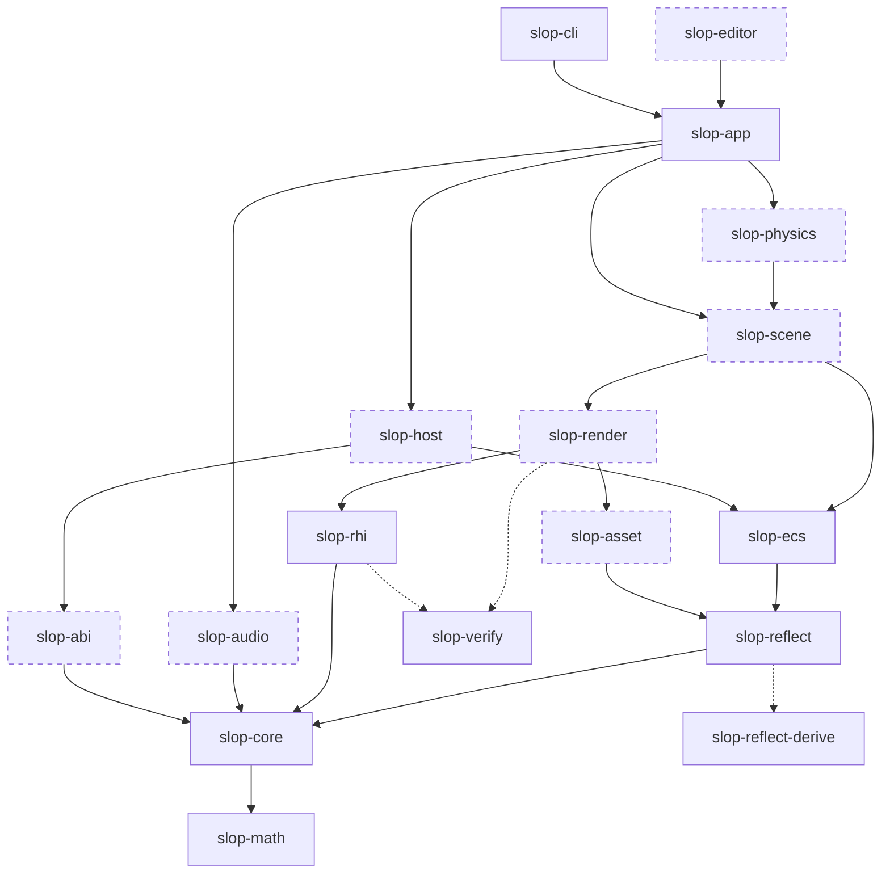
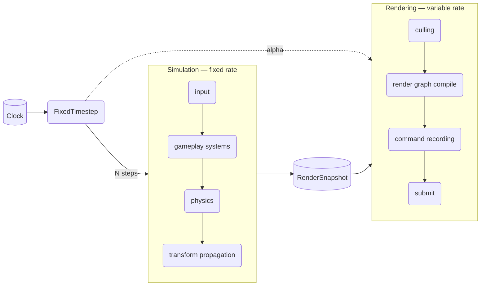
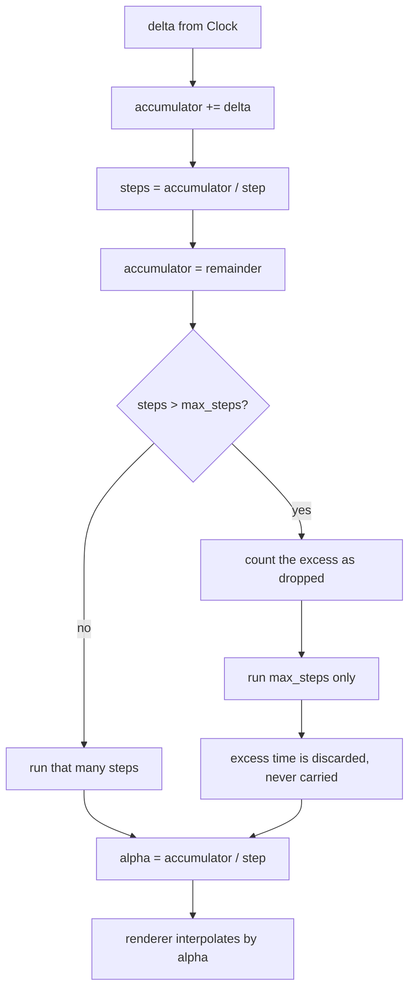
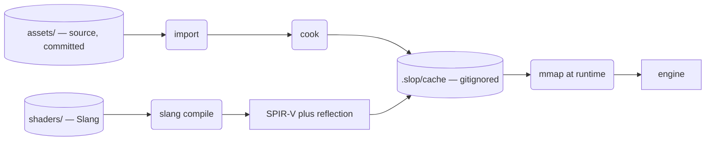
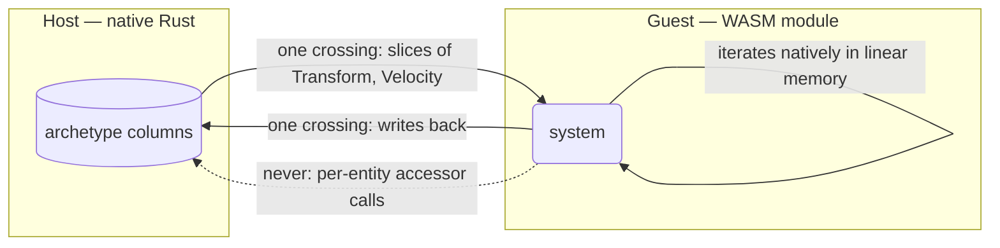

# Architecture

**Last updated:** 2026-08-01

Cross-crate structure and data flow. Decisions and their reasoning live in
[DESIGN.md](DESIGN.md); this document shows how the pieces relate.

---

## 1. Crate layering

Crates depend only downward. Cargo enforces this — a cycle is a build error, not
a review comment — which is why the engine's layering lives in the crate graph
rather than in directory names (`CONVENTIONS.md` §2).

Solid arrows are dependencies that exist or are planned. Dashed boxes are crates
from `DESIGN.md` §4 that do not exist yet.

`slop-math`, `slop-core`, `slop-reflect`, `slop-reflect-derive`, `slop-ecs`,
`slop-rhi`, `slop-app`, `slop-cli`, and `slop-verify` exist today. The rest land
at the milestones in `DESIGN.md` §6.

`slop-ecs` and `slop-reflect` are drawn solid as of M1. What they still lack —
system scheduling, change detection, command buffers — is listed in their own
documents rather than implied by the diagram; a crate existing is not a crate
being finished.

The dashed arrows into `slop-verify` are **dev-dependencies**, which is why they
run upward against the layering without breaking it: nothing it contains reaches
a shipped game, and it depends on none of the crates that depend on it. It is
the golden-image harness (`DESIGN.md` §5), and `slop-render` picks it up at M3.

---

## 2. Frame structure

Simulation runs at a fixed rate and rendering at whatever the display allows,
with the renderer interpolating between the two most recent simulation states
(`DESIGN.md` §2.7).

The renderer never reads live simulation state. It consumes an immutable
snapshot (`DESIGN.md` §2.9) — the single most load-bearing invariant in the
engine, because pipelining, deterministic replay, and interpolation all depend
on it.

Whether rendering runs a full frame behind simulation is a scheduling toggle,
not an architectural question — the snapshot is what makes it one. See
`DESIGN.md` §8 item 3.

---

## 3. Fixed-timestep accumulation

How wall-clock time becomes a whole number of simulation steps, and why a slow
frame cannot compound into a permanent backlog.

The remainder is taken out of the accumulator *before* clamping. That is what
discards excess time rather than deferring it — a carried backlog would return
`max_steps` on every subsequent frame and never catch up, which is the spiral of
death.

---

## 4. Asset pipeline

Shipping builds never parse a source asset (`DESIGN.md` §2.8). Cooking is a
build step for content, cached on content hash plus importer version.

Two properties this depends on and that are easy to break:

- **Content hashing requires byte-stable sources.** `.gitattributes` normalizes
  every text file to LF, because a shader differing only by line ending hashes
  differently on Windows and Linux and silently defeats the cache.
- **Cooked output is never committed.** Source and cooked live in physically
  separate trees so a stale artifact cannot be checked in against a changed
  source.

---

## 5. Extension boundary

Gameplay and third-party extensions run as WebAssembly modules (`DESIGN.md`
§2.3). Rust has no stable ABI, so native dynamic-library plugins are not an
option; WASM provides a versioned one, plus sandboxing, determinism, and hot
reload.

The boundary is columnar and bulk — never per-entity. A guest calling
`get_transform(entity)` a million times per frame is the failure mode the design
exists to prevent.

This is why storage is archetype rather than sparse-set (`DESIGN.md` §2.10):
archetype tables *are* contiguous columns, so handing a slice to a guest is free.
Sparse-set would require gathering scattered data into a temporary buffer every
frame — exactly the cost the columnar ABI exists to avoid.
