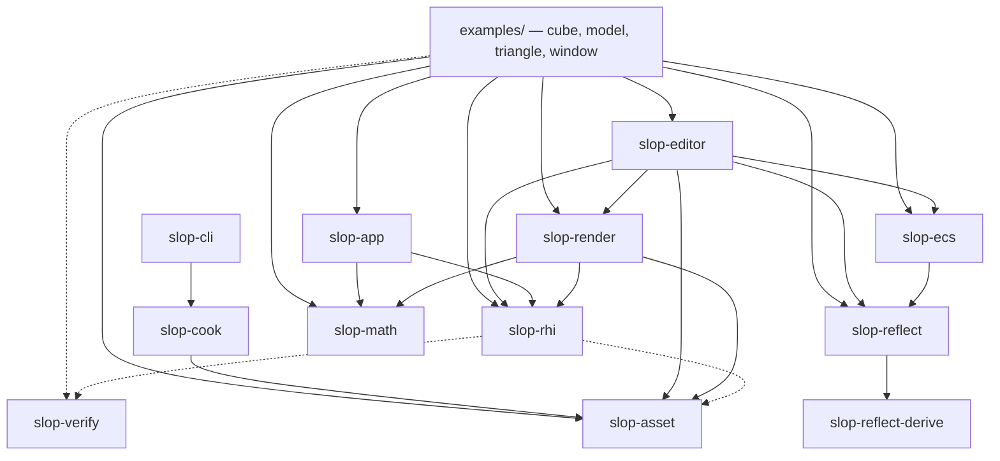
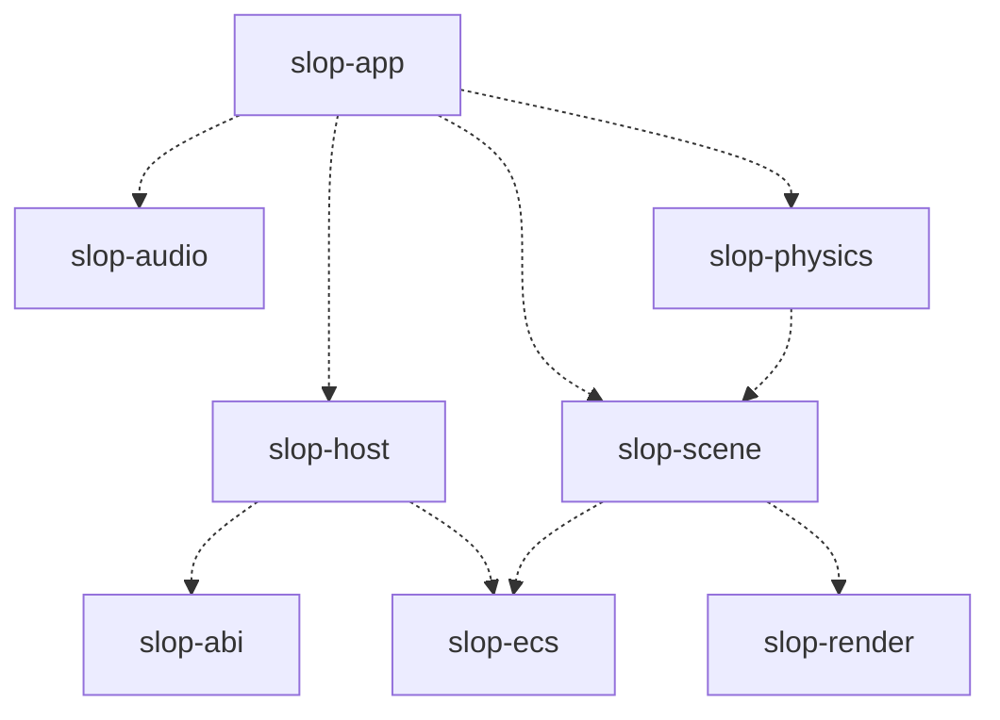
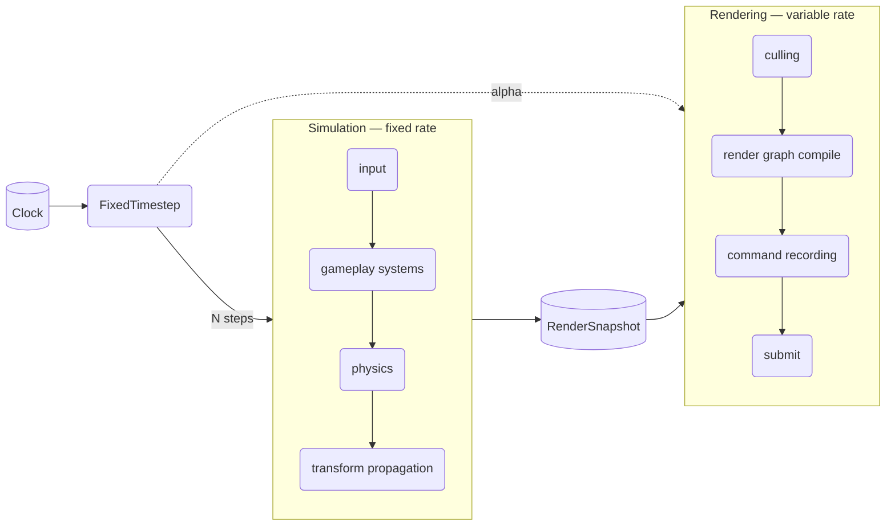
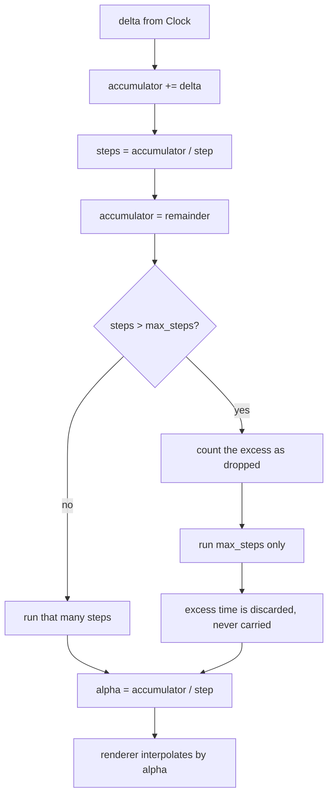
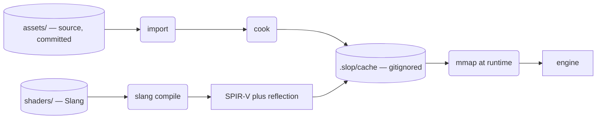
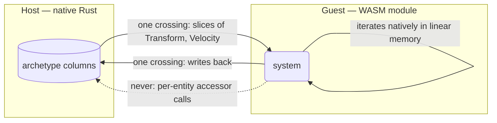

# Architecture

**Last updated:** 2026-08-03

Cross-crate structure and data flow. Decisions and their reasoning live in
[DESIGN.md](DESIGN.md); this document shows how the pieces relate.

---

## 1. Crate layering

Crates depend only downward. Cargo enforces this — a cycle is a build error, not
a review comment — which is why the engine's layering lives in the crate graph
rather than in directory names (`CONVENTIONS.md` §2).

### 1.1 What exists today

Read off the manifests, not from intent. Solid arrows are `[dependencies]`,
dashed arrows are `[dev-dependencies]`.

**Edges into `slop-core` are omitted for legibility.** Every crate depends on it
except `slop-math`, `slop-verify` and `slop-reflect-derive`, which are leaves.

Four properties of this graph are load-bearing, and each is enforced by Cargo
rather than by review:

- **`slop-cli` depends on `slop-cook`, not on `slop-app`.** The cooker is a
  library and the CLI is one front end over it; `DESIGN.md` §2.12's editor is the
  other. Nothing in the cook path links a renderer or a window.
- **Nothing but `slop-cli` depends on `slop-cook`.** That is what makes §2.8's
  "a shipping build never parses a glTF" a property of the dependency graph
  rather than a habit — `gltf`, `png`, `intel_tex_2` and `serde_json` cannot
  reach a game because no edge exists to carry them.
- **`slop-editor` does not depend on `slop-app`.** §2.12 says the editor embeds
  the application layer exactly as a game does; today it sits *beside* it, and an
  example wires the two together. Neither depends on the other, which is what
  keeps that claim available.
- **`slop-app` depends on neither `slop-render` nor `slop-ecs`.** Device
  bring-up, windowing and configuration are genuinely independent of what is
  drawn or simulated.

One absent edge is worth stating, because the layering in `DESIGN.md` §4 implies
it: **`slop-core` does not depend on `slop-math`.** §4 lists math first because
it is conceptually the lowest layer, but the two are siblings and neither
includes the other.

The two dashed edges out of `slop-rhi` are both test-only and both deliberate.
`slop-asset` is there because the golden and shader tests load cooked SPIR-V —
**the RHI itself takes bytes and knows nothing about where assets live**, which
is what keeps the headless path free of a file system. `slop-verify` is the
golden-image harness (`DESIGN.md` §5). Dev-dependencies run upward against the
layering without breaking it: nothing they contain reaches a shipped game, and
neither depends on the crates that depend on them.

`slop-render` still has no direct golden coverage — everything it does needs a
surface, so the coverage sits in `examples/cube` and `examples/model` instead
(`docs/slop-render/README.md` §6).

**A crate existing is not a crate being finished.** `slop-ecs` and `slop-reflect`
are complete for M1. `slop-asset` and `slop-cook` carry M2 in full — cook cache,
VFS, glTF and PNG import, BC7 with mip chains, materials, tangents, the registry
and hot reload — and still want async streaming. `slop-render` holds the frame
loop and `MeshRenderer`; the render graph and the passes are M3. What each crate
lacks is listed in its own document rather than implied by this diagram.

### 1.2 Where the unbuilt crates attach

From `DESIGN.md` §4. None of these exist; the diagram is the plan, not the tree.

`slop-scene` is the runtime spatial structure — hierarchy, transform
propagation, culling — and sits between the ECS and the renderer. Whether the
gameplay layer above it is WASM or something else is an open question rather
than a settled one; `CONSIDERATIONS.md` records the C# proposal, which `DESIGN.md`
§2.3 does not yet reflect and which wants deciding before M4 builds the WASM
gameplay ABI.

---

## 2. Frame structure

Simulation runs at a fixed rate and rendering at whatever the display allows,
with the renderer interpolating between the two most recent simulation states
(`DESIGN.md` §2.7).

The renderer never reads live simulation state. It consumes an immutable
snapshot (`DESIGN.md` §2.9) — the single most load-bearing invariant in the
engine, because pipelining, deterministic replay, and interpolation all depend
on it.

Whether rendering runs a full frame behind simulation is a scheduling toggle,
not an architectural question — the snapshot is what makes it one. See
`DESIGN.md` §8 item 3.

---

## 3. Fixed-timestep accumulation

How wall-clock time becomes a whole number of simulation steps, and why a slow
frame cannot compound into a permanent backlog.

The remainder is taken out of the accumulator *before* clamping. That is what
discards excess time rather than deferring it — a carried backlog would return
`max_steps` on every subsequent frame and never catch up, which is the spiral of
death.

---

## 4. Asset pipeline

Shipping builds never parse a source asset (`DESIGN.md` §2.8). Cooking is a
build step for content, cached on content hash plus importer version.

Two properties this depends on and that are easy to break:

- **Content hashing requires byte-stable sources.** `.gitattributes` normalizes
  every text file to LF, because a shader differing only by line ending hashes
  differently on Windows and Linux and silently defeats the cache.
- **Cooked output is never committed.** Source and cooked live in physically
  separate trees so a stale artifact cannot be checked in against a changed
  source.

---

## 5. Extension boundary

Gameplay and third-party extensions run as WebAssembly modules (`DESIGN.md`
§2.3). Rust has no stable ABI, so native dynamic-library plugins are not an
option; WASM provides a versioned one, plus sandboxing, determinism, and hot
reload.

The boundary is columnar and bulk — never per-entity. A guest calling
`get_transform(entity)` a million times per frame is the failure mode the design
exists to prevent.

This is why storage is archetype rather than sparse-set (`DESIGN.md` §2.10):
archetype tables *are* contiguous columns, so handing a slice to a guest is free.
Sparse-set would require gathering scattered data into a temporary buffer every
frame — exactly the cost the columnar ABI exists to avoid.
