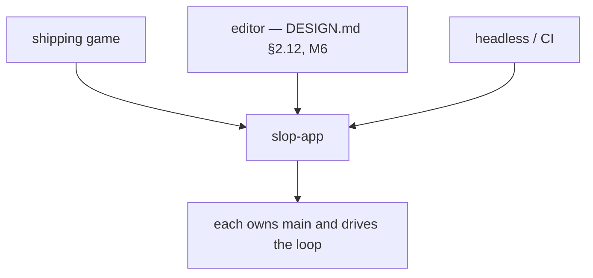
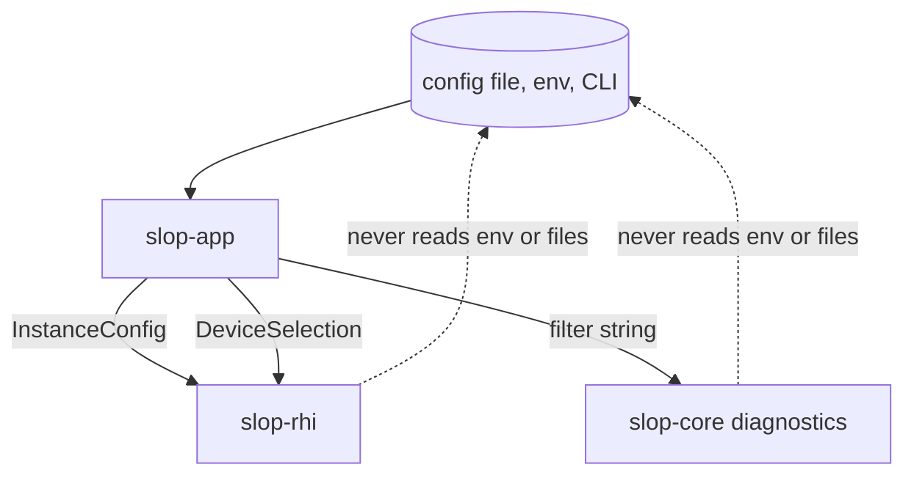
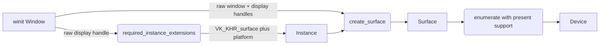

# slop-app

**Last updated:** 2026-08-03

## 1. Purpose

The application layer — main loop, module and plugin wiring, configuration.

This is a **library, not a framework entry point**. The game owns `main()` and
can drive the loop itself (`DESIGN.md` §1.2 principle 4). Runnable targets live
in `examples/`, and the editor embeds this crate exactly as a shipping game does
— it is not a privileged mode inside the engine (`DESIGN.md` §2.12).

## 2. Status

Small, and deliberately so. It owns bring-up and configuration, not the frame
loop — that is `slop-render`'s, and it landed there during M2.

| Area | State | Milestone |
|---|---|---|
| `logging` — log filter policy, `SLOP_LOG` | Landed | M0 |
| `window` — creation, and the winit-to-Vulkan seam | Landed | M0 |
| `gpu` — `Gpu`: window, surface, device and allocator in drop order | Landed | M2 |
| `timing` — `FrameTimes`, a ring of frame durations | Landed | M2 |
| Event-loop shell — `ApplicationHandler`, resize, `SLOP_FRAMES` | **Absent** — see below | M3 |
| Configuration file, CLI arguments | Planned | M3 |
| Module and plugin wiring | Planned | M4 |

**`Gpu` is what removed the last `unsafe` from every example.** `create_surface`
is unsafe for one reason — the window must outlive the surface — and holding the
four objects in one type with a declared drop order discharges that obligation
once, here, rather than at every call site.

**The event-loop shell is still copied, four times.** `window`, `triangle`,
`cube` and `model` each carry an `App`/`Renderer` pair, an
`impl ApplicationHandler`, and hand-rolled `SLOP_FRAMES` parsing.
`CONVENTIONS.md` §2.3's "third copy is the trigger to extract" is the rule that
correctly produced `FrameRenderer` and `Gpu` — it fired on the frame loop and the
extraction stopped halfway, taking everything *except* the loop, which is the
part actually being copied. It is at four copies, one past the trigger.
`CONSIDERATIONS.md` item 4 records it; this crate is the right home and already
depends on `winit`.

## 3. The three consumers

The same crate, embedded three ways. Nothing here may assume which one it is
running under — that assumption is what turns an engine into a framework.

**The editor arrow is the plan, not the tree.** `slop-editor` today is the debug
UI layer (§10.2) and does not depend on this crate at all — the examples wire the
two together. §10.1's editor application is M6, and it is the one that will embed
this crate as a game does.

Headless is not a debug convenience. It is what makes deterministic replay,
golden-image tests, and the frame-budget harness possible (`DESIGN.md` §5), so
it is a first-class consumer from M0.

## 4. The only layer that reads configuration

`CONVENTIONS.md` §5.1: engine crates take parameters, and this crate turns
files, environment variables, and command-line arguments into those parameters.
Nothing below here knows a config file exists.

Three things this buys, none of which survive a shared global:

- A game, the editor, a test harness, and headless CI each configure the same
  engine differently, without any of them fighting over ambient state.
- A crate's behaviour is a function of its arguments, so a test can set up any
  configuration without touching the process environment.
- There is no central `Config` type to become a dependency magnet — each crate
  owns its own, and this crate assembles them.

`logging` is the worked example: `slop-core::diagnostics` takes a filter string
and reads nothing, while `logging::filter_from_env` decides that the filter comes
from `SLOP_LOG`.

## 5. The winit-to-Vulkan seam

This is the only place in the engine that knows both a windowing library and
Vulkan exist. `slop-rhi` takes raw handles and has no `winit` dependency;
`winit` knows nothing about Vulkan.

The ordering is a Vulkan constraint, not an arbitrary one: the instance must be
created *already knowing* which surface extensions the display needs, so the
window has to exist first.

**No event loop or main loop lives here.** `DESIGN.md` §1.2 principle 4 says the
game owns `main()`, so the caller implements winit's `ApplicationHandler` and
drives the loop. Wrapping that would make the engine a framework, and the loop's
eventual shape depends on the renderer — the same reasoning that keeps the M0
RHI thin (`PLAN.md` §4.1-D). `examples/window` is the worked example.

## 6. Decisions

| Decision | Where |
|---|---|
| The engine is a library, not a framework | `DESIGN.md` §1.2 principle 4 |
| Editor is a host application, not an engine mode | `DESIGN.md` §2.12 |
| Fixed-timestep sim, interpolated rendering | `DESIGN.md` §2.7 |
| Renderer consumes a snapshot, never live world state | `DESIGN.md` §2.9 |

## 7. Invariants

1. **No hidden global state.** No singleton device, world, or "current app".
   Globals are exactly what make headless mode, multiple editor worlds, and
   deterministic replay impossible.
2. **The main loop is drivable step by step.** A caller must be able to run one
   iteration rather than surrendering the thread to a `run()` that never
   returns — the editor and the test harness both require this.
3. **The renderer receives a snapshot, never the live world** (`DESIGN.md` §2.9).
4. **Headless is a supported path, tested in CI**, not a flag that rots.
5. **Configuration is read here and nowhere below.** A crate reaching for an
   environment variable or a file is a layering violation, not a shortcut — it
   picks up configuration the application never chose.
6. **No central `Config` struct.** It would have to name every crate's types,
   inverting the dependency graph, and every crate would come to depend on it.
   Each crate owns its own; this one assembles them.
7. **`winit` is re-exported and must not be duplicated.** A consumer depending
   on its own `winit` risks two versions in the graph, which makes the
   `raw-window-handle` types incompatible and breaks surface creation with an
   error that reads as nonsense.
8. **A `Surface` must be dropped before its window.** Vulkan cannot detect a
   surface outliving its window. Keep them in one struct with the surface
   declared first, as `examples/window` does.
