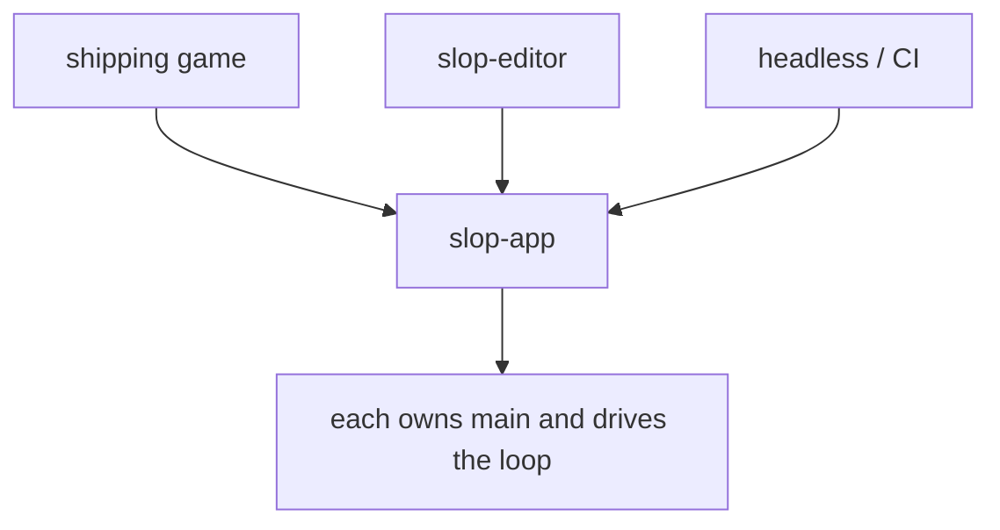

# slop-app

**Last updated:** 2026-08-01

## 1. Purpose

The application layer — main loop, module and plugin wiring, configuration.

This is a **library, not a framework entry point**. The game owns `main()` and
can drive the loop itself (`DESIGN.md` §1.2 principle 4). Runnable targets live
in `examples/`, and the editor embeds this crate exactly as a shipping game does
— it is not a privileged mode inside the engine (`DESIGN.md` §2.12).

## 2. Status

Stub.

| Area | State | Milestone |
|---|---|---|
| Window creation via `winit` | Planned | M0 |
| Main loop wiring sim and render | Planned | M0 |
| Configuration | Planned | M2 |
| Module and plugin wiring | Planned | M4 |

## 3. The three consumers

The same crate, embedded three ways. Nothing here may assume which one it is
running under — that assumption is what turns an engine into a framework.

Headless is not a debug convenience. It is what makes deterministic replay,
golden-image tests, and the frame-budget harness possible (`DESIGN.md` §5), so
it is a first-class consumer from M0.

## 4. Decisions

| Decision | Where |
|---|---|
| The engine is a library, not a framework | `DESIGN.md` §1.2 principle 4 |
| Editor is a host application, not an engine mode | `DESIGN.md` §2.12 |
| Fixed-timestep sim, interpolated rendering | `DESIGN.md` §2.7 |
| Renderer consumes a snapshot, never live world state | `DESIGN.md` §2.9 |

## 5. Invariants

1. **No hidden global state.** No singleton device, world, or "current app".
   Globals are exactly what make headless mode, multiple editor worlds, and
   deterministic replay impossible.
2. **The main loop is drivable step by step.** A caller must be able to run one
   iteration rather than surrendering the thread to a `run()` that never
   returns — the editor and the test harness both require this.
3. **The renderer receives a snapshot, never the live world** (`DESIGN.md` §2.9).
4. **Headless is a supported path, tested in CI**, not a flag that rots.
