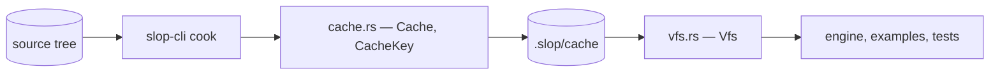
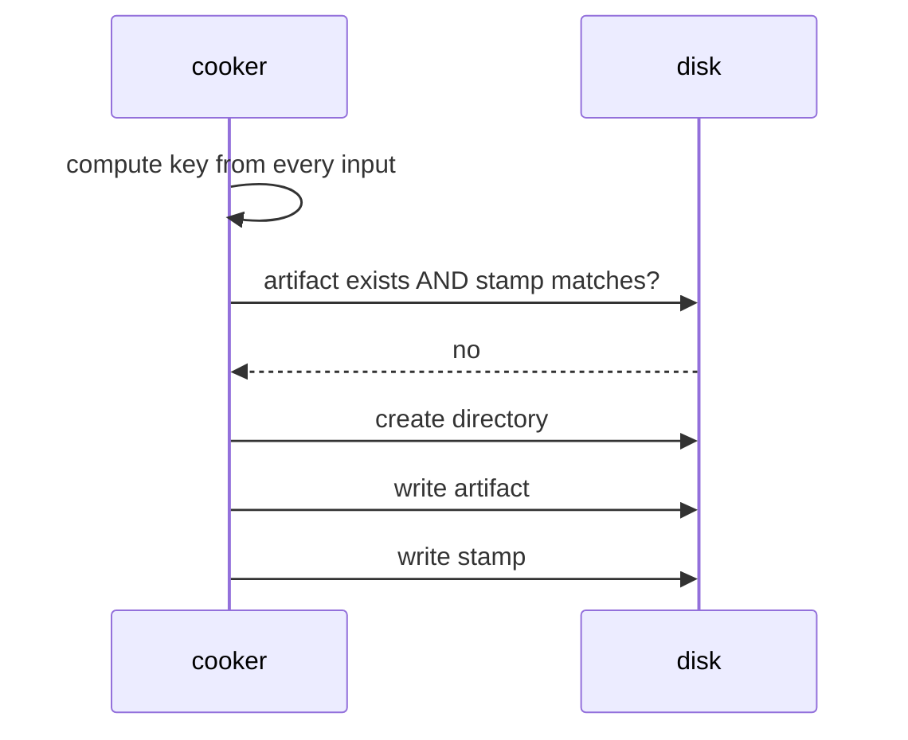

# slop-asset

**Last updated:** 2026-08-02

## 1. Purpose

The content pipeline — `DESIGN.md` §2.8. **A shipping build never parses a source
asset.** Cooking turns a `.slang`, a `.gltf` or a `.png` into bytes the engine
loads directly, keyed by the content that produced them.

```
 source tree            cache                          runtime
 shaders/tri.slang  →   .slop/cache/shaders/tri.spv  →  Vfs::read
        (cook, offline)                  (load, every run)
```

It deliberately does not contain: anything that knows what a mesh, a shader or a
texture *means*. A cooked artifact is bytes at a logical path, and the crate that
cooked it is the one that understands the format.

## 2. Status

| Area | State | Milestone |
|---|---|---|
| `Cache` — layout, content-hash keying, stamps | Landed | M2 |
| `Vfs` — reading cooked bytes at runtime | Landed | M2 |
| Shader cooking driven onto the cache | Landed — in `slop-cli` | M2 |
| `Mesh` — the cooked mesh format | Landed | M2 |
| glTF import + cook | Landed — importer in `slop-cli` | M2 |
| Texture compression | Planned | M2 |
| Async streaming | Planned — **beside** the sync read, not replacing it | M2 |
| Asset handles and a registry of loaded assets | Planned — waits for something that holds one | M2 |
| Hot reload | Planned | M2 |
| Dependency graph across assets | Planned | M2 |

## 3. Module map



Two halves that never meet in one process: `Cache` is the write side and only
`slop-cli` uses it; `Vfs` is the read side and is what ships.

## 4. Key types

| Type | Role | Decision |
|---|---|---|
| `CacheKey` | A content hash over every input that decides an artifact's bytes | §5.1 |
| `KeyBuilder` | Accumulates those inputs, labelled and length-prefixed | §5.1 |
| `Cache` | Where an artifact lives, and whether it is still current | §5.2 |
| `Vfs` | Reading cooked bytes by logical path | §5.3 |

## 5. Diagrams

### 5.1 Why keying is the part worth getting right

A cook cache that misses a change ships a stale artifact, and the symptom
surfaces somewhere unrelated. **That failure has already happened once in this
project.** An early version keyed a shader on its own bytes alone, so editing a
shared `#include` changed what every dependent compiled to while every stamp
still matched. The cache was *wrong*, not merely stale.

So every input is labelled and length-prefixed:

```rust
CacheKey::builder()
    .input("cooker",   &COOKER_VERSION.to_le_bytes())
    .input("compiler", compiler_version.as_bytes())
    .input("includes", include_digest.as_bytes())
    .input("source",   source_bytes)
    .finish()
```

Two properties, both tested:

- **Length prefixes** stop inputs running together at the boundary. Without them
  a source ending `"abc"` followed by a version `"1"` hashes the same as one
  ending `"ab"` followed by `"c1"`, so a source change could be cancelled out by
  a version change.
- **Labels** make an omission visible. Adding an input means naming it, and
  reading a cooker back shows what it does and does not depend on — which is
  exactly what was missing when the include bug shipped.

The cooker's own version is an input too. A change to how cooking works must
invalidate everything, and forgetting that is the classic way a cache becomes
untrustworthy after a compiler upgrade.

### 5.2 The stamp discipline

Beside every artifact is a `.stamp` holding the key that produced it.



Two rules, and both are load-bearing:

1. **An artifact is current only if the file exists *and* the stamp matches.**
   Never the stamp alone — a stamp promises an artifact, and a deleted one makes
   that promise false. Trusting it would report a build complete with nothing to
   load.
2. **The stamp is written after the artifact.** An interrupted cook then leaves a
   missing stamp rather than one vouching for a half-written file. Reversing the
   order turns rerun-and-recover into a corrupt cache.

### 5.3 Logical paths

A caller says `shaders/passes/triangle.spv`, never `.slop/cache/...`. Layout is
this crate's business, which is what lets it change — to a packed archive for a
shipped build, to an override directory for a mod — without a call site moving.

The **writer and the reader are handed the same string**, so they cannot disagree
about where a thing is:

| | Takes |
|---|---|
| `Cache::artifact` | `shaders/passes/triangle.spv` |
| `Vfs::read` | `shaders/passes/triangle.spv` |

Separators are always `/`. A logical path is a name rather than something the OS
sees, so letting it vary by platform would give one asset two names.

Absolute paths and `..` are **refused rather than normalised**. An asset name
reaching arbitrary files is the shape of a real vulnerability once names come
from content rather than from source code.

## 6. Decisions

| Decision | Where |
|---|---|
| A shipping build never parses a source asset | `DESIGN.md` §2.8 |
| Content-hash keying, not timestamps | `DESIGN.md` §2.8 |
| Sync read now, async streaming beside it later | `PLAN.md` §6.1 |
| No `Cooker` trait yet | `PLAN.md` §6.1, and §7 below |
| No asset handles yet | `PLAN.md` §6.1 |

**Why there is no `Cooker` trait.** A shader is one source to one artifact; a
glTF is one source to *many* — meshes, textures, materials. A trait shaped by the
first would break on the second, and designing it against one real implementor
and one imagined one is how an abstraction ends up wrong in a way that is
expensive to undo. What is genuinely shared is the **cache**, and that is what
was factored out. The trait waits until two kinds disagree usefully.

**Why the sync read is not a placeholder.** §2.8 also calls for async streaming,
and this blocks. The two are not alternatives: a blocking read stays correct for
startup, for tools, and for the cooker itself. Streaming is an additional entry
point beside this one. It is recorded in `PLAN.md` §6.1 precisely so that "the
VFS is synchronous" is not mistaken for a shortcut.

## 7. Invariants

1. **An artifact is current only if it exists and its stamp matches.** Never the
   stamp alone.
2. **The stamp is written after the artifact**, so a crash between the two leaves
   a missing stamp rather than a false promise.
3. **Every input to a key is labelled and length-prefixed.** Adding an unlabelled
   or unprefixed input reopens the bug that made this cache wrong once already.
4. **The cooker's own version is an input.** Changing how cooking works
   invalidates everything, and nothing else will notice if this is forgotten.
5. **Logical paths use `/` on every platform**, are relative, and never contain
   `..`. They are names, not filesystem paths.
6. **The read side knows nothing about formats.** `Vfs` returns bytes; whoever
   asked for them is what understands them. A `Vfs` that learned about SPIR-V
   would learn about glTF next, and then it would be the engine.
7. **The write side never ships.** `Cache` exists for `slop-cli`. If engine code
   reaches for it, something has been built the wrong way round — the engine
   loads cooked bytes and compiles nothing (`DESIGN.md` §2.8).
