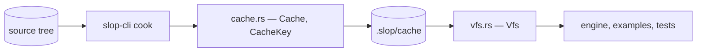
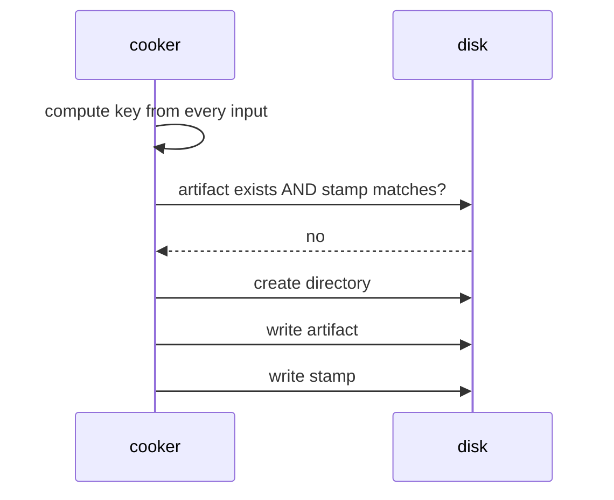
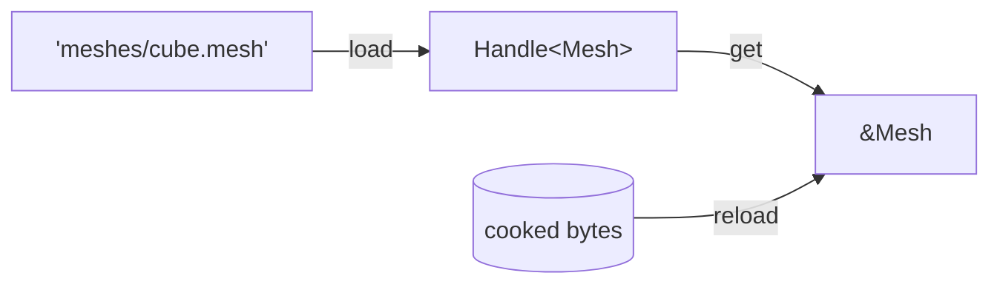

# slop-asset

**Last updated:** 2026-08-02

## 1. Purpose

The content pipeline — `DESIGN.md` §2.8. **A shipping build never parses a source
asset.** Cooking turns a `.slang`, a `.gltf` or a `.png` into bytes the engine
loads directly, keyed by the content that produced them.

```
 source tree            cache                          runtime
 shaders/tri.slang  →   .slop/cache/shaders/tri.spv  →  Vfs::read
        (cook, offline)                  (load, every run)
```

It deliberately does not contain: anything that knows what a mesh, a shader or a
texture *means*. A cooked artifact is bytes at a logical path, and the crate that
cooked it is the one that understands the format.

## 2. Status

| Area | State | Milestone |
|---|---|---|
| `Cache` — layout, content-hash keying, stamps | Landed | M2 |
| `Vfs` — reading cooked bytes at runtime | Landed | M2 |
| Shader cooking driven onto the cache | Landed — in `slop-cli` | M2 |
| `Mesh` — the cooked mesh format | Landed | M2 |
| glTF import + cook | Landed — importer in `slop-cli` | M2 |
| `Texture` — the cooked texture format | Landed | M2 |
| PNG import + cook | Landed — importer in `slop-cli` | M2 |
| Proven end to end — `examples/cube` draws only cooked assets | Landed — see §5.4 | M2 |
| `Assets<T>` — the registry, `Handle<T>`, load, reload, unload | Landed — see §5.5 | M2 |
| Block compression (BC7) | Planned | M2 |
| Async streaming | Planned — **beside** the sync read, not replacing it | M2 |
| Hot reload | Planned — the registry is the half it needs | M2 |
| Reference counting to decide when to unload | Planned — waits for something holding handles | M2/M3 |
| Dependency graph across assets | Planned | M2 |

## 3. Module map



Two halves that never meet in one process: `Cache` is the write side and only
`slop-cli` uses it; `Vfs` is the read side and is what ships.

## 4. Key types

| Type | Role | Decision |
|---|---|---|
| `CacheKey` | A content hash over every input that decides an artifact's bytes | §5.1 |
| `KeyBuilder` | Accumulates those inputs, labelled and length-prefixed | §5.1 |
| `Cache` | Where an artifact lives, and whether it is still current | §5.2 |
| `Vfs` | Reading cooked bytes by logical path | §5.3 |

## 5. Diagrams

### 5.1 Why keying is the part worth getting right

A cook cache that misses a change ships a stale artifact, and the symptom
surfaces somewhere unrelated. **That failure has already happened once in this
project.** An early version keyed a shader on its own bytes alone, so editing a
shared `#include` changed what every dependent compiled to while every stamp
still matched. The cache was *wrong*, not merely stale.

So every input is labelled and length-prefixed:

```rust
CacheKey::builder()
    .input("cooker",   &COOKER_VERSION.to_le_bytes())
    .input("compiler", compiler_version.as_bytes())
    .input("includes", include_digest.as_bytes())
    .input("source",   source_bytes)
    .finish()
```

Two properties, both tested:

- **Length prefixes** stop inputs running together at the boundary. Without them
  a source ending `"abc"` followed by a version `"1"` hashes the same as one
  ending `"ab"` followed by `"c1"`, so a source change could be cancelled out by
  a version change.
- **Labels** make an omission visible. Adding an input means naming it, and
  reading a cooker back shows what it does and does not depend on — which is
  exactly what was missing when the include bug shipped.

The cooker's own version is an input too. A change to how cooking works must
invalidate everything, and forgetting that is the classic way a cache becomes
untrustworthy after a compiler upgrade.

### 5.2 The stamp discipline

Beside every artifact is a `.stamp` holding the key that produced it.



Two rules, and both are load-bearing:

1. **An artifact is current only if the file exists *and* the stamp matches.**
   Never the stamp alone — a stamp promises an artifact, and a deleted one makes
   that promise false. Trusting it would report a build complete with nothing to
   load.
2. **The stamp is written after the artifact.** An interrupted cook then leaves a
   missing stamp rather than one vouching for a half-written file. Reversing the
   order turns rerun-and-recover into a corrupt cache.

### 5.3 Logical paths

A caller says `shaders/passes/triangle.spv`, never `.slop/cache/...`. Layout is
this crate's business, which is what lets it change — to a packed archive for a
shipped build, to an override directory for a mod — without a call site moving.

The **writer and the reader are handed the same string**, so they cannot disagree
about where a thing is:

| | Takes |
|---|---|
| `Cache::artifact` | `shaders/passes/triangle.spv` |
| `Vfs::read` | `shaders/passes/triangle.spv` |

Separators are always `/`. A logical path is a name rather than something the OS
sees, so letting it vary by platform would give one asset two names.

Absolute paths and `..` are **refused rather than normalised**. An asset name
reaching arbitrary files is the shape of a real vulnerability once names come
from content rather than from source code.

### 5.4 What proves the pipeline works

`examples/cube` holds no geometry, no texture and no shader in code. All three
are cooked artifacts read through the `Vfs`, and the example's golden image is
what says the pipeline delivered them intact.

That only means something because of how the source assets were made. Each was
**generated from the code it replaced** — `assets/checker.png` from the
procedural `checkerboard()`, `assets/cube.gltf` plus `cube.bin` from the
`VERTICES`/`INDICES` consts — so the reference image predates the pipeline being
in the path at all:

```
 before:  const VERTICES  ──────────────────────────► render ──► reference.png
 after:   assets/cube.gltf ──► cook ──► cache ──► Vfs ──► render ──► must match
```

A reference regenerated *by* the pipeline would accept whatever the pipeline
produced, including a dropped channel or a mangled accessor, as long as it was
stable. One that predates it cannot. Every stage is covered: parsing, keying,
cache lookup, the logical path, decoding, and the upload.

The narrower assertions live beside it — `examples/cube/tests/mesh.rs` and
`tests/texture.rs` — and say what the image cannot: that the winding is
counter-clockwise, that no index is out of range, that the checkerboard actually
alternates. These are the mistakes that still *draw something*, which is why they
are checked against the cooked artifact rather than left to the pixels.

### 5.5 The registry, and why it came before its consumers

`Assets<T>` maps a logical path to a `Handle<T>` and owns what is behind it.



Loading is **idempotent by name** — two hundred references to one mesh decode
once and share a handle. That alone justifies it, but it is not the reason it was
built now.

**A handle is a seam.** `DESIGN.md` §1.2 principle 6 — defer implementations
freely, never seams — decides the ordering. `slop-render` lands at M3 and will be
written against whatever the asset API is at that moment. If that is `Mesh` by
value, then streaming and hot reload each become a refactor of every call site;
if it is `Handle<Mesh>`, they are code behind an API nobody has to notice. So the
seam goes in first and the implementations follow, which is the opposite of the
order the feature list suggests.

Three properties are load-bearing, and each has a test that fails without it:

1. **Unloading frees the name as well as the slot.** Leaving the path mapped
   would make the next `load` hand back a handle to an emptied slot — the
   registry vouching for something it just dropped.
2. **A reload decodes before it replaces.** Saving a broken mesh mid-session logs
   an error and keeps the old one, rather than leaving a hole where the model
   was. The same check-then-commit shape `slop-ecs`'s serializer uses.
3. **A failed load caches nothing.** Fixing the asset and asking again works;
   poisoning the name would mean restarting the game to recover.

`revision()` is the part that is easy to leave out and impossible to add
retroactively without a second pass over every consumer. Something that uploaded
a mesh to the GPU holds a handle whose *contents* changed underneath it — with no
counter to compare, hot reload updates the CPU-side asset and nothing on screen
moves.

**Why `Handle<T>` and not `Arc<Mesh>`.** Refcounts are the conventional answer
and are simpler right up until an untrusted WASM guest holds one, at which point
they are a pointer the guest can forge. §2.3 makes a handle an opaque integer
across that boundary, and a generational handle is checkable: a stale one fails a
lookup instead of reading freed memory.

**Why `Asset` is a trait when `Cooker` is not.** Cooking is one source to *many*
artifacts for glTF and one-to-one for a shader, so a trait shaped by either
breaks on the other (§6 below). Loading is one artifact to one asset, always —
that is what cooking *is*. `Mesh::read` and `Texture::read` already had identical
signatures; the trait names an agreement rather than imposing one.

## 6. Decisions

| Decision | Where |
|---|---|
| A shipping build never parses a source asset | `DESIGN.md` §2.8 |
| Content-hash keying, not timestamps | `DESIGN.md` §2.8 |
| Sync read now, async streaming beside it later | `PLAN.md` §6.1 |
| No `Cooker` trait yet | `PLAN.md` §6.1, and §7 below |
| Handles are a seam, so the registry precedes its consumers | §5.5 above |

**Why there is no `Cooker` trait.** A shader is one source to one artifact; a
glTF is one source to *many* — meshes, textures, materials. A trait shaped by the
first would break on the second, and designing it against one real implementor
and one imagined one is how an abstraction ends up wrong in a way that is
expensive to undo. What is genuinely shared is the **cache**, and that is what
was factored out. The trait waits until two kinds disagree usefully.

**Why the sync read is not a placeholder.** §2.8 also calls for async streaming,
and this blocks. The two are not alternatives: a blocking read stays correct for
startup, for tools, and for the cooker itself. Streaming is an additional entry
point beside this one. It is recorded in `PLAN.md` §6.1 precisely so that "the
VFS is synchronous" is not mistaken for a shortcut.

## 7. Invariants

1. **An artifact is current only if it exists and its stamp matches.** Never the
   stamp alone.
2. **The stamp is written after the artifact**, so a crash between the two leaves
   a missing stamp rather than a false promise.
3. **Every input to a key is labelled and length-prefixed.** Adding an unlabelled
   or unprefixed input reopens the bug that made this cache wrong once already.
4. **The cooker's own version is an input.** Changing how cooking works
   invalidates everything, and nothing else will notice if this is forgotten.
5. **Logical paths use `/` on every platform**, are relative, and never contain
   `..`. They are names, not filesystem paths.
6. **The read side knows nothing about formats.** `Vfs` returns bytes; whoever
   asked for them is what understands them. A `Vfs` that learned about SPIR-V
   would learn about glTF next, and then it would be the engine.
7. **The write side never ships.** `Cache` exists for `slop-cli`. If engine code
   reaches for it, something has been built the wrong way round — the engine
   loads cooked bytes and compiles nothing (`DESIGN.md` §2.8).
