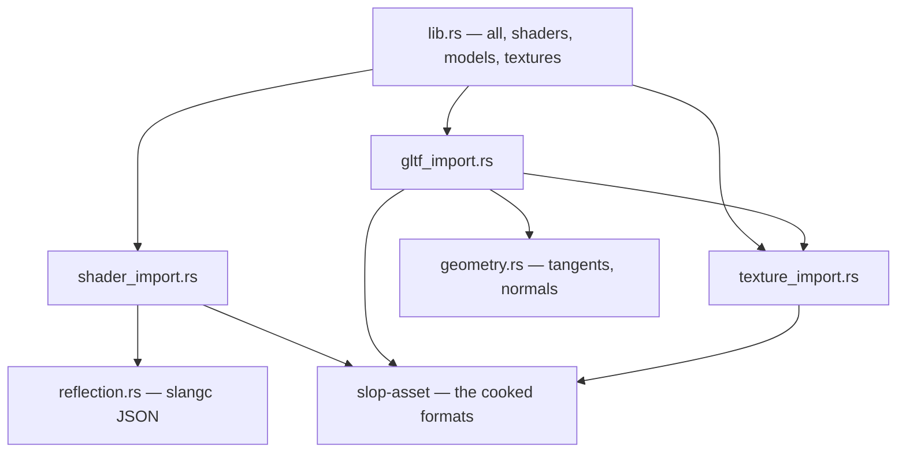

# slop-cook

**Last updated:** 2026-08-03

## 1. Purpose

Source assets in, cooked artifacts out. glTF, PNG and Slang become vertex
buffers, BC7 textures with mip chains, SPIR-V and reflection JSON, keyed on
content hash (`DESIGN.md` §2.8).

**What it deliberately does not own:** the *read* path. `slop-asset` defines the
cooked formats and reads them at runtime; this crate writes them. The two halves
are separate crates so that the writing half can carry a glTF parser, a PNG
decoder and a block compressor without any of them being reachable from a game.

**Nothing that links this crate ships.** `gltf`, `png`, `intel_tex_2` and
`serde_json` live here and nowhere else, and the only crate that depends on this
one is `slop-cli`. That is what makes §2.8's "shipping builds never parse a PNG
or a glTF at runtime" a property of the dependency graph rather than a habit,
and it is `slop-asset` invariant 7 in enforceable form.

It was true by accident before M2 — the cooker happened to be a different binary,
and nothing stopped anything depending on `slop-cli`. It is now true by
construction.

## 2. Status

| Area | State | Milestone |
|---|---|---|
| Shader import — `slangc`, SPIR-V, reflection JSON | Landed | M2 |
| Include-graph digest for shader recooks | Landed, coarse — `PLAN.md` §6.1 | M2 |
| glTF import — primitives, node flattening, materials | Landed | M2 |
| Tangent generation, and normals when a source omits them | Landed | M2 |
| PNG import, BC7 compression | Landed | M2 |
| Mip chain generation, compressed per level | Landed | M2 |
| Per-asset import settings — format, sRGB, mip policy | Planned — `PLAN.md` §6.1 | M2/M3 |
| Better mip kernels, and filtering in linear light | Planned — `PLAN.md` §6.1 | M3 |
| A `Cooker` trait, rather than each kind driving the cache | Planned — `PLAN.md` §6.1 | M2 |
| Typed errors, once a caller branches on the kind | Planned — §5 below | M4 |

## 3. Module map

`gltf_import` depends on `texture_import` because a glTF names its images and
several are embedded in the file rather than beside it. `geometry` was extracted
from `gltf_import` when tangent generation landed: it is pure mathematics over
vertex arrays with no glTF vocabulary in it, and that is what makes it testable
without a file.

## 4. Entry points

| Item | Role |
|---|---|
| `all(root, force)` | Cook shaders, then models, then textures |
| `shaders(root, force)` | Shaders only |
| `models(root, force)` | glTF files, and the materials, images and models they name |
| `textures(root, force)` | Standalone PNGs |
| `Summary` | How many artifacts were cooked and how many were already current |

All four are incremental. An artifact whose stamp still matches its source is
left alone; `force` ignores stamps, which is the escape hatch for when the cache
is suspected of lying.

## 5. Decisions

| Decision | Where |
|---|---|
| Cooked artifacts, content-hash cache, no source parsing at runtime | `DESIGN.md` §2.8 |
| BC7 at one fixed encoder setting, one feature tier | `DESIGN.md` §2.1, `PLAN.md` §6.1 |
| `slangc` as a CLI rather than the Slang library | `PLAN.md` §6.1 |
| Reflection read from `slangc -reflection-json` | `DESIGN.md` §2.11 |
| `anyhow` in a library, against `CONVENTIONS.md` §6 | Below |

**The `anyhow` deviation, argued from the rule's own reason.** `CONVENTIONS.md`
§6 says `thiserror` in libraries because *a caller must be able to match and
respond*. Nothing does here: every caller reports the failure and marks the asset
uncooked. What a cook failure actually owes is the **context chain** — "reading
primitive 3 of mesh 'Body' in sponza.gltf: index 5 names a vertex the primitive
does not have" is the whole diagnosis, and that is what `anyhow` carries and a
flat enum discards.

**The trigger to type these is a caller that branches on the kind** — §2.12's
editor showing a missing-texture failure differently from a malformed-file one.
`anyhow::Error` cannot be matched on, so that distinction cannot be built on top
of what is here; the error type has to change first. `PLAN.md` §6.1 carries the
row, and `docs/reviews/2026-08-03.md` item 11 records that the deviation is sound today
and has an expiry.

## 6. Invariants

1. **No crate but `slop-cli` may depend on this one.** The moment a second
   dependent appears, check what it is: an editor is the expected one
   (`DESIGN.md` §2.12), and anything a game links is a bug that silently puts a
   glTF parser in a shipped binary.
2. **This crate writes cooked formats; it does not define them.** Format
   constants, headers and versions live in `slop-asset` so that the reader and
   the writer cannot disagree about a layout. A cooker that hardcoded an offset
   would be the second definition.
3. **Bump `COOKER_VERSION` when output bytes change for unchanged input.** It is
   what invalidates every stamp at once, and it is the reason a format change is
   cheap — the vertex layout gained a tangent in M2 this way. **There is one per
   importer, not one for the crate** (`gltf_import` 4, `shader_import` 3,
   `texture_import` 2), so changing the mip filter recooks textures without
   touching shaders. The cost is that a change spanning two importers needs two
   bumps, and forgetting the second leaves half the cache stale.
4. **Determinism.** The same source must cook to the same bytes on Windows and
   Linux, or the content-hash cache is worthless and `DESIGN.md` §2.13's
   cross-platform golden images fail for a reason that is not a bug.
   `.gitattributes` normalising text to LF is half of this; the other half is not
   introducing a hash-order or float-formatting dependency here.
5. **A cook failure names what was being cooked.** The context chain is the
   deliverable, per §5. An error that says only "unexpected EOF" has lost the
   thing that makes it actionable.
