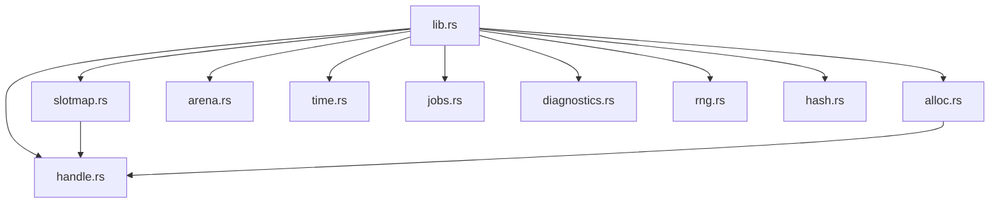
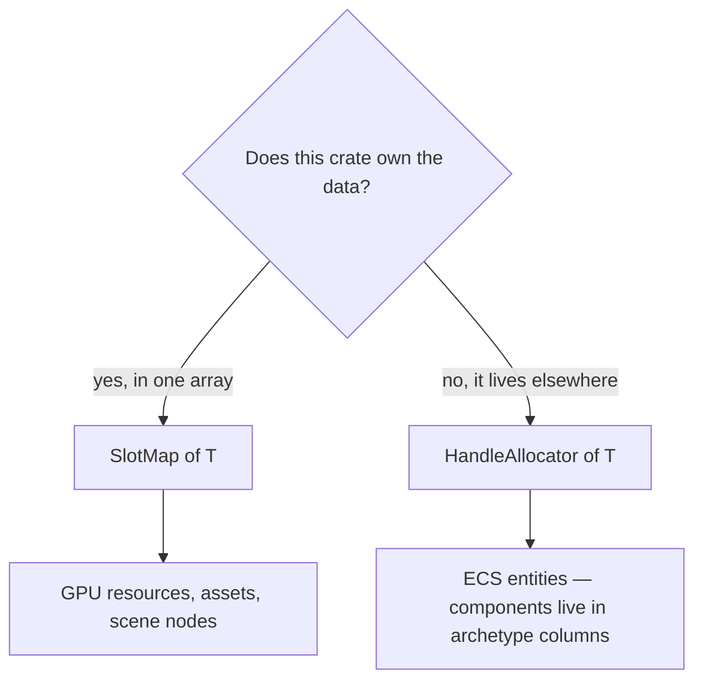
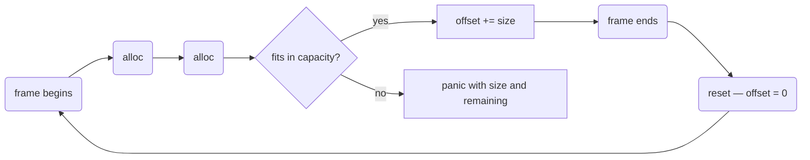
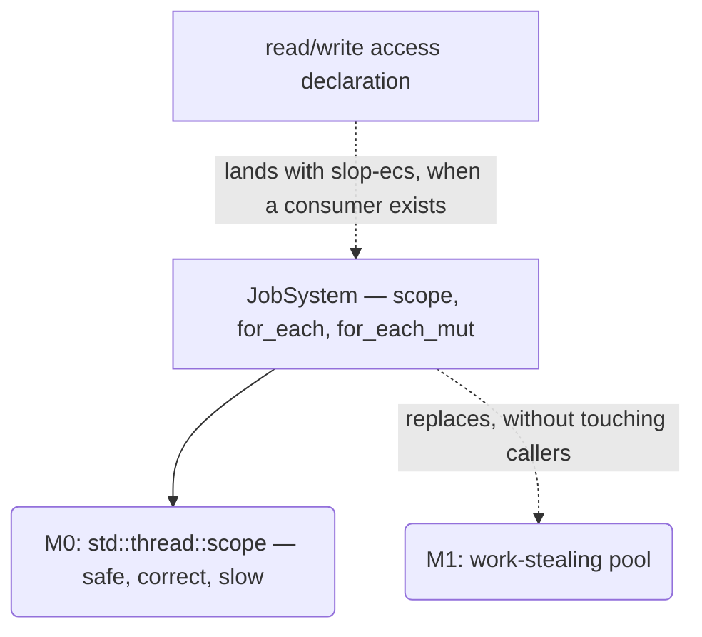

# slop-core

**Last updated:** 2026-08-01

## 1. Purpose

Foundational primitives every other crate depends on. Nothing here knows what a
mesh, an entity, or a GPU is — this is the layer that makes the layers above
possible: identity without pointers, memory without per-frame allocation, and
time without wall-clock nondeterminism.

It deliberately does not contain: math (that is `slop-math`), anything
domain-specific, and anything requiring a dependency beyond `std`.

## 2. Status

| Area | State | Milestone |
|---|---|---|
| Handles, `SlotMap`, `HandleAllocator` | Landed | M0 |
| `FrameArena` | Landed | M0 |
| `FixedTimestep`, `Clock` | Landed | M0 |
| Job system — `JobSystem`, `Scope`, parallel iteration | Landed, **implementation provisional** | M0 |
| Work-stealing pool behind that API | Planned — deferred until ECS scheduling gives real requirements | M1 |
| System read/write access declaration | Planned — no consumer exists until the ECS does | M1 |
| String interning | Planned | M1 |
| `Rng` — seeded PCG32 | Landed | M0 |
| `FxHashMap` / `FxHashSet` — reproducible iteration | Landed | M0 |
| `diagnostics` — `tracing` facade, subscriber install | Landed | M0 |
| Profiling markers, `tracy` integration | Planned | M2 |

## 3. Module map



`rng.rs` and `hash.rs` depend on nothing and are depended on by nothing here.
They exist to be the engine's defaults, replacing `std` choices whose behaviour
varies per run — see §6.

## 3.1 Features

| Feature | Default | Effect |
|---|---|---|
| `subscriber` | off | Pulls `tracing-subscriber` and enables `diagnostics::init` |

Off by default because emitting spans and events is a library's job while
installing a process-wide subscriber is an application's. `slop-app` enables it;
nothing else should. Every crate in the graph would otherwise pay the compile
cost of a subscriber it never installs.

## 4. Key types

| Type | Role | Decision |
|---|---|---|
| `Handle<T>` | Typed 8-byte reference to externally owned data | `DESIGN.md` §2.6, `PLAN.md` §4.1-C |
| `RawHandle` | Type-erased handle for ABI transport | `DESIGN.md` §2.3 |
| `SlotMap<T>` | Generational storage that **owns** its values | `PLAN.md` §4.1-C |
| `HandleAllocator<T>` | Generation bookkeeping with **no payload** | `PLAN.md` §4.1-C |
| `FrameArena` | Fixed-capacity bump allocator, reset per frame | `CONVENTIONS.md` §8 |
| `FixedTimestep` | Accumulates time, releases fixed steps | `DESIGN.md` §2.7 |
| `Clock` | The only reader of the system clock | `DESIGN.md` §5 |
| `JobSystem` | Dispatches work across threads | `DESIGN.md` §2.5, `PLAN.md` §4.1-C |
| `Scope` | Spawns tasks that borrow caller stack data | `DESIGN.md` §2.5 |
| `Rng` | Seeded PCG32; no `Default`, no thread-local | `DESIGN.md` §2.14 |
| `FxHashMap` / `FxHashSet` | Hash containers with reproducible iteration | `DESIGN.md` §2.14 |
| `diagnostics` | `tracing` re-export, subscriber install | `CONVENTIONS.md` §13, §5.1 |

## 5. Diagrams

### 5.1 Handle layout

64 bits. The index is 32 bits and the generation is a `NonZeroU32`, so
`Option<Handle<T>>` occupies the same 8 bytes as `Handle<T>` — the `None` case
uses the zero niche and costs nothing.

```
 63                             32 31                              0
┌─────────────────────────────────┬─────────────────────────────────┐
│      generation (NonZeroU32)    │           index (u32)           │
└─────────────────────────────────┴─────────────────────────────────┘
```

A 32-bit packing (24 index / 8 generation) was rejected: eight bits of
generation wrap after 256 reuses of a slot, which high-churn entities reach
trivially, and a wrapped generation makes a stale handle compare equal to a live
one.

### 5.2 Slot lifecycle

Generations bump on **free**, not on allocate, so a handle stops resolving the
moment its slot is released rather than when the slot is next handed out.

```mermaid
stateDiagram-v2
    [*] --> Occupied: insert / allocate — generation 1
    Occupied --> Vacant: remove / free — generation += 1
    Vacant --> Occupied: reused — handle carries the bumped generation
    Occupied --> Retired: remove at generation u32::MAX
    Retired --> [*]: never reused

    note right of Vacant
        Every handle issued before
        this point is already stale.
    end note

    note right of Retired
        Wrapping would let an ancient
        handle match a live one.
        Leaking one slot is safer.
    end note
```

### 5.3 Choosing a container



Both hand out the same `Handle<T>` and agree exactly on when handles die; a test
drives both through one operation sequence and asserts identical index and
generation.

### 5.4 Frame arena lifecycle



`reset` takes `&mut self`, so it cannot compile while any allocation from the
arena is still borrowed. That is the entire safety argument for allocation
taking `&self` and returning `&mut`.

The arena never grows. An arena that silently falls back to the heap hides the
per-frame allocation it exists to eliminate — the frame still hitches and
nothing reports it.

### 5.5 Job dispatch — a final seam over a provisional implementation

The API assumes parallel execution and many cheap tasks. The M0 implementation
spawns OS threads per call, which is correct but slow. Callers written against
this shape do not change when the work-stealing pool replaces it at M1.



Do not optimize against the current cost model — assume dispatch is cheap and
tasks are many, which is what will be true.

## 6. Decisions

| Decision | Where |
|---|---|
| Handles everywhere, never pointers | `DESIGN.md` §2.6 |
| Handle API: typed, 64-bit, checked, two containers | `PLAN.md` §4.1-C |
| Bump generation on free | `PLAN.md` §4.1-C |
| Fixed timestep, interpolated rendering | `DESIGN.md` §2.7 |
| Job system: API shape at M0, work-stealing at M1 | `PLAN.md` §4.1-C |
| No allocation in per-frame paths | `CONVENTIONS.md` §8 |
| Determinism: same build, any machine, either platform | `DESIGN.md` §2.14 |
| PCG32 with an explicit seed, not `rand::thread_rng` | `DESIGN.md` §2.14 |
| Fixed-seed hasher, because `RandomState` reseeds per process | `DESIGN.md` §2.14 |

## 7. Invariants

1. **A stale handle never resolves.** Not to the wrong value, and not to a
   panic — `get` returns `None`. Releasing something another subsystem still
   references is normal during hot reload and in the editor.
2. **Generations bump on free.** Changing this to bump-on-allocate would leave
   stale handles resolving until reuse, which turns a deterministic failure into
   a timing-dependent one.
3. **A slot at `u32::MAX` is retired, never wrapped.**
4. **The arena runs no destructors.** Types needing `Drop` are rejected at
   compile time; do not relax this to a runtime check.
5. **`FrameArena` is `Send` but not `Sync`.** Concurrent allocation through its
   `Cell` would be a data race — give each job thread its own arena rather than
   sharing one.
6. **`FixedTimestep` never reads a clock.** It takes a delta, which is what
   makes deterministic replay and testing without wall-clock dependence
   possible. `Clock` is the only place `Instant::now` is called.
7. **Excess accumulated time is discarded, never carried.** Carrying it produces
   the spiral of death.
8. **Job execution order is unspecified.** `for_each` chunking, thread
   assignment, and completion order are not part of the contract and will change
   when the work-stealing pool lands. Anything order-dependent belongs in a
   sequential pass or must be sorted afterwards.
9. **No global job system.** It is constructed and passed explicitly, for the
   same reason nothing else here is a singleton.
10. **One thread is a supported configuration**, not a degraded fallback — it is
    how deterministic runs remove scheduling as a variable.
11. **Libraries emit; applications install.** No engine crate may call
    `diagnostics::init`. A library that installs a global subscriber takes a
    decision away from every application embedding it.
12. **Log fields, not sentences**, and never above `debug` in the frame loop
    (`CONVENTIONS.md` §13).
13. **`Rng` has no `Default` and no thread-local instance.** A generator whose
    seed was never stated is the bug the type exists to prevent, and it is not
    cryptographically secure — never use it where one is needed.
14. **The `Rng` output sequence is pinned by a test.** Changing the algorithm is
    a breaking change to every recorded replay and every golden image of a scene
    that consumes randomness, not a refactor. The same holds for `FxHasher`,
    whose output decides `FxHashMap` iteration order.
15. **`FxHashMap` iteration is reproducible, not ordered.** Anything needing a
    defined order sorts or uses a `BTreeMap`. Reproducible-but-arbitrary is
    enough for determinism and not enough for a serialization format.
16. **`FxHasher` is not resistant to a hostile key chooser.** Correct inside the
    engine, where keys are ids the engine produced. Anything parsing untrusted
    input keeps `std::collections::HashMap`.
17. **This crate reads no environment variable and opens no file.**
    `diagnostics` takes a filter string; it does not look up `SLOP_LOG`. Reading
    configuration is `slop-app`'s job alone (`CONVENTIONS.md` §5.1), which is
    what lets a game, the editor, a test harness, and headless CI configure the
    same engine differently without fighting over ambient state.
