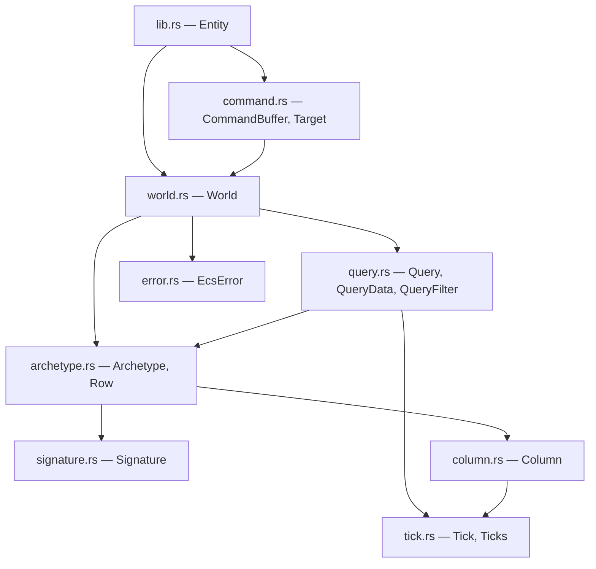
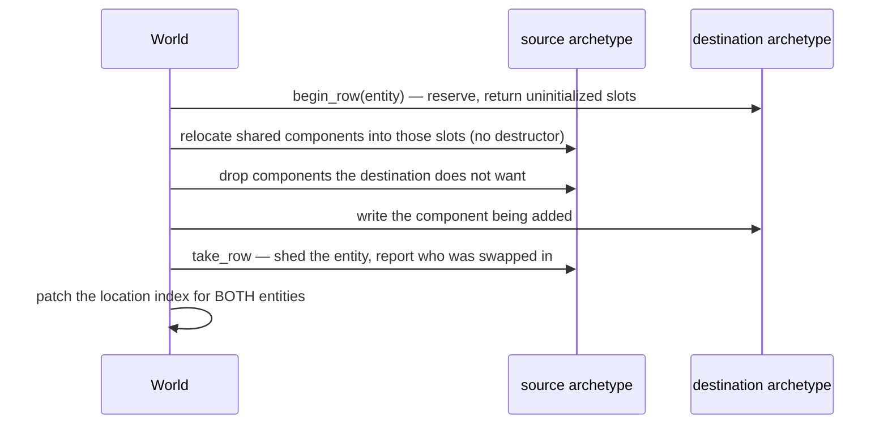
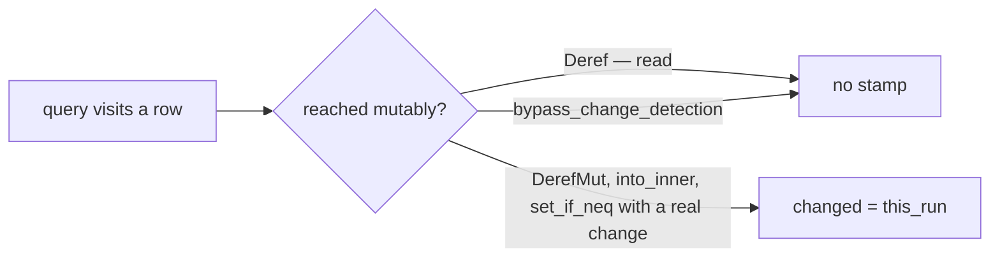
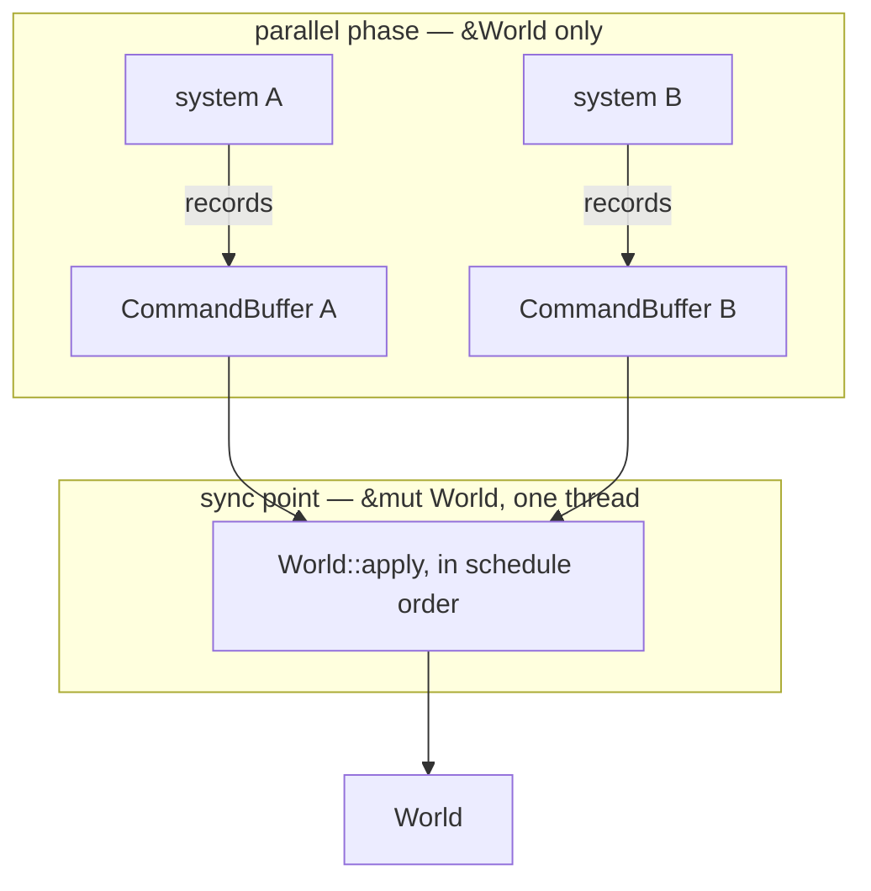

# slop-ecs

**Last updated:** 2026-08-01

## 1. Purpose

The engine's data model, structurally an in-memory database. An *entity* is an id
and nothing more; a *component* is plain data attached to one; a *system* is a
function over every entity holding a given set of components. Entities are rows,
components are columns, systems are queries.

`DESIGN.md` §2.10 chose **archetype (table) storage**: entities are grouped by
their exact component set, so all entities with `{Position, Velocity, Mesh}`
share one table of parallel arrays.

It deliberately does not contain: anything that knows what a mesh, a texture or a
frame is. Components are opaque bytes described by a `TypeInfo`.

## 2. Status

| Area | State | Milestone |
|---|---|---|
| `Column` — type-erased contiguous storage | Landed | M1 |
| `Signature` — an archetype's identity | Landed | M1 |
| `Archetype` — parallel columns plus an entity roster | Landed | M1 |
| `World` — spawn, despawn, insert, remove, get | Landed | M1 |
| Queries — `&T`, `&mut T`, `Entity`, tuples to arity 8 | Landed | M1 |
| `CommandBuffer` — deferred structural change | Landed | M1 |
| Untyped `insert_raw` / `remove_by_id` — the §2.4 guest path | Landed | M1 |
| Filters — `With`, `Without`, `Or`, and `Option<&T>` as data | Landed | M1 |
| Change detection — `Tick`, `Mut<T>`, `Changed<T>`, `Added<T>` | Landed | M1 |
| Periodic clamp of stamps older than `MAX_AGE` | Planned — the comparison is already correct; this stops ages growing without bound | M2 |
| System scheduling from read/write sets | Planned — needs the work-stealing pool | M1 |
| Relationships (parent/child) | Planned | M2 |
| Opt-in sparse-set storage for high-churn types | Planned — §2.10 says "without disturbing the archetype default" | M5+ |

## 3. Module map



`column.rs` is the bottom and holds raw pointers into component storage;
`command.rs` is the only other module that does, because a staged component is
bytes with a destructor until the sync point. Everything between them is
bookkeeping.

## 4. Key types

| Type | Role | Decision |
|---|---|---|
| `Entity` | `Handle<EntityTag>` — an id with a generation | `PLAN.md` §4.1-C |
| `Column` | One component type's contiguous, type-erased array | §5.1 |
| `Signature` | The sorted component set identifying an archetype | §5.2 |
| `Archetype` | Parallel columns plus the entities occupying their rows | §5.2 |
| `Row` | A position within an archetype. **Not stable** | §5.3 |
| `World` | Entities, archetypes, the location index, and the registry | §5.3 |
| `Query` / `QueryData` | Typed iteration over matching archetypes | §5.4 |
| `QueryFilter` / `With` / `Without` / `Or` | Which entities to visit, yielding nothing | §5.5 |
| `Tick` / `Ticks` | When something was written, and the window being asked about | §5.6 |
| `Mut<T>` | Exclusive access that stamps on write, not on visit | §5.6 |
| `Changed<T>` / `Added<T>` | Filters over those stamps | §5.6 |
| `CommandBuffer` | Structural changes recorded now, applied at a sync point | §5.7 |
| `Target` | What a recorded command acts on: an entity, or an ordinal | §5.7 |

## 5. Diagrams

### 5.1 Why columns are type-erased

`DESIGN.md` §2.4 lets a WASM guest declare a component the host was never
compiled against, so `Column<T>` cannot exist for that `T`. What does exist is a
`TypeInfo` carrying size, alignment and a destructor — exactly enough to
allocate, index, move and free.

Typed access is layered on top: a query resolves a whole column to a base pointer
**once per archetype**, then strides. Erasure costs one check per column per
query, not one per element.

### 5.2 The layout, and the invariant that matters

```
Archetype { signature: {Position, Velocity} }

  entities   [ E7   E2   E9   E4 ]
  column 0   [ Pos  Pos  Pos  Pos ]   ← Position, because it sorts first
  column 1   [ Vel  Vel  Vel  Vel ]

               row 0 is E7 in every column
```

Three invariants hold it together:

1. Every column's length equals the entity roster's.
2. Columns are parallel to `signature.types()` — column *i* holds type *i*.
3. Row *n* of every column belongs to `entities[n]`.

A violation does not crash. It presents as one entity reading another's
components, which is why `assert_consistent` runs after every structural change
in the test suite.

### 5.3 Structural change physically moves an entity

The cost §2.10 accepted in exchange for iteration being a linear scan.



The last step is the one that looks optional. A swap-remove moves some *other*
entity into the vacated row; if its location is not patched it points at a row
that now belongs to someone else.

### 5.4 Aliasing, enforced two ways

| Rule | Mechanism | Why that mechanism |
|---|---|---|
| A read-only query cannot request `&mut` | Type system — `World::query` requires `ReadOnlyQueryData`, which `&mut T` does not implement | Lets `query` take `&self`, so several read-only queries can be live at once |
| One query cannot name a component twice with mutable access | Runtime panic when the query is built | Not expressible in the type system without far more machinery, and it is a property of the code as written — always wrong, caught the first time the line runs |

Reading the same component twice is allowed: two shared references alias
harmlessly, and an over-strict check would forbid legitimate queries.

### 5.5 Filters narrow; they do not yield

```rust
world.query::<&Position>().with::<Player>().without::<Frozen>()
world.query::<&Position>().filtered::<Or<(With<Player>, With<Enemy>)>>()
```

A filter is a separate trait from `QueryData` for one reason: it yields nothing.
`With<Player>` modelled as query data would have to produce `()`, and every call
site would carry a `()` in its tuple pattern.

| | Narrows | Yields | Declares `Access` |
|---|---|---|---|
| `&T` | archetype | `&T` | ✓ |
| `&mut T` | archetype | `Mut<T>` | ✓ mutable |
| `Option<&T>` | — | `Option<&T>` | ✓ — it reads `T` where present |
| `Entity` | — | the id | — |
| `With<T>`, `Without<T>` | archetype | nothing | — |
| `Changed<T>`, `Added<T>` | archetype, then **row** | nothing | ✓ read |
| `Or<..>` | as its members | nothing | as its members |

**Why filters resolve per archetype and then answer per row.** `With` and
`Without` could have been a plain `fn(&Archetype) -> bool` — but "was this
component written since I last looked?" cannot, and it belongs in the same trait
rather than a second one. `With`'s per-row hook is a constant `true`, which the
optimizer removes.

**Why `With` declares no access.** It inspects whether an archetype's *signature*
holds `Player`; it never reads a `Player`. A system writing `Player` therefore
does not conflict with one filtering on it. `Changed<T>` does read something that
travels with the component, so it declares a read.

Filter access is deliberately kept **out** of the aliasing check a query performs
on its own data. `&mut Position` filtered by `Changed<Position>` is the ordinary
"react to what moved" query, not an aliasing pair.

**Why `Option<&T>` does.** It reads `T` on exactly the archetypes where the
option is `Some`, so `(&mut Health, Option<&Health>)` is an aliasing pair and is
rejected by the same check that rejects `(&mut Health, &Health)`.

**Why the builder, and not a second `query_filtered` method.** Narrowing is
type-changing — `.with::<T>()` returns `Query<D, (F, With<T>)>` — so the chain
composes to any depth without the caller naming a filter tuple. Its one sharp
edge is that narrowing builds a *fresh* query, so doing it after iteration has
started would revisit rows already yielded; that panics rather than silently
rewinding. `filter` would have shadowed `Iterator::filter`, hence `filtered`.

### 5.6 Change detection

Two stamps per component per entity — when it was added, and when it was last
written — so a system can skip work it does not need to do.

**Granularity.** Three options, and the choice is not close:

| | Cost | Precision |
|---|---|---|
| Per archetype, per component | One tick per column | Useless — one moving entity dirties every static sibling in the table |
| **Per entity, per component** | 8 bytes per component per entity | Exact |
| Per chunk | One tick per chunk | Unity's answer, and only sensible because its archetypes are already chunked |

The first defeats the purpose. The third would mean restructuring single growable
columns into fixed-size chunks to buy precision the second already has, and
§2.10 did not ask for chunking.

**The stamps live in `Column`,** not beside it, so `push` and `swap_remove` keep
them in lockstep automatically rather than by two structures agreeing — which is
the bug class this crate spends most of its effort on. Invariant 5 states it and
`assert_consistent` checks it.

**`&mut T` yields `Mut<T>`, which stamps on `DerefMut` rather than on visit.**
That is the whole value: a loop that writes one row in a hundred marks one row.
`position.x += 1.0` reads identically; what changes is that the binding needs
`mut`, and code wanting a bare `&mut T` says `into_inner()`.



**Relocation is not writing.** A component migrating between archetypes carries
its stamps with it. Without that, tagging an entity through a command buffer
would report every one of its other components as changed — the exact false
positive change detection exists to avoid, and the thing most worth testing.

**A stamp equal to `last_run` is not newer**, so a system never sees its own
writes. Comparison is by *age* rather than by ordering, which is what survives
the `u32` counter wrapping; the cost is a documented hole past `MAX_AGE` that a
periodic clamp closes without changing any signature.

### 5.7 Deferred structural change, and why the id is not real yet

Every structural change needs `&mut World`. A system running in parallel with
other systems cannot have one — it holds a query, and a query is a borrow. §2.10
calls the resolution *required for safe parallel system execution regardless*:
record now, apply at an explicit sync point.



**`CommandBuffer::spawn` returns a `Target`, not an `Entity`,** and that is the
one part worth arguing for because the conventional engine answer is the
opposite. Bevy and Unity's `EntityCommandBuffer` both hand back a usable id
immediately, reserving it from the allocator through an atomic.

`DESIGN.md` §2.14 rules that out. Two systems spawning on two threads would
receive ids in whatever order the hardware resolved the contention, so the same
build on the same machine assigns different ids on different runs — and every
recorded replay and every golden image of a scene that spawns anything becomes
timing-dependent. Deferring assignment removes the race rather than tolerating
it: each buffer numbers its spawns from zero, buffers apply in schedule order,
and ids come off the allocator one at a time on one thread.

What it costs, recorded in `PLAN.md` §6.1: a `Target` cannot be stored *inside*
a component, so wiring a freshly spawned child into its parent takes the direct
`&mut World` path or a second frame.

**Where the owned values live.** A recorded `insert` takes ownership at once, so
between recording and the sync point the buffer holds component values that
nothing else will destroy. They are parked in a bump-allocated staging area that
tracks the strictest alignment any component has demanded — a `Vec<u8>` cannot
serve, because its allocation is aligned to 1 and an 8-aligned *offset* within
it is still misaligned in memory.

Every exit runs exactly one destructor per staged value:

| Exit | What happens to the value |
|---|---|
| Applied to a live entity | Moved into the column. The world owns it. |
| Target already despawned | Destroyed. A system recording a change to something another system removed is the ordinary case, not an error. |
| Type not registered | Destroyed, and the first such error is returned. |
| Buffer cleared | Destroyed. |
| Buffer dropped unapplied | Destroyed. |

## 6. Decisions

| Decision | Where |
|---|---|
| Archetype storage, not sparse-set | `DESIGN.md` §2.10 |
| Forced by the columnar WASM boundary | `DESIGN.md` §2.3 |
| Storage and that boundary designed together | `DESIGN.md` §2.10 |
| Components are always reflected | `DESIGN.md` §2.4, `lib.rs` module docs |
| Handles with generations, bumped on free | `PLAN.md` §4.1-C |
| Structural change deferred to a sync point | `DESIGN.md` §2.10 |
| A deferred spawn's id is assigned at the sync point, not reserved | `DESIGN.md` §2.14, §5.7 above |
| Change detection is per entity, per component | §5.6 above |
| `&mut T` yields `Mut<T>`, stamping on write rather than on visit | §5.6 above |
| `unsafe` is sanctioned here | `CONVENTIONS.md` §7 |

**Why archetype and not sparse-set.** §2.10 gives three reasons and the second
is binding: §2.3's WASM boundary requires handing guest modules *contiguous
columns* of component data. Archetype storage produces that natively. Sparse-set
would need a gather into a temporary buffer every frame — exactly the per-frame
cost the columnar ABI exists to avoid.

**Why there is no unregistered component.** A column cannot be allocated without
a layout or freed without a destructor, and §2.4 requires both to arrive as
data. A type the editor cannot inspect and the serializer cannot write would be
a component that silently vanishes from a save file.

**Why empty archetypes are kept.** An entity set that oscillates across a
boundary — a component added and removed every frame — would otherwise pay a
table rebuild each time. Queries skip empty tables instead.

## 7. Invariants

1. **Row `n` of every column in an archetype belongs to the same entity.** The
   structure's reason for existing. Violation reads as a gameplay bug, not a
   crash.
2. **Rows are added and removed whole.** A half-populated row is not a
   recoverable state — it is a column whose element `n` is uninitialized while
   its length says otherwise.
3. **`begin_row` leaves the column's invariants broken until every slot is
   written.** The sharpest safety contract in the crate.
4. **A removal reports the entity swapped into the hole, and the caller must
   patch its location.** Skipping it makes one entity read another's data.
5. **Signatures are sorted and deduplicated**, so `{A, B}` and `{B, A}` are one
   archetype. Otherwise a world silently doubles its table count depending on
   insertion order.
6. **A `Row` is not stable and must not be stored.** The world's location index
   is authoritative; a `Row` is meaningful only alongside the archetype it came
   from, until the next removal.
7. **Migration relocates without dropping.** A component moving between
   archetypes must not be destroyed and rebuilt — that would free a heap
   allocation the destination then points at.
8. **A component the destination does not want is dropped exactly once.** The
   other half of the same pass.
9. **Zero-sized components allocate nothing and are never pointer-arithmetic'd
   over.** Marker components are the common case, not an edge case.
10. **`Transfer::Blittable` gates `Column::as_bytes`.** A column of `String`
    holds pointers into the host heap; handing those to a guest would be
    meaningless and would disclose host addresses.
11. **A filter never reads a component's value.** `With` and `Without` test the
    signature; `Changed` and `Added` test a stamp. Neither dereferences the
    component, which is what lets a filter yield nothing and what keeps
    `&mut Position` filtered by `Changed<Position>` from being an aliasing pair.
    A filter that needed the value belongs in `QueryData`.
12. **The change stamps travel with the elements.** They live inside `Column`
    precisely so `push` and `swap_remove` move them without a second structure
    having to agree — invariant 5, checked by `assert_consistent`. Drift does not
    crash; it reports the wrong entity as changed.
13. **Relocating a component is not writing it.** Migration carries stamps
    across. Resetting them would report every component of an entity as changed
    the moment it gained an unrelated one, which is the false positive change
    detection exists to avoid.
14. **A recorded `insert` owns its value from the moment it is recorded.** Every
    exit destroys it exactly once — see the table in §5.7. A path added to
    `CommandBuffer` or `World::apply` that does not appear there is a leak or a
    double free.
15. **A `Target::Pending` belongs to the buffer that produced it.** Ordinals are
    per-buffer and restart after every apply. Handing one to a different buffer
    addresses whatever that buffer's spawn of the same ordinal created, or
    nothing. Documented rather than prevented: detecting it means stamping every
    buffer with an identity that exists only to catch it.
16. **A command aimed at a dead entity is skipped, not an error.** The window
    between recording and the sync point is exactly where another system's
    despawn lands.
17. **Run Miri after touching anything in `column.rs`, `command.rs`,
    `archetype.rs`, or the migration path in `world.rs`** — under both
    `-Zmiri-stacked-borrows` (the default) and `-Zmiri-tree-borrows`. Misaligned
    access, aliasing violations, deallocating with the wrong layout and double
    frees are all invisible to ordinary tests and usually invisible on x86
    (`CONVENTIONS.md` §7). Both break-on-purpose results in this crate — a wrong
    dealloc alignment and a staging area that ignored alignment — passed the
    entire ordinary suite.

    Miri also settles claims that would otherwise be folklore. The comment on
    `Column::changed` says a plain `Vec<Tick>` would *not* be undefined here,
    because `Vec::as_ptr` carries the vector's own provenance rather than the
    `&self` borrow's — that was measured under both models, not assumed. The
    `Cell` stays for a different reason: it needs no `unsafe` and does not rest
    on an implementation detail of `Vec`.
