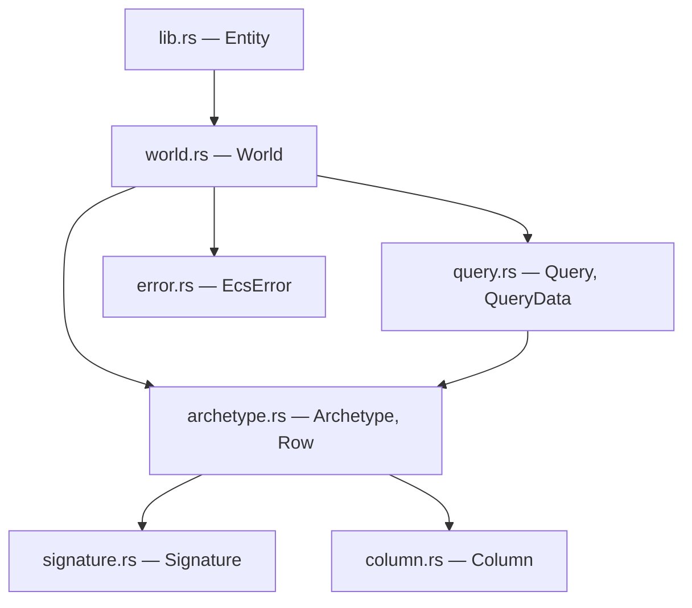
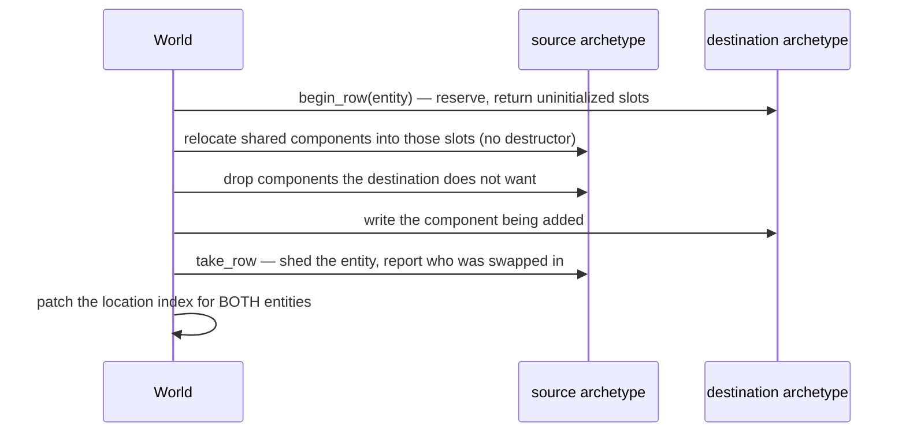

# slop-ecs

**Last updated:** 2026-08-01

## 1. Purpose

The engine's data model, structurally an in-memory database. An *entity* is an id
and nothing more; a *component* is plain data attached to one; a *system* is a
function over every entity holding a given set of components. Entities are rows,
components are columns, systems are queries.

`DESIGN.md` §2.10 chose **archetype (table) storage**: entities are grouped by
their exact component set, so all entities with `{Position, Velocity, Mesh}`
share one table of parallel arrays.

It deliberately does not contain: anything that knows what a mesh, a texture or a
frame is. Components are opaque bytes described by a `TypeInfo`.

## 2. Status

| Area | State | Milestone |
|---|---|---|
| `Column` — type-erased contiguous storage | Landed | M1 |
| `Signature` — an archetype's identity | Landed | M1 |
| `Archetype` — parallel columns plus an entity roster | Landed | M1 |
| `World` — spawn, despawn, insert, remove, get | Landed | M1 |
| Queries — `&T`, `&mut T`, `Entity`, tuples to arity 8 | Landed | M1 |
| Command buffers — deferred structural change | Planned — §2.10 calls this required for parallel systems | M1 |
| Change detection | Planned | M1 |
| System scheduling from read/write sets | Planned — needs the work-stealing pool | M1 |
| Query filters — `With`, `Without`, `Option` | Planned | M1 |
| Relationships (parent/child) | Planned | M2 |
| Opt-in sparse-set storage for high-churn types | Planned — §2.10 says "without disturbing the archetype default" | M5+ |

## 3. Module map



`column.rs` is the bottom and the only module holding raw pointers into
component storage. Everything above it is bookkeeping.

## 4. Key types

| Type | Role | Decision |
|---|---|---|
| `Entity` | `Handle<EntityTag>` — an id with a generation | `PLAN.md` §4.1-C |
| `Column` | One component type's contiguous, type-erased array | §5.1 |
| `Signature` | The sorted component set identifying an archetype | §5.2 |
| `Archetype` | Parallel columns plus the entities occupying their rows | §5.2 |
| `Row` | A position within an archetype. **Not stable** | §5.3 |
| `World` | Entities, archetypes, the location index, and the registry | §5.3 |
| `Query` / `QueryData` | Typed iteration over matching archetypes | §5.4 |

## 5. Diagrams

### 5.1 Why columns are type-erased

`DESIGN.md` §2.4 lets a WASM guest declare a component the host was never
compiled against, so `Column<T>` cannot exist for that `T`. What does exist is a
`TypeInfo` carrying size, alignment and a destructor — exactly enough to
allocate, index, move and free.

Typed access is layered on top: a query resolves a whole column to a base pointer
**once per archetype**, then strides. Erasure costs one check per column per
query, not one per element.

### 5.2 The layout, and the invariant that matters

```
Archetype { signature: {Position, Velocity} }

  entities   [ E7   E2   E9   E4 ]
  column 0   [ Pos  Pos  Pos  Pos ]   ← Position, because it sorts first
  column 1   [ Vel  Vel  Vel  Vel ]

               row 0 is E7 in every column
```

Three invariants hold it together:

1. Every column's length equals the entity roster's.
2. Columns are parallel to `signature.types()` — column *i* holds type *i*.
3. Row *n* of every column belongs to `entities[n]`.

A violation does not crash. It presents as one entity reading another's
components, which is why `assert_consistent` runs after every structural change
in the test suite.

### 5.3 Structural change physically moves an entity

The cost §2.10 accepted in exchange for iteration being a linear scan.



The last step is the one that looks optional. A swap-remove moves some *other*
entity into the vacated row; if its location is not patched it points at a row
that now belongs to someone else.

### 5.4 Aliasing, enforced two ways

| Rule | Mechanism | Why that mechanism |
|---|---|---|
| A read-only query cannot request `&mut` | Type system — `World::query` requires `ReadOnlyQueryData`, which `&mut T` does not implement | Lets `query` take `&self`, so several read-only queries can be live at once |
| One query cannot name a component twice with mutable access | Runtime panic when the query is built | Not expressible in the type system without far more machinery, and it is a property of the code as written — always wrong, caught the first time the line runs |

Reading the same component twice is allowed: two shared references alias
harmlessly, and an over-strict check would forbid legitimate queries.

## 6. Decisions

| Decision | Where |
|---|---|
| Archetype storage, not sparse-set | `DESIGN.md` §2.10 |
| Forced by the columnar WASM boundary | `DESIGN.md` §2.3 |
| Storage and that boundary designed together | `DESIGN.md` §2.10 |
| Components are always reflected | `DESIGN.md` §2.4, `lib.rs` module docs |
| Handles with generations, bumped on free | `PLAN.md` §4.1-C |
| Structural change deferred to a sync point | `DESIGN.md` §2.10 — **not yet built** |
| `unsafe` is sanctioned here | `CONVENTIONS.md` §7 |

**Why archetype and not sparse-set.** §2.10 gives three reasons and the second
is binding: §2.3's WASM boundary requires handing guest modules *contiguous
columns* of component data. Archetype storage produces that natively. Sparse-set
would need a gather into a temporary buffer every frame — exactly the per-frame
cost the columnar ABI exists to avoid.

**Why there is no unregistered component.** A column cannot be allocated without
a layout or freed without a destructor, and §2.4 requires both to arrive as
data. A type the editor cannot inspect and the serializer cannot write would be
a component that silently vanishes from a save file.

**Why empty archetypes are kept.** An entity set that oscillates across a
boundary — a component added and removed every frame — would otherwise pay a
table rebuild each time. Queries skip empty tables instead.

## 7. Invariants

1. **Row `n` of every column in an archetype belongs to the same entity.** The
   structure's reason for existing. Violation reads as a gameplay bug, not a
   crash.
2. **Rows are added and removed whole.** A half-populated row is not a
   recoverable state — it is a column whose element `n` is uninitialized while
   its length says otherwise.
3. **`begin_row` leaves the column's invariants broken until every slot is
   written.** The sharpest safety contract in the crate.
4. **A removal reports the entity swapped into the hole, and the caller must
   patch its location.** Skipping it makes one entity read another's data.
5. **Signatures are sorted and deduplicated**, so `{A, B}` and `{B, A}` are one
   archetype. Otherwise a world silently doubles its table count depending on
   insertion order.
6. **A `Row` is not stable and must not be stored.** The world's location index
   is authoritative; a `Row` is meaningful only alongside the archetype it came
   from, until the next removal.
7. **Migration relocates without dropping.** A component moving between
   archetypes must not be destroyed and rebuilt — that would free a heap
   allocation the destination then points at.
8. **A component the destination does not want is dropped exactly once.** The
   other half of the same pass.
9. **Zero-sized components allocate nothing and are never pointer-arithmetic'd
   over.** Marker components are the common case, not an edge case.
10. **`Transfer::Blittable` gates `Column::as_bytes`.** A column of `String`
    holds pointers into the host heap; handing those to a guest would be
    meaningless and would disclose host addresses.
11. **Run Miri after touching anything in `column.rs`, `archetype.rs`, or the
    migration path in `world.rs`.** Misaligned access, aliasing violations,
    deallocating with the wrong layout and double frees are all invisible to
    ordinary tests and usually invisible on x86 (`CONVENTIONS.md` §7).
