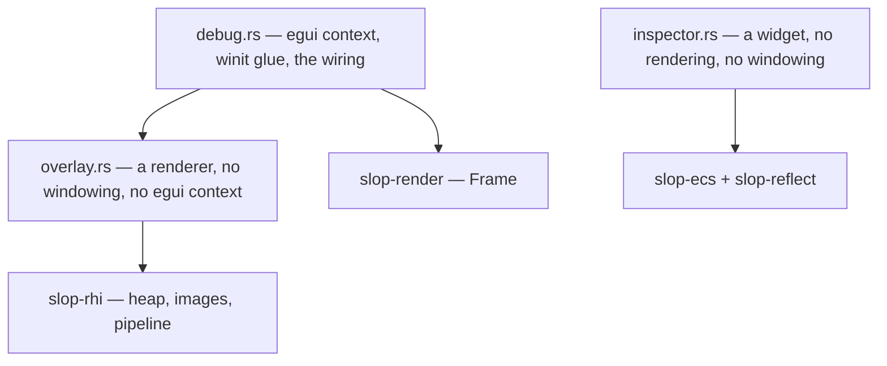

# slop-editor

**Last updated:** 2026-08-03

## 1. Purpose

Tooling drawn on top of a running engine — `DESIGN.md` §4's "egui-based tooling"
and §10.2's debug UI layer. The immediate-mode overlay, the renderer that draws
it, and the reflection-driven entity inspector.

**Immediate mode is the point, not a convenience.** A debug UI is re-declared
every frame from current state, so there is no widget tree to keep synchronised
and it cannot fall out of sync with the engine it reports on.

**What this crate is not, yet.** §10.1's *editor* — the scene authoring
application — is M6, and §2.12 says it is a host **application** that embeds
`slop-app` exactly as a game does. §10.1 and §10.2 are described in `DESIGN.md`
as sharing "almost nothing architecturally", and they are currently shipped in
one crate under the editor's name. `docs/reviews/2026-08-03.md` item 5 records this and
recommends renaming this crate to `slop-debug`, leaving `slop-editor` free for
what §2.12 says it is.

## 2. Status

| Area | State | Milestone |
|---|---|---|
| `Overlay` — tessellated triangles to the screen | Landed | M2 |
| `DebugUi` — egui context, winit input, the wiring | Landed | M2 |
| Frame timing readout | Landed | M2 |
| Entity inspector over `slop-reflect` | Landed | M2 |
| Render pass visualiser | Planned — needs a graph to visualise | M3 |
| `inspector` behind a cargo feature, off by default | Landed — see §2.1 | M2 |
| Rename to `slop-debug` | Planned — `docs/reviews/2026-08-03.md` item 5 | — |
| §10.1's scene editor, as a binary | Planned | M6 |

### 2.1 Features

| Feature | Default | What it adds |
|---|---|---|
| `inspector` | off | The entity inspector, and with it `slop-ecs` and `slop-reflect` |

Off by default because the module map below is a strict chain and the inspector
is its last link — nothing else in this crate needs it, and it is the only part
needing an ECS or a reflection system.

The effect is measurable rather than tidy-minded: `examples/triangle` and
`examples/cube` now link neither crate, while `examples/model` — the one that
edits components live — turns the feature on. That is the same complaint this
crate's existence answers, which `docs/reviews/2026-08-03.md` item 5 found reproduced one
layer up: a frame-timing overlay on a triangle should not pull in an ECS to draw
one.

The rename to `slop-debug` is a separate matter and stays deferred. Merging the
two is what would have stopped the cheap half happening.

## 3. Module map

A strict chain, and that is what keeps the headless tests possible — they use
`overlay` alone, with no event loop and no display.

`inspector` is drawn *into* a `debug` UI and knows about neither rendering nor
windowing; note that it does not depend on `overlay` or `debug` at all. It is
also the **only** module that reaches `slop-ecs` and `slop-reflect`, which is why
a feature gate would drop two crates from every consumer that only wants a frame
timer.

## 4. Key types

| Type | Role | Decision |
|---|---|---|
| `Overlay` | Draws tessellated egui output through the bindless heap | §5 below |
| `DebugUi` | Owns the egui context and the winit glue; four calls per frame | §5 below |
| `Declared` | What one frame's UI declared — output to upload and draw | `debug.rs` |
| `InspectorState` | Which entity is selected | `DESIGN.md` §10.2 |
| `inspector()` | Renders a live entity's components from `TypeInfo` | `DESIGN.md` §2.11 |
| `EditorError` | Setup and draw failures | `CONVENTIONS.md` §6 |

## 5. Decisions

| Decision | Where |
|---|---|
| A debug UI layer, pulled forward ahead of the renderer | `DESIGN.md` §10.2, `PLAN.md` §8 |
| egui rather than an owned immediate-mode UI | `DESIGN.md` §4 |
| Split out of `slop-app` | Below |
| The overlay renderer lives here, not in `slop-render` | Below |

**Why this is not in `slop-app`.** It was, briefly. `slop-app` is the crate every
game depends on and it has no features, so a game that wanted a window and a
device also linked `egui`, `egui-winit`, `slop-ecs` and `slop-reflect` whether it
drew an interface or not. Splitting puts the cost where the benefit is. It also
fixes the direction of the dependency: §2.12 says the editor *embeds* `slop-app`
exactly as a game does, which cannot be true while the editor's code is inside
it.

That complaint is currently reproduced one layer up — `examples/triangle` links
`slop-ecs` and `slop-reflect` to draw a triangle — which is what the feature gate
in §2 fixes.

**Why the renderer half is here too.** `Overlay` was in `slop-render`, on the
reasoning that it is a renderer and knows nothing about windows. Both halves of
that are still true. It lives here anyway, because "what draws the UI" and "what
feeds the UI" are one concern split across two types, and a renderer crate
carrying a UI backend is a renderer crate with an opinion about UI toolkits.
`slop-render` now depends on nothing egui-shaped.

## 6. The overlay renderer

*Moved here from `docs/slop-render/README.md` §8 when `Overlay` moved crates.*

**egui rather than Dear ImGui**, and `DESIGN.md` §4 had already chosen it.
Checked again rather than assumed: egui is at 0.35 and pure Rust, `imgui-rs` is
at 0.12 and behind upstream, and the actively developed `dear-imgui-rs` is at
`0.16.0-alpha.1`. Dear ImGui also means a C++ build, which `DESIGN.md` §2.13's
trap table names as the dependency *most likely to actually bite us*.

**The backend is written rather than taken.** `egui-ash-renderer` exists, and it
brings its own descriptor pool, sampler and pipeline management — all of which
this engine already has in a bindless form a general-purpose backend cannot
assume. Taking it would mean two descriptor models in one frame. What is written
instead is an upload, a pipeline and a draw loop that sets a scissor rectangle;
the font rasterizer and layout engine, the genuinely hard parts, are egui's.

Five things that are not obvious, each of which cost a debugging pass:

- **The overlay opens its own render pass.** A pipeline used inside a pass must
  declare the depth format that pass carries. The overlay wants no depth at all,
  so sharing the scene's pass would depth-test the interface against the geometry
  and let the scene occlude the readout describing it.
- **The descriptor set is re-bound with the overlay's own layout.** Two pipeline
  layouts are compatible only if their push constant ranges match as well as
  their set layouts, and the overlay's block is a different size from the
  scene's. Validation catches this; nothing else would.
- **Vertex buffers are per in-flight slot.** `Frame::slot` exists for this. One
  shared buffer is corrupted by the frame still reading it — `FrameRenderer`
  waits for *this* slot before recording, which says nothing about the others.
- **Vertex positions are in points; scissor rectangles are in physical pixels.**
  The shader divides by the screen size *in points*, so a scaled display draws
  the interface at the right size. Dividing by the physical size instead draws it
  at 1/scale while its clip rectangles stay full size, which shaves the left edge
  off every label — invisible at 100% scaling, which is what a headless test
  defaults to.
- **The colour attribute is four bytes in the buffer and a `float4` in the
  shader.** egui packs colour as four normalized bytes and the hardware converts,
  so reflection reports `Float32x4` while the correct buffer format is
  `R8G8B8A8_UNORM`. Deriving the layout from reflection alone would read each
  vertex at four times the right stride. This module states its format explicitly
  and uses `VertexBinding::check_layout` to verify the shader still reads what
  was assumed — see `docs/slop-render/README.md` §9 for why that split is real
  rather than a gap.

## 7. Invariants

1. **`DebugUi::run` before the frame is recorded; `DebugUi::draw` inside it.**
   Uploading a texture waits on the GPU, and nothing inside a recorded frame may
   block on it. Getting this wrong shows as a font atlas one frame late — which
   looks like the UI failing to appear at all on the first frame, because the
   atlas *arrives* in that frame's delta.
2. **The overlay draws last, and does not perform the final transition.** Only
   the last writer may transition the target, and the overlay composites over a
   scene that has already drawn. The caller ends the frame with `Frame::finish`.
   This is a convention today and the render graph is what will derive it —
   `PLAN.md` §6.1 carries the row, and it has already failed once, when
   `MeshRenderer` and the overlay both believed they were last.
3. **`overlay` must stay drivable without a window.** No event loop, no egui
   context, no `winit` type in its signatures. That is the whole reason the
   headless golden tests can assert the overlay changes the image.
4. **`inspector` must not reach rendering or windowing.** It is a widget over
   `World` and `TypeInfo`. Keeping it at the leaf is what makes the feature gate
   in §2 a two-line change rather than an untangling.
5. **`egui` is re-exported and must be used through this crate.** Two versions of
   egui in one binary produce type mismatches that read as nonsense — the same
   reasoning that re-exports `winit` from `slop-app`.
6. **`default_fonts` stays on.** Without it egui has no font data, every label
   tessellates to nothing, and the overlay renders an empty window. Found by a
   test that asserted the overlay changes the image; Vulkan validation stayed
   silent throughout.
