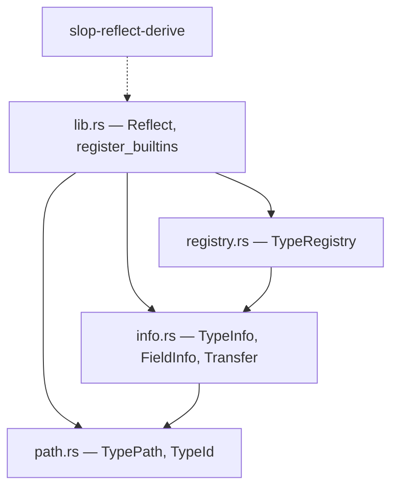
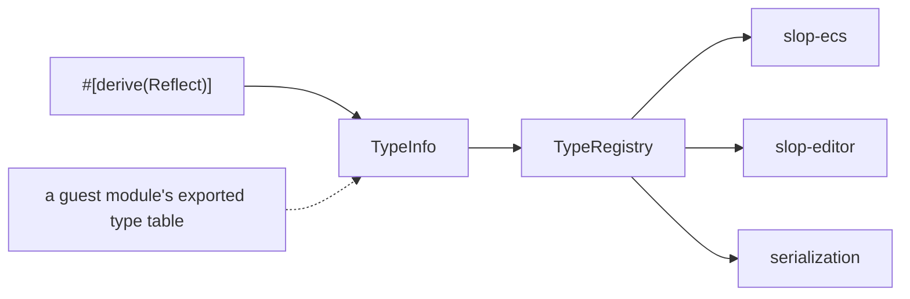

# slop-reflect

**Last updated:** 2026-08-01

## 1. Purpose

Runtime type information: what the engine knows about a type, as data.

`DESIGN.md` §2.4 makes this a first-class subsystem built in the first
milestone, because serialization, the scene format, editor property panels, WASM
binding generation, network replication, undo/redo diffs, save games and debug
inspectors are all *derived* from it. §2.4 calls skipping it the single most
common fatal mistake in from-scratch engines — it produces five incompatible
hand-written serializers and a rewrite around month 18.

It deliberately does not contain: serializers. Reflection describes types;
turning a described value into JSON, a binary scene chunk, or a network packet is
a separate concern that consumes this one. Building them together is how a
reflection system ends up shaped by whichever format was written first.

**`slop-reflect-derive` is a sibling crate**, not a design decision. Rust
requires a proc macro to live in its own crate. Consumers depend on
`slop-reflect`, which re-exports the macro behind a default-on `derive` feature.
`DESIGN.md` §4's crate list does not mention it for that reason.

## 2. Status

| Area | State | Milestone |
|---|---|---|
| `TypePath`, `TypeId` — stable identity | Landed | M1 |
| `TypeInfo`, `FieldInfo`, `TypeKind` | Landed | M1 |
| `TypeRegistry` — registration, lookup, collision detection | Landed | M1 |
| `#[derive(Reflect)]` | Landed | M1 |
| `Transfer` — the §2.3 columnar boundary's gate | Landed | M1 |
| Enums in `TypeKind` | Planned — needs a variant model | M1 |
| Generic types | Planned — the path must encode type arguments (§6) | M2 |
| Serialization primitives | Planned — a separate concern consuming this one | M2 |
| Guest-module type tables decoded into `TypeInfo` | Planned — needs `slop-host` | M4 |

## 3. Module map

The dashed arrow is a re-export, not a dependency: `slop-reflect-derive` knows
nothing about `slop-reflect`'s types, it emits source that names them.

## 4. Key types

| Type | Role | Decision |
|---|---|---|
| `TypePath` | The canonical name. What serialization writes | §5.1 |
| `TypeId` | 64-bit FNV-1a hash of the path. A cheap `Copy` key, nothing durable | §5.1 |
| `TypeInfo` | Layout, destructor, transfer, fields — everything, as data | `DESIGN.md` §2.4 |
| `Transfer` | Whether the bytes mean anything outside this address space | `DESIGN.md` §2.3 |
| `TypeRegistry` | The types one world knows about | §6 |
| `Reflect` | The compile-time front end. `unsafe` — see §7 | §6 |

## 5. Diagrams

### 5.1 Two front ends, one data model

The decision everything else follows from.

Nothing downstream can tell which front end a type came from. That is the whole
point: a WASM guest's `Inventory` is a first-class component, not a second tier.

### 5.2 Identity: path is truth, id is an optimization

| | `TypePath` | `TypeId` |
|---|---|---|
| Written to files | **yes** | never |
| Compared in hot paths | no | **yes** |
| Survives a rebuild | yes | yes |
| Collision possible | no | vanishingly — and detected |

Serialization writes the path, so a hash collision cannot corrupt a file. It can
only be an in-memory ambiguity, which the registry rejects at registration rather
than tolerating — the error names both types so a human knows which to rename.

### 5.3 What the derive computes rather than accepts

Three fields of `TypeInfo` are trusted by the ECS in ways that are memory-unsafe
or ABI-unsafe to get wrong. The author supplies none of them.

| Field | Derived from | Consequence of taking the author's word |
|---|---|---|
| `layout` | `Layout::new::<Self>()` | Columns allocate and stride by it — out-of-bounds access |
| `drop_in_place` | `needs_drop::<Self>()` | A leak, or a double free |
| `transfer` | `#[repr(C)]` **and** no destructor **and** every field blittable | Host heap pointers handed to a guest as raw memory |

The `#[repr(C)]` term is the subtle one: a default-repr Rust struct has
unspecified field order, so its offsets are not reproducible across compilations
and mean nothing to a separately compiled guest module. A type without it is
never blittable, even when every field is.

## 6. Decisions

| Decision | Where |
|---|---|
| Reflection is first-class and early | `DESIGN.md` §2.4 |
| Types registrable at runtime, not only at compile time | `DESIGN.md` §2.4 |
| The columnar guest ABI, which `Transfer` gates | `DESIGN.md` §2.3 |
| One registry per world, never global | `CONVENTIONS.md` §5, `registry.rs` module docs |

**Why not `std::any::TypeId`.** Two independent reasons, either sufficient. It
cannot name a type declared at runtime — there is no Rust type to ask. And it is
documented as unstable across compilations, so anything written to a file needs
a stable key regardless. The runtime requirement promotes that key from
secondary to primary rather than inventing it.

**Why FNV-1a and not something stronger.** Because a guest module written in Zig
must reproduce the same id, and thirty characters of arithmetic is a lighter ask
than "call blake3". Collision risk is managed by *detection*, not by hash
strength.

**Why this is the engine-conventional route.** `bevy_reflect` and most Rust
crates key on `std::any::TypeId`, which needs a Rust type. Engines that had to
support user-defined types at runtime all landed here: Godot's `ClassDB`
registers at runtime, Unity gets it from the CLR, and Unreal's static `UCLASS`
reflection needed `UBlueprintGeneratedClass` grafted alongside it for exactly the
case §2.4 describes. The Rust-conventional design cannot express the requirement.

**Why generics are rejected by the derive.** A generic type's path would have to
encode its type arguments — `game::Slot<u32>` and `game::Slot<f32>` are different
types with different layouts and must not share an id. How a guest module names
an instantiation is a real design question, and guessing at it now would be
designing against imagined requirements. Rejected loudly rather than silently
producing one id for every instantiation.

## 7. Invariants

1. **The path is the identity; the id is derived from it.** Never key durable
   data on the id. A collision then cannot corrupt a file.
2. **`TypeRegistry::register` refuses a conflicting definition** rather than
   overwriting. Last-write-wins would make a save file's `game::Health` resolve
   to whichever module loaded second.
3. **The safe `TypeInfo` constructor cannot install a destructor.** Data from an
   untrusted guest may describe a layout; it may never hand the host a function
   pointer to call.
4. **`TypeInfo::with_drop` is `unsafe`, and the derive is its only routine
   user.** A hand-written `Reflect` impl is the one way to get the layout wrong.
5. **`Transfer::Blittable` is computed, never declared.** A struct containing a
   `String` cannot claim to cross into a guest's linear memory however it is
   annotated.
6. **`#[repr(Rust)]` is never blittable.** Field order is unspecified, so offsets
   are not reproducible and mean nothing to a separately compiled guest.
7. **Registry iteration is reproducible** (`DESIGN.md` §2.14) but *arbitrary*.
   Anything writing a file uses `sorted()`, which orders by path.
8. **A type's path changes only as a migration.** Moving a type between modules
   changes its `module_path!()` and therefore its identity, invalidating every
   save file written against it. `#[reflect(path = "...")]` is what pins it.
9. **The output of `TypeId::from_path` and `FxHasher` are pinned by tests.**
   Changing either is a breaking change to stored data, not a refactor.
