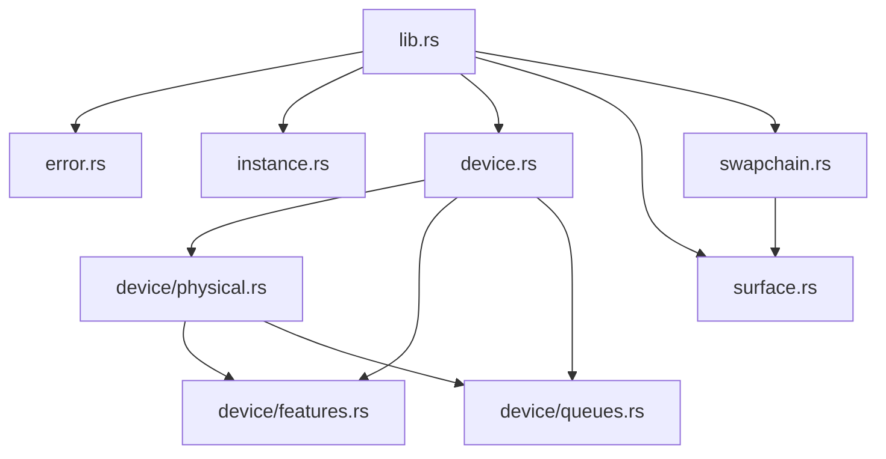
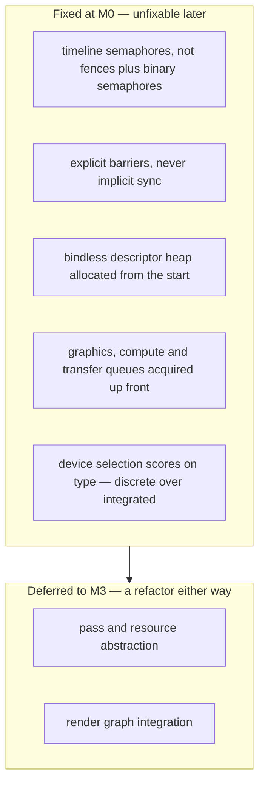
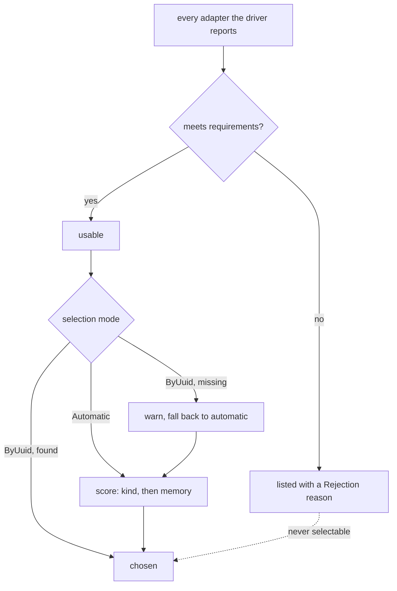

# slop-rhi

**Last updated:** 2026-08-01

## 1. Purpose

The render hardware interface — the engine's own abstraction over the graphics
API. Vulkan via `ash` is the first and only initial backend.

The RHI is ours rather than `wgpu`'s because desktop-only removes the
portability argument, and the features the fidelity target needs are precisely
the ones `wgpu` does not expose well: mesh shaders, full bindless descriptor
indexing, sparse residency, explicit barriers and transient aliasing, timeline
semaphores, async compute, and ray tracing (`DESIGN.md` §2.2).

## 2. Status

Started. This is the bulk of M0 and the largest single body of work in it.

| Area | State | Milestone |
|---|---|---|
| Instance, validation layers, debug messenger | Landed | M0 |
| Physical device enumeration, scoring, selection | Landed | M0 |
| Queue family discovery | Landed | M0 |
| Required feature tier, checked at selection | Landed | M0 |
| Logical device, queue creation | Landed | M0 |
| Surface, and surface capability queries | Landed | M0 |
| Swapchain, format and mode selection, recreation | Landed | M0 |
| Timeline semaphores, binary semaphores | Landed | M0 |
| Command pools, buffers, image barriers | Landed | M0 |
| Acquire and present | Landed | M0 |
| Shader modules from cooked SPIR-V | Landed | M0 |
| Graphics pipelines, dynamic rendering | Landed | M0 |
| `gpu-allocator` integration | Planned | M0 |
| Bindless descriptor heap | Planned | M0 |
| Minimal pipeline path | Planned | M0 |
| Shader reflection, pipeline layout derivation | Planned | M2–M3 |
| Consumer-facing RHI API extraction | Planned | M3 |

## 3. Module map

`device.rs` holds the `Device` type; `device/` holds the three things that exist
only to serve it — choosing an adapter, the feature tier it must meet, and its
queue families. `instance.rs` stays at the top level because an instance is a
device's *parent*, not one of its parts (`CONVENTIONS.md` §2.3).

## 4. Scope at M0 — primitives, not abstraction

M0 sits close to `ash` and defers the consumer-facing API to M3.

An abstraction designed with no consumers is designed against imagined
requirements. The render graph and frame renderer at M3 are what determine what
the API must be, and a shape guessed now gets rebuilt then anyway. Building it
twice is fine; building it once, early, and living with it is worse
(`PLAN.md` §4.1-D).

What M0 must get right is the **feature model**, because that is the part which
cannot be retrofitted:

Get the left side right and the M3 extraction is a refactor. Get it wrong and it
is a rewrite.

## 5. Vulkan 1.3 is the required API version

Not 1.4, despite the development machine reporting 1.4.341. Everything §2.2
commits to is core in 1.3:

| Feature | Core since |
|---|---|
| Timeline semaphores | 1.2 |
| Descriptor indexing (bindless) | 1.2 |
| Dynamic rendering | 1.3 |
| `synchronization2` — explicit barriers | 1.3 |

Requiring 1.4 would narrow supported hardware without buying anything the design
needs. The version is checked at instance creation and reported as a typed error
naming both the required and found versions, since "update your driver" is only
actionable with numbers.

## 6. Validation

Enabled automatically in debug builds, off in release — validation costs
substantial CPU per call and has no place in a shipping frame loop.

Requesting it explicitly and not getting it is an **error, not a downgrade**. A
developer who asked for validation and silently did not receive it would be
debugging undefined behaviour with the one tool that reports it switched off.
`Validation::Automatic` does fall back with a warning, so a machine without the
SDK can still run a debug build.

Validation output is routed into `tracing` rather than stdout, so it obeys the
same filtering as everything else and appears in captured logs. Vulkan's `INFO`
severity maps to `debug` here, keeping `CONVENTIONS.md` §13's rule that `info`
stays meaningful.

## 7. Device selection is player-facing

A game built on the engine will expose a GPU picker in its graphics settings, so
enumeration is public API rather than an internal step (`DESIGN.md` §7). Three
consequences shape the design:

**Selection keys on `deviceUUID`, not an enumeration index.** A player's saved
choice must survive adding a GPU, removing one, or a driver update reordering
them. Indices do not survive any of those; a saved index silently points at a
different card.

**A saved choice degrades rather than fails.** If the named device is gone or has
become unusable, selection falls back to automatic with a warning. Swapping a
graphics card must not prevent a game from launching. `ByIndex` deliberately does
*not* fall back — it exists for test harnesses, which want to fail loudly rather
than silently measure a different device.

**Unusable devices are listed with a reason**, not hidden, so a settings UI can
grey an entry out and say why.

Filtering happens **before** scoring, so scoring can never pick a device that
cannot do the job.

Kind outranks memory in the score, which is not arbitrary: an integrated GPU
reports shared system RAM as device-local memory. On this development machine
the UHD 770 claims 16 GiB against the 5090's 32 GiB, and on a machine with an
8 GiB card and 32 GiB of RAM a memory-only score would pick the iGPU.

A software rasterizer ranks last by a wide margin. lavapipe is what CI golden
images render on (`PLAN.md` §4.1-G), and selecting it by accident on real
hardware would mean rendering thousands of times slower with nothing reporting
it.

## 8. One feature tier, declared once

`DESIGN.md` §2.1 buys "one GPU feature tier, no capability-tier branching in the
renderer" by targeting desktop only. That guarantee is worth nothing unless the
tier is stated somewhere singular and checked *before* a device is accepted —
otherwise it decays into scattered runtime checks, which is exactly the
branching the decision exists to avoid.

`features.rs` is that single place. A device either supports all of it and is
usable, or it is rejected by name. There is no partial support and no fallback
path.

| Requirement | Why |
|---|---|
| `timeline_semaphore` | §2.2 — not fences plus binary semaphores |
| `synchronization2` | §2.2 — explicit barriers, modern API |
| `dynamic_rendering` | Removes render pass and framebuffer objects the render graph would have to cache |
| `descriptor_indexing` + 5 related | §2.2 — what "bindless" actually means in Vulkan terms |
| `buffer_device_address` | Shaders holding pointers, for GPU-driven passes |
| `multi_draw_indirect`, `draw_indirect_count` | §4.2 stage B's GPU-driven pipeline |
| `sampler_anisotropy` | Table stakes for the fidelity target |
| `fill_mode_non_solid` | Wireframe, for the §10.2 debug UI |

Rejections carry the spec's own feature names, so a report can be looked up
directly rather than translated.

**Device extensions are conditional on need.** `VK_KHR_swapchain` is enabled if
and only if a present queue family exists — which happens exactly when a surface
was supplied. It depends on the instance-level `VK_KHR_surface`, so requesting it
on a headless instance is a spec violation that permissive drivers accept and
strict ones reject. Validation caught this during bring-up; NVIDIA had been
creating the device anyway.

## 9. Swapchain: four choices, each with a plausible wrong answer

Every one of these looks correct on the development machine if you get it wrong,
which is why each is explicit and tested.

| Choice | Decision | The wrong answer that still works here |
|---|---|---|
| Format | Prefer `B8G8R8A8_SRGB` + `SRGB_NONLINEAR` | A `UNORM` format looks merely "a bit dark", easily misattributed to lighting |
| Present mode | Requested, falling back to FIFO | Assuming `MAILBOX` exists — it is not guaranteed; only FIFO is |
| Image count | `min + 1`, clamped | Clamping against `max_image_count` of **0**, which means *unlimited*, not zero |
| Extent | Surface's, unless it defers | Trusting `current_extent` unconditionally |

**The extent case is a genuine Windows/Linux split.** When a surface reports
`current_extent` of `u32::MAX` it is saying *you choose* — Wayland does this,
Windows does not. Ignoring it yields a swapchain four billion pixels wide on
Linux while working perfectly on Windows, which is exactly the class of breakage
`DESIGN.md` §2.13 exists to catch. There is a test for both branches.

**Sizes are physical pixels.** A window requested at 1280×720 logical reports a
1920×1080 surface at 150% display scaling. `winit`'s `inner_size()` is already
physical; the value passed to `WindowConfig` is not.

**Sharing mode is `EXCLUSIVE` even when graphics and present families differ.**
`CONCURRENT` costs bandwidth on every access; the correct answer for split
families is an explicit ownership-transfer barrier, which §2.2's explicit model
wants anyway.

## 10. Synchronization: timelines, and the one forced exception

§2.2 commits to timeline semaphores rather than fences plus binary semaphores. A
timeline semaphore is a monotonically increasing 64-bit counter that both host
and device can wait on and signal, which subsumes three older primitives:

| Older primitive | Replaced by |
|---|---|
| Fence — device signals, host waits | Host waiting on a timeline value |
| Binary semaphore — device to device | Device waiting on a timeline value |
| Event — fine-grained ordering | Timeline values within a queue |

The practical difference: a timeline value can be waited on **before** it is
signalled, and by any number of waiters. Binary semaphores can be waited exactly
once and must be signalled first, which is what makes frame-in-flight
bookkeeping with them so error-prone. There is a test that blocks a thread on a
value and then signals it from another.

**No fences exist in this engine.** Submission passes `vk::Fence::null()`
throughout.

**The forced exception:** `vkAcquireNextImageKHR` and `vkQueuePresentKHR` do not
accept timeline semaphores. `BinarySemaphore` exists solely for those two calls
— a Vulkan limitation, not a choice, and the only place binary semaphores are
permitted.

## 11. Command recording

**Pools are per-thread, per frame in flight.** A Vulkan command pool is not
thread-safe; two threads recording from one pool is undefined behaviour. The
parallel recording §2.5 and §4.1 depend on therefore means one pool each, and
that shape is baked in now rather than discovered later.

**Buffers are recycled by resetting the pool, never the buffer.** Vulkan offers
`RESET_COMMAND_BUFFER` for per-buffer reset, but setting it forces the driver
onto a slower internal allocator for every buffer in the pool, to support a
capability the engine does not want. Resetting a whole pool returns its memory
in one operation. The frame loop is: wait on the timeline value that frame
signalled, then reset its pool.

**`ImageState` bundles layout, stage, and access.** The failure mode of explicit
barriers is not forgetting them — it is getting the layout right while the stage
or access mask is subtly wrong, which validation may not catch and hardware may
tolerate until it does not. Naming the common states once means the three cannot
drift apart. Transitioning *from* `UNDEFINED` is the correct source for a
swapchain image, since discarding is faster than preserving contents about to be
overwritten.

## 12. Decisions

| Decision | Where |
|---|---|
| Own the RHI; Vulkan via `ash`; not `wgpu` | `DESIGN.md` §2.2 |
| Require Vulkan 1.3, not 1.4 | §5 above |
| Device selection by UUID, degrading to automatic | §7 above |
| One feature tier, checked at selection, no fallbacks | §8 above |
| `Device` holds an `Arc<Instance>` to encode lifetime ordering | `device.rs` module docs |
| Swapchain format, present mode, image count and extent | §9 above |
| Timeline semaphores throughout; no fences | §10 above |
| Pools reset wholesale, never per-buffer | §11 above |
| M0 ships primitives, not abstraction | `PLAN.md` §4.1-D |
| Slang as the shading language, library-integrated | `DESIGN.md` §2.11 |
| Which Slang Rust binding | `DESIGN.md` §8 item 2 — revisit at M3 |
| Desktop only; one GPU feature tier | `DESIGN.md` §2.1 |

## 13. Invariants

1. **This crate and the allocator are the only sanctioned homes for `unsafe`.**
   `unsafe` anywhere else is a design discussion, not a review comment.
2. **Every `unsafe` block carries a `// SAFETY:` comment** stating the invariant
   that makes it sound. Enforced by `clippy::undocumented_unsafe_blocks`.
3. **Physical device selection scores on `deviceType`.** The development machine
   exposes both a discrete 5090 and an integrated UHD 770; taking index 0 is the
   difference between the two.
4. **Never hand-roll platform surface code.** `ash-window` and
   `raw-window-handle` exist to absorb the Win32/Wayland/X11 split.
5. **Validation layers on in debug builds**, plus our own assertions on barrier
   and resource-lifetime correctness.
6. **The FFI seam stays in one place.** Wrapping `ash` and the Slang bindings
   behind a narrow internal interface is what keeps swapping or vendoring them
   contained (`DESIGN.md` §2.11).
7. **Struct field order is drop order, and it is load-bearing.** Vulkan objects
   must be destroyed before whatever created them — the debug messenger before
   its instance, the instance before the entry that loaded the library.
   Reordering fields to look tidier is a use-after-free.
8. **The instance knows nothing about windows.** Surface extensions are supplied
   by the caller, so one code path serves both a windowed application and the
   headless mode `DESIGN.md` §5 requires.
9. **GPU-dependent tests live in `tests/` and skip only on a missing loader.**
   Any other failure is reported. Skipping on every error would make the suite
   worthless the first time it mattered.
10. **Filter before scoring.** A device that cannot meet requirements is never
    scored, so it can never be selected — including by an explicit request,
    which errors with the reason instead.
11. **Never select by index in player-facing paths.** Indices are not stable
    across hardware or driver changes; `deviceUUID` is.
12. **Required features are declared only in `features.rs`.** A capability check
    anywhere else is the capability-tier branching §2.1 exists to prevent.
13. **This crate never depends on a windowing library.** `Surface` takes raw
    handles via `raw-window-handle`, so the RHI stays agnostic, the headless
    path pulls in no window code, and an embedder can supply a surface from
    windows it already owns. Joining `winit` to Vulkan is `slop-app`'s job.
14. **Swapchain extents come from the surface, in physical pixels.** A window
    requested at 1280×720 logical pixels reports a 1920×1080 surface on a
    display at 150% scaling. Sizing a swapchain from the logical request
    produces blurry output or validation errors.
15. **`current_extent` of `u32::MAX` means "you choose", not a size.** Wayland
    reports it; Windows does not. See §8.
16. **`max_image_count` of `0` means unlimited, not zero.** Clamping against it
    naively yields a swapchain with no images.
17. **Only FIFO present mode is guaranteed.** Every other mode needs a fallback.
18. **No fences.** Timeline semaphores cover host-waits. `BinarySemaphore` is
    permitted only for swapchain acquire and present, which the spec forbids
    timelines from.
19. **Timeline values increase monotonically.** Signalling backwards is
    undefined behaviour Vulkan will not report; a debug assertion catches it.
20. **One command pool per thread, per frame in flight.** Pools are not
    thread-safe.
21. **Reset the pool, not the buffer**, and only after the frame's timeline
    value has been waited on.
22. **Wait for device idle before dropping anything that owns Vulkan objects.**
    `Device::drop` also waits, but that is too late for objects declared before
    the device — they are already destroyed by the time it runs. The owning
    struct must wait in its own `Drop`, which executes before any field drops.
23. **Front faces wind counter-clockwise in framebuffer space, where +Y points
    down.** That inverts the sense relative to the y-up convention most winding
    intuition is built on. A wrongly wound triangle vanishes silently with no
    validation complaint, so keep back-face culling on: it is the only thing
    that catches this.
13. **Enable an extension only when it is needed and its dependencies are
    present.** A permissive driver accepting an invalid create-info is not
    evidence of correctness.
14. **`Device::drop` waits for idle first.** Destroying objects with GPU work
    still referencing them is the shutdown crash that only reproduces under
    load.
