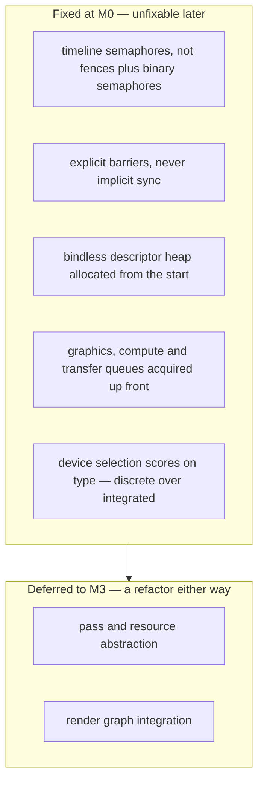

# slop-rhi

**Last updated:** 2026-08-01

## 1. Purpose

The render hardware interface — the engine's own abstraction over the graphics
API. Vulkan via `ash` is the first and only initial backend.

The RHI is ours rather than `wgpu`'s because desktop-only removes the
portability argument, and the features the fidelity target needs are precisely
the ones `wgpu` does not expose well: mesh shaders, full bindless descriptor
indexing, sparse residency, explicit barriers and transient aliasing, timeline
semaphores, async compute, and ray tracing (`DESIGN.md` §2.2).

## 2. Status

Stub. This is the bulk of M0 and the largest single body of work in it.

| Area | State | Milestone |
|---|---|---|
| Instance, validation layers | Planned | M0 |
| Physical device selection and scoring | Planned | M0 |
| Logical device, queue families | Planned | M0 |
| `gpu-allocator` integration | Planned | M0 |
| Surface, swapchain and recreation | Planned | M0 |
| Command pools and buffers | Planned | M0 |
| Timeline semaphores, explicit barriers | Planned | M0 |
| Bindless descriptor heap | Planned | M0 |
| Minimal pipeline path | Planned | M0 |
| Shader reflection, pipeline layout derivation | Planned | M2–M3 |
| Consumer-facing RHI API extraction | Planned | M3 |

## 3. Scope at M0 — primitives, not abstraction

M0 sits close to `ash` and defers the consumer-facing API to M3.

An abstraction designed with no consumers is designed against imagined
requirements. The render graph and frame renderer at M3 are what determine what
the API must be, and a shape guessed now gets rebuilt then anyway. Building it
twice is fine; building it once, early, and living with it is worse
(`PLAN.md` §4.1-D).

What M0 must get right is the **feature model**, because that is the part which
cannot be retrofitted:

Get the left side right and the M3 extraction is a refactor. Get it wrong and it
is a rewrite.

## 4. Decisions

| Decision | Where |
|---|---|
| Own the RHI; Vulkan via `ash`; not `wgpu` | `DESIGN.md` §2.2 |
| M0 ships primitives, not abstraction | `PLAN.md` §4.1-D |
| Slang as the shading language, library-integrated | `DESIGN.md` §2.11 |
| Which Slang Rust binding | `DESIGN.md` §8 item 2 — revisit at M3 |
| Desktop only; one GPU feature tier | `DESIGN.md` §2.1 |

## 5. Invariants

1. **This crate and the allocator are the only sanctioned homes for `unsafe`.**
   `unsafe` anywhere else is a design discussion, not a review comment.
2. **Every `unsafe` block carries a `// SAFETY:` comment** stating the invariant
   that makes it sound. Enforced by `clippy::undocumented_unsafe_blocks`.
3. **Physical device selection scores on `deviceType`.** The development machine
   exposes both a discrete 5090 and an integrated UHD 770; taking index 0 is the
   difference between the two.
4. **Never hand-roll platform surface code.** `ash-window` and
   `raw-window-handle` exist to absorb the Win32/Wayland/X11 split.
5. **Validation layers on in debug builds**, plus our own assertions on barrier
   and resource-lifetime correctness.
6. **The FFI seam stays in one place.** Wrapping `ash` and the Slang bindings
   behind a narrow internal interface is what keeps swapping or vendoring them
   contained (`DESIGN.md` §2.11).
