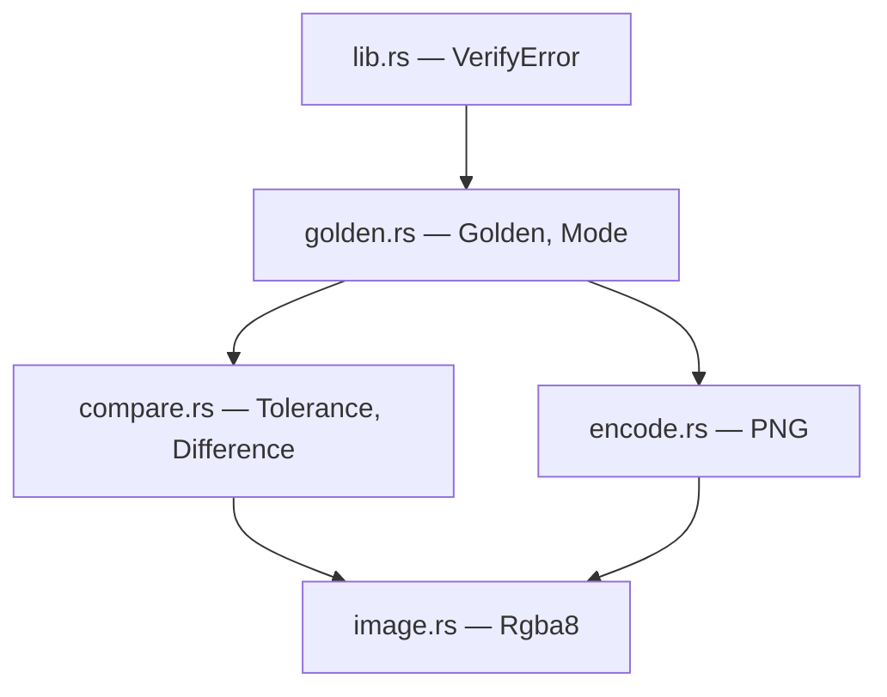
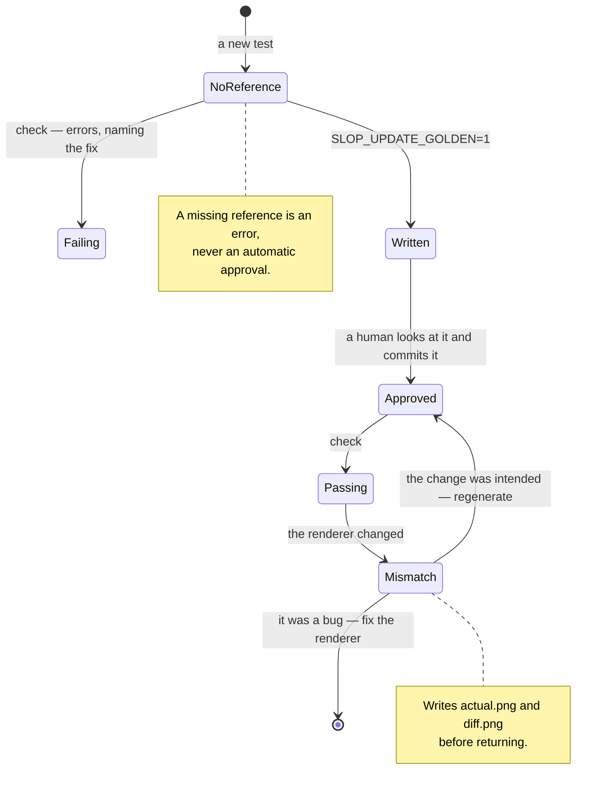

# slop-verify

**Last updated:** 2026-08-01

## 1. Purpose

The golden-image harness: compare a rendered frame against an approved
reference, report how they differ, and write artifacts a human can look at when
they do.

`DESIGN.md` §5 treats verification as a subsystem rather than as something each
test reinvents, for a stated reason — when code is produced faster than it can
be reviewed line by line, automated truth is the only thing preventing large
volumes of subtly wrong architecture. The bottleneck is verification, not
authoring.

It deliberately does not contain: anything that renders, anything that knows
what Vulkan is, and any scene definition. Producing an image is the caller's
job; this crate only judges one.

**It is a `[dev-dependencies]` crate.** Nothing it pulls in reaches a shipped
game. It is a normal library rather than something behind `cfg(test)` so that
`slop-cli` can eventually drive the same comparison outside `cargo test`.

## 2. Status

| Area | State | Milestone |
|---|---|---|
| `Rgba8`, PNG encode and decode | Landed | M0 |
| Tolerance model, difference reporting, diff images | Landed | M0 |
| `Golden` — check, update, failure artifacts | Landed | M0 |
| Real-hardware tier, `Tolerance::HARDWARE` | Landed | M0 |
| lavapipe tier, `Tolerance::EXACT` in CI | Planned — lands with CI | M1 |
| Region-of-interest assertions | Planned — `DESIGN.md` §8 item 8 | M3 |
| Depth and HDR references — an `R32F` alongside `Rgba8` | Planned — needs a depth buffer to compare | M3 |
| Serialization round-trip harness | Planned — needs `slop-reflect` | M2 |
| Frame-budget harness | Planned | M3 |

## 3. Module map

`golden.rs` is the only module a test normally names. The rest are reachable for
callers doing something the harness does not cover.

## 4. Key types

| Type | Role | Decision |
|---|---|---|
| `Rgba8` | Tightly packed 8-bit RGBA, the layout a GPU readback produces | §6 below |
| `Tolerance` | Two thresholds: per-channel magnitude, and fraction of pixels | §5.1 |
| `Difference` | How two images differ, reported on success as well as failure | §5.1 |
| `Golden` | One comparison: reference, failure directory, tolerance, mode | `DESIGN.md` §5 |
| `Mode` | Check against the reference, or replace it | §5.2 |

## 5. Diagrams

### 5.1 Why two thresholds and not one

The two failure modes look nothing alike, and a single averaged number passes
both.

| | Pixels affected | Magnitude | Cause |
|---|---|---|---|
| Driver rounding | nearly all | 1–2 levels of 255 | Vendor differences in interpolation and blending |
| Real regression | a handful | 100+ levels | Geometry, state, or ordering is wrong |

So a comparison passes only if **both** hold: no pixel anywhere exceeds
`tolerance.channel`, and no more than `tolerance.pixels` of them differ at all.

A pixel's difference is the **maximum** across its four channels, never the
average. Red swapped for green leaves blue and alpha identical, and an average
would report half the difference actually present.

### 5.2 The approval loop

### 5.3 Two tiers, one test

`PLAN.md` §4.1-G splits golden images by where they run. Both tiers use the same
comparison code and the same file format; only the reference and the tolerance
differ.

| Tier | Renderer | Tolerance | Catches |
|---|---|---|---|
| Hosted CI, both platforms | lavapipe, a CPU rasterizer | `EXACT` | State, ordering, and logic errors — bit-deterministic and vendor-independent, so a Windows/Linux difference is real signal |
| Opt-in lane, local | The actual GPU | `HARDWARE` | Driver behaviour and real hardware features |

## 6. Decisions

| Decision | Where |
|---|---|
| Verification is a subsystem, landing early | `DESIGN.md` §5 |
| Two tiers: lavapipe exact, hardware with tolerance | `PLAN.md` §4.1-G |
| Whole-frame comparison is not enough for dense scenes | `DESIGN.md` §8 item 8 |
| Determinism is a prerequisite, not a peer | `DESIGN.md` §2.14 |

**PNG rather than a raw dump.** Lossless, so exact comparison is meaningful, and
it renders in a browser, a diff viewer, and a pull request with no tooling.
Looking at the image is the first thing a failed golden test needs.

**Pure-Rust codec.** A C library here would add exactly the MSVC-versus-GCC build
surface `DESIGN.md` §2.13's trap table warns about, to the one crate whose job is
making cross-platform differences visible.

**`Rgba8` is a concrete type, not a trait.** Depth is `R32_SFLOAT` and HDR is
`R16G16B16A16`, and both will want comparing. The answer is a sibling type when
there is a depth buffer to compare, not a generic abstraction designed now
against a guess (`DESIGN.md` §1.2 principle 6 — defer implementations, not
seams; `Golden` already accepts any image and cares nothing about where it came
from).

## 7. Invariants

1. **A missing reference is an error, never an approval.** A new test must not
   pass by writing out whatever it happened to render the first time. This is
   the single most important behaviour in the crate.
2. **Approving a reference is a human decision.** `Mode::Update` writes whatever
   it is given, correct or not, so a run in that mode proves nothing. Nothing
   infers it from a missing file.
3. **A failed comparison writes its artifacts before returning**, so the
   evidence exists whether or not the test runner captured stdout.
4. **Failure artifacts go under `target/`.** They are build output. A reference
   and a failed render sitting in the same directory is how the wrong one gets
   committed.
5. **References are binary and byte-exact.** `.gitattributes` marks
   `tests/golden/**` binary; a normalization pass over one would corrupt it
   silently.
6. **`Difference` is reported on success too.** A test sitting at 0.9% of a 1%
   budget should be visible before it crosses, not after.
7. **Non-RGBA8 PNGs are rejected, not converted.** References are written by
   this crate, so a different format means the file was replaced by something
   else — and converting it would hide that.
8. **A golden image is only as meaningful as the frame is reproducible.** This
   crate cannot check that. It rests on `DESIGN.md` §2.14, and a scene with an
   unseeded RNG or an order-dependent parallel reduction will produce a flaky
   test that looks like a comparison problem and is not.
